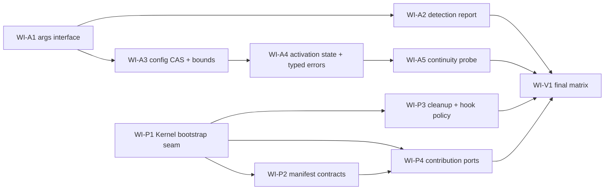
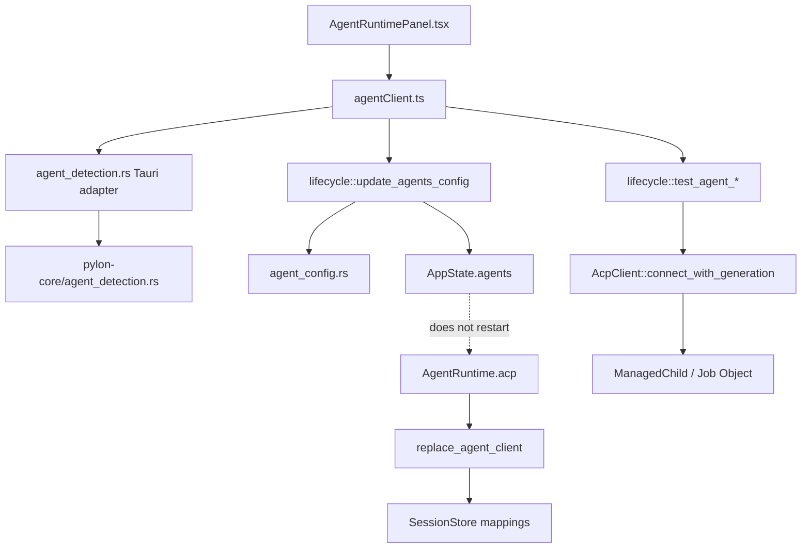
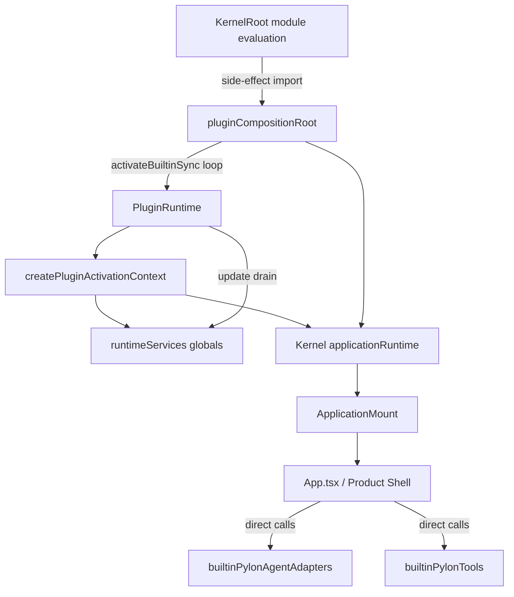

# Pylon Kernel 剩余任务长程施工书

> 文档性质：剩余 AGT/PLG 问题的唯一施工规格、源码地图、执行台账与单执行者 harness。
>
> 建立基线：`25455fc`（2026-08-20）。
>
> 项目目录：`G:\Project\prism-team-workdir\prism-desktop`。
>
> 上游决策：以 `docs/Pylon-Kernel-施工台账.md` 的 D1–D17 为准；本文件不重开既有决策。
>
> 约束：不启用子 Agent；不改变五个第一方 Product Plugin 的粗粒度构造；第三方插件是完全可信本机代码；canonical journal 仍是唯一 durable history。

## 0. 如何使用本文档

本文档取代后续“全量侦察”。未来执行者每次只需要：

1. 读取本节、§2 源码地图、当前 Work Item（WI）和 §7 harness。
2. 核对 `git status --short`、当前分支和 HEAD；不要重扫全仓。
3. 只阅读当前 WI 列出的直接调用方、实现、类型和测试。
4. 按 WI 的步骤实施、定向验证、提交、冻结 SHA、自审、测试、回写台账。
5. 只有源码路径或 interface 发生变化时才更新 §2；不要每轮重写架构图。

状态只使用六种：`待施工`、`施工中`、`待审查`、`待测试`、`已完成`、`阻塞`。

## 1. 剩余问题与施工切片

| WI | 覆盖问题 | 目标 | 前置 | 状态 |
|---|---|---|---|---|
| WI-A1 | AGT-003 | 参数数组编辑器与 effective invocation 预览 | 无 | 待施工 |
| WI-A2 | AGT-004–008 | 有预算、可诊断、不泄漏进程的 Agent detection report | WI-A1 | 待施工 |
| WI-A3 | AGT-010、AGT-012 | 配置 CAS、备份、原子替换与数值 hard max | WI-A1 | 待施工 |
| WI-A4 | AGT-009、AGT-011 | Stored/PendingRestart/Activated 与类型化连接错误 | WI-A3 | 待施工 |
| WI-A5 | AGT-013 | 重连后逐 Session continuity probe 与 detached 收敛 | WI-A4 | 待施工 |
| WI-P1 | PLG-001、PLG-002、PLG-005 | Kernel-first bootstrap、Safe Mode、显式 host seam | 无 | 待施工 |
| WI-P2 | PLG-003 | dependencies/conflicts/activation events 硬契约 | WI-P1 | 待施工 |
| WI-P3 | PLG-004、PLG-007、PLG-008 | 可观察的部分 cleanup 与 hook disable-plugin 一致性 | WI-P1 | 待施工 |
| WI-P4 | PLG-006 | Product Shell 只消费稳定 contribution/interface | WI-P1、WI-P2 | 待施工 |
| WI-V1 | Phase 5 | 台账对账、故障矩阵、一次全链路验收 | 全部 WI | 待施工 |

推荐顺序：`A1 → A2 → A3 → A4 → A5 → P1 → P2 → P3 → P4 → V1`。A 线与 P 线源码交集小，但本 harness 是单执行者，不做并行超前施工。



## 2. 经源码确认的当前图景

### 2.1 Agent Runtime 调用链



当前事实（基线 `25455fc`）：

- `src/components/settings/AgentRuntimePanel.tsx` 的 `CandidateDraft.args` 是字符串；`candidateDraft()` 用 `join(' ')`，`detectedAgentConfig()` 与 `validateCandidate()` 用 `/\s+/` 切割，带空格参数不可逆。
- `src-tauri/pylon-core/src/agent_detection.rs::find_rule` 在第一个 alias 找到任何结果后立即 `return found`，后续 alias 被遮蔽。
- 同文件 `version_probe` 用 `timeout(spawn_blocking(Command::output))`；超时只丢 future，不终止同步子进程。
- `detect_agent_runtime_candidates_inner` 同步执行目录/注册表/配置扫描，随后对全部候选 `join_all`；没有总预算、并发上限或候选上限。
- detector id 只是 filter 条件；未知 id 不产生错误或 diagnostic。
- `confidence=high` 由 version 文本或 config field 命中决定，身份证据与 ACP initialize 可用性混在一个词中。
- `lifecycle::connection_test_stage` 和 `connection_test_error_payload_with_diagnostics` 通过错误字符串 `contains` 推断阶段。
- `agent_config::write_config_atomically` 使用固定 PID 临时文件、`sync_all + rename`；没有外部 revision、跨进程 lease 或 `.bak`。
- `lifecycle::update_agents_config` 写盘后替换 `AppState.agents`，但不会替换已运行 `AgentRuntime.acp`，返回值仍只有 `applied: true`。
- `agent_config::validate_acp_section` 只拒绝 0；timeout、附件和 replay 上限没有 hard max。
- `client_activation_for_action` 已有 `SessionContinuity::Unknown`，但 `do_connect_and_replace` 仅记录日志；`replace_agent_client(... keep_sessions=true)` 会直接把旧映射迁移到新 generation。
- prompt 报错后才由 `cleanup_ghost_session_mapping` 通过字符串判断 session missing 并删除映射，属于被动修复。

### 2.2 Agent 源码地图

| 层 | 文件 / symbol（基线位置） | 当前责任 | 后续 WI |
|---|---|---|---|
| UI | `src/components/settings/AgentRuntimePanel.tsx`：`CandidateDraft`、`candidateDraft`、`detectedAgentConfig`、`saveEdit`、候选卡片 | Agent 编辑、发现、验证、导入 | A1、A2、A4 |
| TS domain | `src/domains/agent/agentDetector.ts` | detection DTO normalize | A2 |
| TS domain | `src/domains/agent/candidateValidation.ts` | 导入门禁和验证展示 | A2、A4 |
| TS adapter | `src/infrastructure/acp/agentClient.ts` | Tauri typed client | A1–A4 |
| Rust adapter | `src-tauri/src/agent_detection.rs` | 配置实例匹配、Tauri command | A2 |
| Rust core | `src-tauri/pylon-core/src/agent_detection.rs`：`find_rule`、`version_probe`、`detect_agent_runtime_candidates_inner` | 受控 runtime discovery | A2 |
| Rust config | `src-tauri/src/agent_config.rs`：`AgentDef`、`validate_acp_section`、`write_config_atomically` | 配置 parse/validate/write | A1、A3、A4 |
| Rust lifecycle | `src-tauri/src/lifecycle/mod.rs`：`update_agents_config`、`initialize_agents_config`、`test_agent_*`、`do_connect_and_replace` | 配置事务、连接、替换 | A3–A5 |
| ACP | `src-tauri/src/acp/mod.rs`：`AcpError`、`connect_with_generation` | preflight/spawn/initialize | A4、A5 |
| Process | `src-tauri/src/acp/process.rs`：`ManagedChild` | Windows Job Object 与进程树终止 | A2、A4 |
| Runtime | `src-tauri/src/agent_runtime.rs`：`ClientActivation`、`SessionContinuity` | generation/continuity 类型 | A4、A5 |
| Session | `src-tauri/src/lib.rs::replace_agent_client`、`src-tauri/src/session/create.rs::ensure_session_mapping`、`src-tauri/src/session/prompt.rs::cleanup_ghost_session_mapping` | 映射迁移、复用、被动修复 | A5 |
| FE binding | `src/runtimeStore.ts`、`src/components/chat/useSessionLifecycle.ts` | binding generation 与 stale gate | A5 |

### 2.3 Plugin Host 调用链



当前事实：

- `KernelRoot.tsx` 顶层 side-effect import `pluginCompositionRoot.ts`；后者模块求值时构造 runtime 并对全部内置 definition 调用 `activateBuiltinSync`。任何 throw 都发生在 Recovery UI 可渲染之前。
- `PluginRuntime.activateBuiltinSync` 的 catch 使用 `void scope.dispose()` 后立即 rethrow，rollback 自身也可能在后台失败。
- `PluginRuntime` 接收 definition 的 `dependencies`，但 activate/enable/disable/update 都没有执行依赖、冲突或 activation event 契约。
- `packageManifest.ts` 解析 dependencies/conflicts，但没有完整校验 `activation`；`PackageInstallationService` 只检查 enabled/active。
- `PluginRuntime.deactivate` 不论 `deactivateError` 或 `scope.errors` 都删除 instance，并发布 inactive snapshot。
- `PluginScope.disposeNow` 对 Promise 只挂异步 catch；返回时 `errors` 尚未稳定。
- 全局 `HookRuntime` 在 `runtimeServices.ts` 以 `new HookRuntime()` 创建，没有 `onDisablePlugin`，所以 `failurePolicy='disable-plugin'` 只禁用一个 handler。
- `pluginActivationContext.ts` 直接读取全部 global registry 和 Kernel `applicationRuntime`；`PluginRuntime.ts` 又直接读取 `getHookRuntime`，形成 Kernel/plugin-runtime 双向和初始化顺序耦合。
- `App.tsx` 直接 import/call `applyPylonAgentInstances`、`applyPylonToolDictionary`；`Settings.tsx` 也直接调用 tools implementation，Product Shell 知道具体 Product Plugin 实现。
- 五个第一方包已经有独立 `pylon-plugin.json` 与 entry；`builtinProductPlugins.ts` 已做第一方依赖拓扑排序，这部分构造必须保留。

### 2.4 Plugin 源码地图

| 层 | 文件 / symbol | 当前责任 | 后续 WI |
|---|---|---|---|
| Kernel | `src/kernel/KernelRoot.tsx`、`KernelRecoveryLayer.tsx`、`ApplicationMount.tsx` | Kernel surface 与 Application mount | P1 |
| Composition | `src/plugin-runtime/pluginCompositionRoot.ts` | 全局实例与模块求值期激活 | P1、P2 |
| Host | `src/plugin-runtime/pluginRuntime.ts` | activate/update/deactivate/enable/reload | P1–P3 |
| Instance | `src/plugin-runtime/pluginInstance.ts` | activation transaction 与 deactivate result | P3 |
| Resource | `src/plugin-runtime/pluginScope.ts` | resource ownership/dispose | P3 |
| Context | `src/plugin-runtime/pluginActivationContext.ts`、`runtimeServices.ts` | activation context 与全局 registries | P1 |
| Manifest | `src/plugin-runtime/packageManifest.ts`、`firstPartyProductPackage.ts` | manifest parse 与第一方映射 | P2 |
| Package runtime | `src/plugin-runtime/packagePluginRuntime.ts` | 动态 import、style、native runtime dir | P2、P3 |
| Package orchestration | `src/plugin-runtime/packageInstallationService.ts` | startup/install/enable/disable/uninstall | P1–P3 |
| Native package | `src-tauri/src/plugin_cmds.rs` | package/state/journal/runtime directory authority | P2、P3 |
| Hook | `src/plugin-runtime/hooks/hookRuntime.ts`、`runtimeServices.ts` | failure policy/circuit/drain | P3 |
| UI | `src/components/settings/PluginManager.tsx` | active/enabled 操作和日志 | P1–P3 |
| Product | `src/App.tsx`、`src/components/Settings.tsx`、`builtinPylonAgentAdapters.ts`、`builtinPylonTools.ts` | Product Shell 与具体插件直连 | P4 |

### 2.5 本文档的源码核验边界

本文档不是从旧报告转抄。建立时已逐文件阅读以下执行路径；后续只有这些路径或公开 interface 漂移，才需要局部补勘：

- Agent：`AgentRuntimePanel.tsx`、`agentDetector.ts`、`candidateValidation.ts`、`agentClient.ts`、Tauri/core 两层 `agent_detection.rs`、`agent_config.rs`、`lifecycle/mod.rs`、`acp/mod.rs`、`acp/process.rs`、`agent_runtime.rs`、`lib.rs::replace_agent_client`、`session/create.rs`、`session/prompt.rs`、`runtimeStore.ts`、`useSessionLifecycle.ts` 及其定向测试。
- Plugin：`KernelRoot.tsx`、`KernelRecoveryLayer.tsx`、`ApplicationMount.tsx`、`applicationRuntime.ts`、`pluginCompositionRoot.ts`、`pluginRuntime.ts`、`pluginInstance.ts`、`pluginScope.ts`、`pluginActivationContext.ts`、`runtimeServices.ts`、`packageManifest.ts`、`packagePluginRuntime.ts`、`packageInstallationService.ts`、`hookRuntime.ts`、`plugin_cmds.rs`、`App.tsx`、`Settings.tsx`、五个第一方 package manifest/entry 及其定向测试。
- 决策与历史：`Pylon-Kernel-施工台账.md` 的 D1–D17/剩余问题表，以及 `Pylon-项目架构参考.md` 的 Agent、Plugin、Session/canonical 拓扑。

源码核验基准是 `25455fc`。若 `git diff <本 WI base> -- <上述相关路径>` 没有 interface/ownership 漂移，禁止以“保险”为由重新全仓扫描。

## 3. Work Item 施工规格

### WI-A1：参数数组编辑器与 effective invocation

覆盖：AGT-003。

目标 interface：

```ts
interface InvocationDraft {
  executable: string
  args: string[]
}

interface EffectiveInvocation {
  executable: string
  editableArgs: readonly string[]
  effectiveArgs: readonly string[] // AgentDef::command_args() 的真实结果
  display: string       // 仅展示；不得反向 parse
  validation: { ok: boolean; issues: InvocationIssue[] }
}
```

施工步骤：

1. 新建 `src/domains/agent/invocationDraft.ts`。实现不可变的 `appendArgument`、`updateArgument`、`removeArgument`、`moveArgument`、`validateInvocation`、`formatInvocationForDisplay`。
2. `formatInvocationForDisplay` 只负责人类预览：Windows 展示规则对空串、空格、引号和反斜杠做转义；真实 spawn 永远继续传 `string[]`，禁止把 display 文本重新切割。
3. 在 `AgentRuntimePanel.tsx` 把 `CandidateDraft.args: string` 改为 `string[]`；`candidateDraft` 复制数组；`detectedAgentConfig` 原样复制数组。
4. 抽出 `ArgumentListEditor.tsx`：每个参数一行，支持增删、上下移动、空字符串显式保留；候选导入、现有 Agent 编辑、新建 Agent 共用同一 module。
5. 扩充现有 Agent `Draft` 和 `AgentEntry`，让 `normalizeAgentList` 保留 `args` 与 `effectiveArgs`；`saveEdit` 的 `agent_fields` patch 包含数组。`agentConfig()` 也接收数组，不再内置一个不可编辑的 `['acp']`。
6. Rust `agent_summary_payload` 增加原始 `args` 与 `effectiveArgs=AgentDef::command_args()`；不返回 env。已有 `model/acp_args` 必须体现在 effective preview 中，避免界面显示的命令与真实 spawn 不同。
7. 新建 Agent 默认仍为 `['acp']`，但 UI 立即显示为可编辑的一项。
8. 每个编辑区域下显示 effective invocation，错误至少覆盖空 exe、NUL 字符、参数内 NUL；warning 覆盖超长参数和空参数，不擅自拒绝合法空参数。
9. 删除所有 `.join(' ') → split(/\s+/)` 的 round-trip。保留 CLI 人类输出的 join 仅限展示。

测试：

- 新增 `src/domains/agent/__tests__/invocationDraft.test.ts`：`['--profile','work space','', 'a"b']` round-trip 不变。
- 扩充 `AgentRuntimePanel.default.test.tsx`：编辑/验证/导入发出的 invoke payload 保留带空格和空字符串参数。
- 扩充 `agentContracts.test.ts`：`args` normalize 拒绝非字符串成员，但不拆字符串。
- Rust 已有 `apply_agent_create` 特殊字符测试继续作为 wire 另一端证据，不改 YAML 构造。

定向命令：

```text
npx vitest run src/domains/agent/__tests__/invocationDraft.test.ts src/components/settings/__tests__/AgentRuntimePanel.default.test.tsx src/infrastructure/acp/__tests__/agentContracts.test.ts
npx tsc -b --pretty false
npx eslint src/domains/agent/invocationDraft.ts src/components/settings/ArgumentListEditor.tsx src/components/settings/AgentRuntimePanel.tsx src/infrastructure/acp/agentClient.ts
git diff --check
```

建议提交：`feat: preserve structured agent invocation arguments`。

### WI-A2：Agent detection report、预算与进程收敛

覆盖：AGT-004、AGT-005、AGT-006、AGT-007、AGT-008。

目标 Rust interface（放在 `pylon-core`，Tauri 仅做 adapter）：

```rust
pub struct AgentDetectionReport {
    pub candidates: Vec<AgentRuntimeCandidate>,
    pub diagnostics: Vec<AgentDetectionDiagnostic>,
    pub elapsed_ms: u64,
    pub truncated: bool,
}

pub struct AgentRuntimeCandidate {
    // existing identity/invocation fields
    pub identity_confidence: IdentityConfidence,
    pub protocol_availability: ProtocolAvailability, // NotTested in discovery
}

pub struct AgentDetectionLimits {
    pub total_budget: Duration,
    pub version_probe_budget: Duration,
    pub max_candidates: usize,
    pub max_concurrent_probes: usize,
}
```

`IdentityConfidence` 只表达“这是哪个产品/安装”；`ProtocolAvailability` 只允许 `NotTested | Verified | Failed`。Discovery 不做 ACP initialize，所以 version 文本再可信也只能得到 `NotTested`；只有 `test_agent_candidate` 成功后 UI 本地状态才显示 `Verified`。

施工步骤：

1. 在 `agent_detection.rs` 增加上述 DTO 和默认限额：总预算 8 秒、version 单候选 2 秒、候选上限 32、并发 probe 上限 4。测试可注入更小值。
2. 在 `src-tauri/pylon-core/Cargo.toml` 增加 Windows target-only `windows-sys` 直接依赖，只开启 `Win32_Foundation`、`Win32_System_JobObjects`、`Win32_System_Threading`；Unix 继续用现有 `libc`。这是本 WI 明确授权的进程回收依赖，不把 Tauri 主 crate 的 `ManagedChild` 反向耦合进 core。
3. 将同步 roots/registry/config 文件工作放入 `spawn_blocking`。扫描必须同时受确定性上限约束（每 detector roots ≤ 16、目录深度 ≤ 4、访问 entry ≤ 2,000、配置文件 ≤ 64）；命中上限写 diagnostic。每个 detector 返回自己的 `Result<Vec<LocatedRuntime>, Diagnostic>`，不要让一个 detector 的 IO 错误吞掉其他 detector。总 deadline 后不等待尚未完成的 blocking task，其迟到结果不得进入 report。
4. 改写 `find_rule`：遍历全部 invocation alias，不在首个命中后 return；以 `(canonical executable, args)` 去重，保留 alias index 和 evidence。
5. candidate id 必须包含 detector、canonical executable 和 args 的稳定编码，防止同 exe 不同 args 在 React key/validation map 中碰撞。
6. 先核对请求的 detector ids 与 catalog ids；每个未知 id 追加 `code='unknown_detector_id'`、`stage='selection'` diagnostic。若请求只含未知 id，返回成功 report + 空 candidates + diagnostics，不返回裸空数组。
7. 用 `tokio::sync::Semaphore` 控制 version probe 并发；在总 deadline 前只启动剩余预算允许的 probe。达到候选上限时稳定排序后截断并设置 `truncated=true`、追加 `candidate_limit_reached`。
8. 为 version probe 建立 `ManagedProbeChild`。Windows 使用 Job Object `KILL_ON_JOB_CLOSE`（实现纪律与 `src-tauri/src/acp/process.rs::ManagedChild` 对齐）；Unix 建立独立 process group，并在 timeout 后终止 group、wait 回收。不得再用不可取消的 `Command::output()`。
9. probe 读取 stdout/stderr 使用有界缓冲（各 4 KiB）；首行最多 160 字符；timeout、non-zero、spawn failure 分别进入 diagnostic，不把它们混成“没有 version”。
10. 排序键固定为：catalog priority 降序、identity confidence 降序、invocation alias index 升序、PATH 来源优先、canonical path、args。增加 stale-first alias fixture，确认第二 alias 的有效候选不被遮蔽。
11. Tauri `detect_agent_runtimes` 返回 report；`agentClient` 新增 `normalizeAgentDetectionReport`，不再只 normalize array。独立 CLI 的 JSON 直接输出 report；human output 追加 diagnostics/truncated 摘要。
12. UI 分开显示“身份可信度”和“ACP 状态：未验证/验证中/可用/失败”。修改 `candidateImportMode` 只读取 `identityConfidence + validation state`；任何 version evidence 都不得显示“ACP 已验证”。
13. 发现面板显示 detector diagnostics；unknown detector、总预算耗尽、probe timeout 都是可见而非全局 throw。

关键测试：

- Rust core：首 alias stale/第二 alias valid；unknown detector；候选上限；并发上限；总 deadline；伪造 `--version` 输出仍为 `NotTested`。
- Rust process：fixture 启动子进程再挂起，probe timeout 后父子 PID 均退出。Windows 断言 Job Object 路径；非 Windows 断言 process group。
- TS domain：corrupt report normalize；identity/protocol 两字段不能互相替代；候选 id 不碰撞。
- UI：version evidence 卡片仍显示“ACP 未验证”；diagnostic 可见；验证成功后才显示“ACP 可用”。
- CLI：JSON schema 与 human diagnostic 输出。

定向命令：

```text
cd src-tauri
cargo test -p pylon-core agent_detection
cargo test --bin pylon-detect
cargo test agent_detection --lib
cd ..
npx vitest run src/domains/agent/__tests__/agentDetector.test.ts src/domains/agent/__tests__/candidateValidation.test.ts src/components/settings/__tests__/AgentRuntimePanel.default.test.tsx
npx tsc -b --pretty false
git diff --check
```

本 WI 是明确的多文件联动，可额外跑 `cargo check -p pylon-core` 与 `cargo check --lib`；不需要 `check:all`。

建议提交：`feat: make agent discovery bounded and diagnosable`。

### WI-A3：配置 CAS、备份、原子替换与 hard max

覆盖：AGT-010、AGT-012。

目标 interface：

```rust
pub struct ConfigRevision(String); // SHA-256 of exact bytes

pub struct AgentConfigSnapshot {
    pub revision: ConfigRevision,
    pub agents: Vec<AgentSummary>, // no env/secret values
}

pub fn write_config_transaction(
    path: &Path,
    expected: &ConfigRevision,
    candidate: &[u8],
) -> Result<ConfigRevision, ConfigError>;
```

施工步骤：

1. 给 `ConfigError` 增加 `Conflict { expected, actual }`、`Backup`、`LockBusy`，稳定 code 分别为 `config_revision_conflict`、`config_backup_error`、`config_lock_busy`。
2. 在 `src-tauri/Cargo.toml` 显式增加 `sha2 = "0.10"`，在 `agent_config.rs` 用 `Sha256` 计算精确文件字节 revision；不能依赖 lockfile 中某个间接依赖。日志只输出 revision 前 12 位，不输出配置内容。
3. 新增 `agent_config_snapshot` Tauri command，返回 revision 与可交互字段（id/name/provider/transport/exe/args/default/cwd）；不返回 env、凭据或完整 YAML。
4. `agentClient` 缓存最近 snapshot revision；所有 update/create/default 操作携带 `expectedRevision`。成功响应返回新 revision，UI 原子更新；conflict 时保留用户 draft，提示“配置已被其他进程修改”，提供重新载入而非覆盖。
5. `update_agents_config` / `initialize_agents_config` 在进入候选生成前获取跨进程文件 lease。Windows 在现有 `windows-sys` dependency 增加 `Win32_Storage_FileSystem` feature，用独占 `CreateFileW` 且 delete-on-close；Unix 用现有 `libc::flock(LOCK_EX|LOCK_NB)`。lease 路径固定为相邻 `.agents.yaml.pylon.lock`，RAII drop 释放。上述 Cargo 变动是本 WI 明确范围。
6. lease 内重读 exact bytes 并比较 expected revision；不匹配立即返回 conflict，禁止生成/写入候选。
7. 重写 `write_config_atomically` 为：写唯一 temp → `sync_all(temp)` → 从已验证 baseline 写唯一 backup temp → sync → 原子替换 `agents.yaml.bak` → 平台原子替换目标 → sync parent directory（支持的平台）。Windows 不再依赖会因目标存在而失败的普通 rename。
8. 主文件替换失败时保持原文件；backup 失败时不替换主文件；成功后清理 temp。启动读取失败时错误 DTO 标出 backup 是否可恢复，但不得静默用 backup 覆盖主文件。
9. 在 `validate_acp_section` 建立唯一常量表：prompt ≤ 3600s、cancel settle ≤ 300s、RPC ≤ 300s、attachments ≤ 64、单附件 ≤ 256 MiB、replay ≤ 100_000。warning threshold（如 prompt > 900s、单附件 > 64 MiB、replay > 50_000）进入 snapshot diagnostics，不阻止保存。
10. 同步验证 `client_info` / initialize caps 的合理序列化体积（建议 256 KiB），避免任意大配置进入每次握手。
11. CLI 或其他调用者若没有 revision，必须先读 snapshot；不要保留“缺省盲写”后门。

测试：

- 两个模拟 writer 持同 expected revision：只有一个成功，另一个稳定 conflict，文件是完整 YAML。
- backup 与主文件逐字对应上一个成功版本；替换失败、backup 失败、lock busy 都不损坏当前文件。
- crash/temp 残留不被当配置；下一次 lease 可自愈清理只属于本命名规则的陈旧 temp。
- 每个数值字段覆盖 `0 / max / max+1`；warning threshold 不误当 hard error。
- UI conflict 保留 draft，reload 后 revision 更新。

定向命令：

```text
cd src-tauri
cargo test agent_config::tests --lib
cargo test lifecycle::tests::config --lib
cd ..
npx vitest run src/components/settings/__tests__/AgentRuntimePanel.default.test.tsx src/infrastructure/acp/__tests__/agentContracts.test.ts
npx tsc -b --pretty false
git diff --check
```

建议提交：`fix: serialize agent config updates with revision CAS`。

### WI-A4：配置生效状态与类型化连接诊断

覆盖：AGT-009、AGT-011。

目标状态：

```rust
pub enum AgentConfigActivationState {
    Stored,          // 已存储，没有 live runtime
    PendingRestart,  // live fingerprint != stored fingerprint
    Activated,       // live fingerprint == stored fingerprint
}

pub enum AgentConnectStage { Preflight, Spawn, Initialize, Capability }
pub struct AgentConnectFailure {
    pub stage: AgentConnectStage,
    pub code: String,
    pub message: String,
    pub exit_code: Option<i32>,
    pub stderr_excerpt: Option<String>,
    pub retryable: bool,
}
```

施工步骤：

1. `AgentDef::runtime_fingerprint()` 对真正影响进程/协议的字段生成 SHA-256：transport、resolved exe、`command_args()`、cwd、env、hermes profile、ACP protocol。先构造显式 canonical DTO；env 按 key 排序、JSON object 递归稳定排序，禁止直接 hash `HashMap` 的非确定迭代。name/default 不进入 fingerprint。
2. `AgentRuntimeState` 增加 `activated_config_fingerprint: Option<String>`；`do_connect_and_replace` 成功激活时写入连接所用 definition 的 fingerprint。
3. `agent_summary_payload` 和 `list_agents` 比较 stored/live fingerprint，返回 `configActivationState`。断开 runtime 为 Stored；连接且相等为 Activated；连接且不同为 PendingRestart。
4. `update_agents_config` 成功响应也返回目标 Agent 的 activation state。active Agent 改 name/default 不应变 PendingRestart；改 exe/args/env/acp 必须变 PendingRestart。
5. 新增显式 `restart_agent_runtime(agent_id)` command：持 lifecycle lock，按当前 stored AgentDef 建立新 client，成功后原子替换；失败保留旧 live client 和 PendingRestart，不谎报 Activated。
6. UI 在每张 Agent 卡显示 Stored/PendingRestart/Activated；PendingRestart 显示“立即重启应用此配置”，并在操作期间显示 Reconnecting。
7. 深化 `AcpError`：把 Child(String) 中与连接阶段相关的路径拆为 `Preflight`、`Spawn`、`Initialize`、`Capability` 变体或统一 `AgentConnectError`。`connect_with_generation` 在每个 seam 显式 map，不再靠 lifecycle 的字符串 contains。
8. initialize JSON-RPC error 保留远端 code/data 的安全摘要；spawn 保留 `io::ErrorKind` 和 exit code；stderr 继续 4 KiB 有界且脱敏。
9. 删除 `connection_test_stage` 字符串分类；`test_agent_connection` 与 `test_agent_candidate` 直接序列化 typed failure。
10. 外层 15 秒总 timeout 仍保留；timeout drop 必须经 `ManagedChild` 终止树并 wait。增加 capability stage，为握手成功但必需能力缺失预留稳定错误码。

测试：

- runtime fingerprint 相同/不同矩阵；display-only patch 不要求 restart。
- restart 成功：generation +1、state Activated、旧 child 终止；失败：旧 generation/client 仍可用、state PendingRestart。
- preflight/spawn/initialize/capability/timeout 每类稳定 code 和 stage，不用文案断言分类。
- UI PendingRestart 按钮和失败后状态。

定向命令：

```text
cd src-tauri
cargo test agent_config::tests::runtime_fingerprint --lib
cargo test lifecycle::tests --lib
cargo test acp::tests::fake_acp_initialize --lib
cd ..
npx vitest run src/domains/agent/__tests__/candidateValidation.test.ts src/components/settings/__tests__/AgentRuntimePanel.default.test.tsx src/components/settings/__tests__/agentStatusGeneration.test.ts
npx tsc -b --pretty false
git diff --check
```

建议提交：`feat: expose stored and activated agent configuration state`。

### WI-A5：Session continuity probe 与 detached 收敛

覆盖：AGT-013。

不另立 Session authority。probe 只判断现有 runtime mapping 是否仍可继续；durable owner、canonical journal 和 Session metadata 权威不变。

目标状态：

```rust
pub enum SessionContinuity { Preserved, Invalidated, Unknown }
pub enum SessionBindingHealth { Attached, Probing, Detached { reason: String } }
```

施工步骤：

1. 将 `ClientActivation` 从日志值变成 `replace_agent_client` 的显式参数；移除 `keep_sessions: bool` 作为业务语义，改由 continuity 决定。
2. `Invalidated` 直接清映射；`Preserved` 迁移 generation；`Unknown` 暂存旧映射为 `Probing`，不得立即当可发送 Attached。
3. 为当前 `AgentRuntime.sessions` 的每个 source 建立有界 probe 队列，最多并发 4、总预算取 agent RPC timeout 且 hard cap 30 秒。
4. 优先使用 Agent 明确声明的 resume/load/list capability；没有 capability 时用最小、无副作用的 session/load probe。不能用 prompt 作为 probe。
5. probe 成功且 remote id 一致：更新 generation、标 Preserved/Attached；明确 session missing：移除 runtime mapping、清 prompt lock、标 Detached；临时网络/timeout：保持 Detached/Unknown 并允许用户重试，禁止假定 preserved。
6. dispatcher 在 Probing/Detached 状态拒绝旧代 notification；现有 generation gate 保留。
7. Tauri agent status 或新增 session binding event 返回 source、agentId、health、reason（不返回敏感正文）。前端 `runtimeStore.bindingGenerations` 扩为绑定健康快照。
8. `InputBarBindingGate` 对 Probing/Detached 禁止发送并给出“重新连接会话”动作；`useSessionLifecycle` 走现有显式 load/retry/fork，不自动创建一个冒名 remote session。
9. 保留 `cleanup_ghost_session_mapping` 作为远端错误兜底，但改读 typed RPC/session-missing code；不再是主要恢复模型。

测试：

- auto-reconnect 后三个 session：preserved、missing、timeout 分别收敛 Attached、Detached、Detached/Retryable。
- probe 期间旧 notification 不落 canonical journal；probe 成功后的新 generation 事件可写。
- 手动 reconnect/switch 仍 Invalidated，不执行 probe。
- 前端 detached 不自动 new session；用户显式 retry/fork 行为保持 KER-017。

定向命令：

```text
cd src-tauri
cargo test agent_runtime::tests --lib
cargo test auto_reconnect --lib
cargo test session:: --lib
cd ..
npx vitest run src/components/chat/__tests__/InputBarBindingGate.test.tsx src/components/chat/__tests__/useSessionLifecycle.loadFailure.test.tsx src/__tests__/runtimeStoreIsolation.test.ts
npx tsc -b --pretty false
git diff --check
```

该 WI 跨 lifecycle/dispatcher/session/frontend，允许跑相关 `session::` 模块全量；仍不跑整个仓库。

建议提交：`fix: probe remote session continuity after reconnect`。

### WI-P1：Kernel-first bootstrap、Safe Mode 与显式 host seam

覆盖：PLG-001、PLG-002、PLG-005。

目标：Kernel recovery surface 必须先可渲染；Plugin Host 激活是 effect，不是 ESM module evaluation side effect。

目标 interface：

```ts
type KernelBootstrapState =
  | { kind: 'idle' | 'starting' }
  | { kind: 'ready'; activePluginIds: readonly string[] }
  | { kind: 'degraded'; failures: readonly PluginBootstrapFailure[] }
  | { kind: 'safe-mode'; skippedPluginIds: readonly string[] }

interface PluginHostServices {
  application: ApplicationRuntime
  registries: RuntimeRegistries
  hooks: HookRuntime
  requestSoftRemount(): void | Promise<void>
}
```

施工步骤：

1. 新建 `src/kernel/kernelBootstrap.ts`，提供 external-store snapshot、`startNormal()`、`startSafeMode()`、`retryPlugin(id)`、`subscribe()`。同一时刻只允许一个启动事务。
2. `pluginCompositionRoot.ts` 只构造 definitions、host services 和 `PluginRuntime`，删除模块顶层 `activateBuiltinSync` 循环；导出显式 `bootstrapBuiltins(mode)`。
3. `KernelRoot.tsx` 删除 side-effect import 的隐式语义。首帧先渲染 Kernel loading/recovery surface，`useEffect` 再调用 bootstrap。
4. `KernelRecoveryLayer` 显示每个失败插件、错误阶段、重试、进入 Safe Mode。Kernel Recovery UI 不注册为插件，避免恢复面依赖故障插件。
5. 正常模式按既有 `loadFirstPartyProductPackages()` 拓扑顺序逐个激活；单插件失败记录 failure，依赖它的插件标记 skipped/dependency_failed，其他无关插件继续。
6. Safe Mode 默认不激活用户包，也不自动激活任何 Product Plugin，只保留 Kernel Recovery surface。用户可从恢复面选择第一方插件；选择 shell 时必须按现有 manifest 补齐 workspace/renderers/agent-adapters/tools 的完整依赖闭包。Pylon Shell 失败时 Kernel 仍显示恢复面，不把空 Application 当崩溃。
7. 在 `BuiltinPluginDefinition` 增加 `criticality: 'kernel-required' | 'product-required' | 'optional'`。Kernel 本身没有插件；五个 Product Plugin 至多是 product-required。普通 PluginManager 禁止停用会令当前 Application 无法工作的 product-required 插件，Safe Mode/recovery 动作可以受控停用。
8. 把 `createPluginActivationContext` 改为接收 `PluginHostServices`；`PluginRuntime` 构造时注入 context factory/hook runtime，并把 factory 显式传给 `activatePluginInstance`。删除 `pluginRuntime.ts`、`pluginInstance.ts`、`pluginActivationContext.ts` 对 global `runtimeServices.ts` 或 Kernel `applicationRuntime` 的直接 import。
9. `runtimeServices.ts` 改为 `createRuntimeServices()` 返回实例集合；composition root 持有唯一实例并继续导出兼容 getter。这样 plugin-runtime module 不反向 import Kernel。
10. `KernelRoot` 只在 shell contribution 已注册后 mount application；移除模块顶层 `applicationRuntime.mount(...)`。
11. 把 `App.tsx` 中用户包 `initialize()` 移到 Kernel bootstrap 的 `kernel.ready` 后；初始化失败进入 degraded snapshot，而非 `console.warn` 后丢失。
12. `PluginManager` 读取 bootstrap/runtime instance 状态，恢复按钮调用显式 host action；不再用“active=false”同时表示未激活、失败和 cleanup-failed。

测试：

- import `KernelRoot` 不激活任何插件；首帧 Recovery/Loading 可渲染。
- 一个 builtin activate throw：Kernel surface 仍在、无关插件可 active、依赖者 skipped。
- shell failure、用户包初始化 failure、重试成功、Safe Mode 四条路径。
- product-required 普通 disable 被拒并返回稳定错误；Safe Mode 可进入。
- 静态依赖检查：`pluginRuntime.ts` / `pluginActivationContext.ts` 不再 import `../kernel` 或 `runtimeServices` global。

定向命令：

```text
npx vitest run src/kernel/__tests__ src/plugin-runtime/__tests__/pluginRuntime.test.ts src/plugin-runtime/__tests__/pluginInstance.test.ts src/components/settings/__tests__/PluginManager.test.tsx
npx tsc -b --pretty false
npx eslint src/kernel src/plugin-runtime/pluginCompositionRoot.ts src/plugin-runtime/pluginRuntime.ts src/plugin-runtime/pluginActivationContext.ts src/plugin-runtime/runtimeServices.ts
git diff --check
```

建议提交：`refactor: bootstrap plugins behind the kernel recovery surface`。

### WI-P2：manifest dependencies/conflicts/activation events 硬契约

覆盖：PLG-003。

施工步骤：

1. 新建 `src/plugin-runtime/pluginContractResolver.ts`，输入 installed/builtin manifest snapshot，输出稳定拓扑、eligible、blocked diagnostics；这是唯一契约计算 module。
2. `packageManifest.ts` 完整校验 dependency key 是合法 plugin id、range 非空、conflict id 合法且不等于自身、activation.events 是非空唯一字符串数组。
3. 实现明确且有测试的版本范围子集：exact `x.y.z`、caret `^x.y.z`、通配 `*`。遇到不支持 range 必须 `plugin_manifest_invalid`，不可当满足。
4. 解析 required dependency、optional dependency、双向 conflict、依赖环。required 缺失/版本不符阻止 activate；optional 仅在存在但版本不符时 diagnostic，不阻止；conflict 任一方向命中都阻止。
5. `BuiltinPluginDefinition` 携带完整 dependencies map、optionalDependencies、conflicts、activationEvents，不再只保留 id 数组。`createBuiltinProductPluginDefinitions` 继续保持五包构造，仅丰富 definition metadata。
6. `PackagePluginRuntimeService.loadDefinition` 从 manifest 传完整契约给 runtime。
7. `PackageInstallationService.initialize/installOrUpdate/setEnabled/reload/uninstall` 每次 mutation 前用同一 resolver 计算 candidate graph。禁止停用/卸载仍被 enabled required dependent 使用的插件，错误列出 dependent ids。
8. `PluginRuntime.activate/enable/update` 再做一次 active snapshot defense-in-depth；不能只信上层 service。
9. Kernel bootstrap 维护已发出的 activation event set。启动完成发 `kernel.ready`；显式安装/启用在 Kernel 已 ready 时重放该 event。未命中 activation event 的 enabled 插件显示 `waiting-activation`，不是 active。
10. native `plugin_cmds.rs` 继续是 package bytes/state authority；增加必要的 manifest shape 对称校验，但依赖图业务只留在 TS Plugin Host，避免两套 resolver。
11. `PluginManager` 显示 blocked dependency/conflict/waiting event 与可操作建议。

测试矩阵：缺依赖、错误版本、环、单向/双向 conflict、optional absent、dependent disable/uninstall、event 未命中/命中、update 破坏 dependent range 回滚。

定向命令：

```text
npx vitest run src/plugin-runtime/__tests__/packageManifest.test.ts src/plugin-runtime/__tests__/packageInstallationService.test.ts src/plugin-runtime/__tests__/packagePluginRuntime.test.ts src/plugin-runtime/__tests__/pluginRuntime.test.ts
npx tsc -b --pretty false
cd src-tauri
cargo test plugin_cmds::tests --lib
cd ..
git diff --check
```

建议提交：`feat: enforce plugin manifest lifecycle contracts`。

### WI-P3：部分 cleanup、disable-plugin 与稳定 dispose

覆盖：PLG-004、PLG-007、PLG-008。

目标状态：

```ts
type PluginInstanceStatus =
  | 'active' | 'deactivating' | 'inactive' | 'cleanup-failed'

interface PluginDeactivateResult {
  complete: boolean
  alreadyInactive: boolean
  deactivateError?: PluginCleanupError
  scope: { disposed: number; remaining: number; errors: PluginCleanupError[] }
}
```

施工步骤：

1. `PluginScope` 内部把 disposable 从裸函数改为带稳定 resource id/label/state 的记录；`add` 的 metadata 可选，旧调用不必一次改完。
2. `dispose()` 逆序执行；成功项移除，失败项保留为 retryable residual。返回错误使用 `{resourceId, message}`，不暴露任意对象。
3. 将 `disposeNow()` 改成真正可等待的 `Promise<PluginScopeDisposeResult>`（可保留同名兼容入口），内部委托 `dispose()`；禁止返回后再异步 push errors。
4. `deactivatePluginInstance` 在 hook 或 scope 有错误时进入 `cleanup-failed`，返回 `complete=false`；只有全部完成才为 inactive。
5. `PluginRuntime.deactivate` 只有 complete 时才删除 instance/definition；cleanup-failed 保留在 runtime snapshot，贡献已成功清理的部分不复活。
6. 增加 `retryCleanup(instanceKey)`；只重试失败 residual。若 deactivate hook 本身失败，错误单独可见；重复调用须幂等，不重复释放已成功资源。
7. `PluginRuntimeSnapshot` 增加 instances 状态/cleanup diagnostics；`active` 保持兼容派生字段。
8. `PackageInstallationService.setEnabled(false)` 只有 complete 才写 native disabled flag；否则返回失败并保持 enabled。uninstall 同理，禁止带 residual 删除 package bytes。
9. 在 P1 注入的 `HookRuntime` 构造中设置 `onDisablePlugin: id => pluginRuntime.disable(id)`。`failurePolicy='disable-plugin'` 必须使整个 instance 进入 inactive 或 cleanup-failed，而非只禁 handler。
10. callback 失败写 Hook trace `plugin-disable-failed`，并保留 circuit/disabled handler 防止故障风暴。
11. `PluginManager` 展示 cleanup-failed、残留资源、retry cleanup；操作日志不能写“停用成功”。CLI disable 返回同一结构化结果。

测试：

- 一个 async disposer 延迟 reject：`disposeNow`/dispose 返回前不完成，最终 errors 稳定。
- 三个资源中一个失败：成功项只执行一次，retry 只执行失败项。
- deactivate hook failure 与 scope failure 分别显示；runtime 不删除 failed instance。
- package disable/uninstall cleanup-failed 时 native enabled/package 不变。
- hook disable-plugin 后 runtime snapshot 不再 active；cleanup failure 时为 cleanup-failed 且 trace 可查。

定向命令：

```text
npx vitest run src/plugin-runtime/__tests__/pluginScope.test.ts src/plugin-runtime/__tests__/pluginInstance.test.ts src/plugin-runtime/__tests__/pluginRuntime.test.ts src/plugin-runtime/hooks/__tests__/hookRuntime.test.ts src/plugin-runtime/__tests__/packageInstallationService.test.ts src/components/settings/__tests__/PluginManager.test.tsx
npx tsc -b --pretty false
git diff --check
```

建议提交：`fix: keep partial plugin cleanup observable and retryable`。

### WI-P4：Product Shell 通过稳定 contribution/interface 消费

覆盖：PLG-006。

施工步骤：

1. 新建 `src/app/ports/productContributionPorts.ts`，定义 `AgentInstanceSink` 与 `ToolDictionarySink` interface；port 只依赖 domain type 和 `PluginServiceRegistry`，不 import 任何 `builtinPylon*` implementation。
2. 扩充 `PluginServiceKind`：`agent-instance-sink`、`tool-dictionary-sink`。给 registry 增加 `resolveRequired(kind,id?)`，缺失/重复返回结构化错误。
3. `builtinPylonAgentAdapters.activate` 注册 `AgentInstanceSink`，内部调用当前 `applyPylonAgentInstances` 逻辑；`builtinPylonTools.activate` 注册 `ToolDictionarySink`。
4. 将 `App.tsx` 的 `applyAgents/applyToolDictionary` 改为调用 port；删除对两个 product implementation 的 import。
5. 将 `Settings.tsx` 的 tool dictionary 直调改为同一 port。
6. port 缺失时 bootstrap 进入 degraded 并给恢复动作；不要 fallback 直接 import implementation，否则 seam 形同虚设。
7. 不把组件对 renderer/sidebar/context-panel registry 的读取误判为跨插件直调：这些本来就是稳定 host contribution interfaces。
8. 保留五个 package、manifest、entry 和 logical activation；只移动 caller 知识，不合并包。
9. 增加静态 import guard script 或现有 boundary script 规则：`src/App.tsx`、`src/components/**` 禁止 import `plugins/product/builtinPylon*.ts`，允许 import contracts/ports。

测试：

- sink active 时后端 Agent/tool dictionary 正常应用；插件 inactive 时 port 返回明确 unavailable。
- disable/enable 后 sink ownership 随 runtime instance 切换，不持有 stale implementation。
- 静态 boundary check 失败 fixture。

定向命令：

```text
npx vitest run src/plugin-runtime/services src/plugins/product src/app/bootstrap src/components/settings
npm run check:solid
npx tsc -b --pretty false
npx eslint src/app/ports src/App.tsx src/components/Settings.tsx src/plugins/product/builtinPylonAgentAdapters.ts src/plugins/product/builtinPylonTools.ts
git diff --check
```

建议提交：`refactor: route product data through plugin contribution ports`。

### WI-V1：最终对账与故障注入

本 WI 不再添加架构能力，只做收口：

1. 逐项核对 AGT-003–013、PLG-001–008 的验收标准与代码/test evidence。
2. 更新本文件 §1 状态、§6 执行记录，并把最终状态同步回 `Pylon-Kernel-施工台账.md`；架构路径有变化时更新 `Pylon-项目架构参考.md`。
3. 跑一次真实故障矩阵：detection timeout/process tree、config CAS conflict/backup、restart rollback/session continuity、builtin failure/Safe Mode、dependency conflict、cleanup retry/hook disable。
4. 只有此 WI 运行一次 `npm run check:all`。若全量存在与本施工无关的基线失败，记录命令、失败测试和 focused 绿色证据，不擅自扩大范围修复。
5. `git diff --check`、工作树核对、提交最终文档证据。

建议提交：`docs: close kernel hardening construction ledger`。

## 4. 不变量与禁止事项

- 不另建第二份 history、session authority、plugin state authority 或 agent config authority。
- detection report 是一次观测结果，不持久化为真相。
- Agent config file 仍是配置 authority；revision/backup/lock 只保护它。
- Runtime fingerprint 只判断“live 是否应用 stored”，不能代替完整配置。
- continuity probe 只验证 remote binding，不复制 canonical journal。
- 第三方插件完全可信，不增加权限沙箱、capability allowlist 或签名体系。
- Plugin Host 可以隔离故障、执行依赖、监督 cleanup；不能悄悄改变五个第一方 Product Plugin 的产品责任。
- 不用错误字符串控制业务分支；跨 seam 使用 typed error/code。
- 不用 `git add .`；不提交 `mechanical-transform-audit.md`，除非用户以后明确授权。
- 不 push、merge、reset、stash、clean。
- 不做全仓格式化；只格式化本 WI 修改文件。

## 5. 测试强度规则

| 变更类型 | 必跑 | 可选 | 禁止默认执行 |
|---|---|---|---|
| 单 pure TS module | 对应 Vitest + targeted ESLint | `tsc -b` | 全量 Vitest |
| 单 Rust module | 对应 `cargo test <module/filter>` | `cargo check -p <crate>` | `cargo test --lib` 全量 |
| TS/Rust wire 联动 | 两端 focused tests + `tsc -b` + Rust filter | 相关 module suite | `check:all` |
| Plugin runtime 多 registry 联动 | 指定 plugin-runtime tests + `tsc -b` | lint 相关目录 | Rust 全量 |
| 最终 WI-V1 | `npm run check:all` | 打包 smoke | 重复跑多次全量 |

失败时先分类：本次缺陷、测试缺陷、环境问题、既有基线。只有本次缺陷进入当前 WI 修复。

## 6. 轻量施工台账

### 6.1 当前指针

```yaml
active_wi: null
state: 待施工
baseline_sha: 25455fc
implementation_target_sha: null
review_verdict: null
test_verdict: null
blocker: null
next_wi: WI-A1
```

### 6.2 执行记录

每个 WI 只增加一行；详细命令放 commit message 或当次交接，不把台账膨胀成日志仓库。

| WI | base | implementation target | review | tests | evidence checkpoint | 状态 |
|---|---|---|---|---|---|---|
| WI-A1 | — | — | — | — | — | 待施工 |
| WI-A2 | — | — | — | — | — | 待施工 |
| WI-A3 | — | — | — | — | — | 待施工 |
| WI-A4 | — | — | — | — | — | 待施工 |
| WI-A5 | — | — | — | — | — | 待施工 |
| WI-P1 | — | — | — | — | — | 待施工 |
| WI-P2 | — | — | — | — | — | 待施工 |
| WI-P3 | — | — | — | — | — | 待施工 |
| WI-P4 | — | — | — | — | — | 待施工 |
| WI-V1 | — | — | — | — | — | 待施工 |

### 6.3 自审 finding 台账

只登记未关闭项；关闭后保留一行 disposition。

| Finding | WI | 严重度 | 文件/符号 | 要求 | disposition |
|---|---|---|---|---|---|
| — | — | — | — | — | — |

### 6.4 建议台账

`APPROVED_WITH_NOTES` 的 NOTE/MINOR 在下一 WI 消化或写明不实现理由。

| Note | 来源 WI | 下一 WI 处理 | 状态/理由 |
|---|---|---|---|
| — | — | — | — |

## 7. 单执行者长程自主施工 Harness

下面的 prompt 可直接交给后续长程执行者。它逐份参考了 `F:\A-I\Harness\Prompt\通用长程开发-审查-测试循环Prompt` 下的 `00-工作循环.md`、`01-天玑-长程开发提示词.md`、`02-玉衡-审查测试提示词.md`，保留其“原子实现提交 → 冻结 SHA → 独立审查门禁 → 精确 SHA 测试 → 证据回写”协议，并将双角色协作改造成不使用子 Agent 的单执行者顺序状态机。

```text
你是 Pylon Kernel 长程施工执行者。唯一工作区：
G:\Project\prism-team-workdir\prism-desktop

唯一施工规格与活台账：
docs/Pylon-Kernel-剩余任务长程施工书.md

上游只读参考：
- docs/Pylon-Kernel-施工台账.md（D1–D17 决策）
- docs/Pylon-项目架构参考.md（稳定架构地图）

硬约束：
1. 不创建或调用子 Agent；开发、自审、测试由你亲自顺序完成。
2. 不做全量侦察。每轮只读施工书 §0、§1、§2 当前相关行、§6、§7 和当前 WI。
3. 每次开始先核对 git status --short、git branch --show-current、git rev-parse HEAD。
4. 未跟踪 mechanical-transform-audit.md 不属于施工，不读取、不修改、不暂存、不提交。
5. 不 push/merge/reset/stash/clean；不 git add .；不做全仓格式化。
6. 第三方插件完全可信；不增权限沙箱。五个第一方 Product Plugin 粗粒度构造保持不变。
7. canonical journal 是唯一 durable history；不得另立中央。
8. 少跑全量测试。只有 WI-V1 跑一次 npm run check:all；其他 WI 按施工书定向命令。

固定循环：

A. 领取
- 从 §6.1 读取 next_wi；确认前置 WI 已完成。
- 把 active_wi/state 更新为该 WI/施工中。
- 记录 base_sha=当前 HEAD。
- 只读该 WI 列出的源码、直接调用方、类型和测试；若源码已漂移，先更新该 WI 的源码地图再实施。

B. 失败证据
- 先补或运行一个能证明问题的 focused test。
- 记录修改前失败或明确的源码反证。禁止只写结构守卫制造“红灯”。

C. 实施
- 严格按 WI 步骤做最小完整 vertical slice。
- interface 改动必须同一 WI 更新所有直接 caller/adapter/test，不能留半套 wire。
- 遇到范围外缺陷登记 finding/note；不顺手扩修。

D. 开发验证
- 跑 WI 指定 focused tests、必要 typecheck/lint/check、git diff --check。
- 逐文件审阅 git diff；确认没有 secret、生成物、无关格式和外部文件。
- 更新 §6 当前指针为待审查，并在执行记录预填 base/commands 摘要。

E. 原子实现提交
- 用显式文件列表 git add -- <files>。
- 提交 WI 建议的 commit message。
- 记录 implementation_target_sha=HEAD；从此冻结该 SHA。

F. 只读自审门禁
- 暂停一切业务写入。
- 只审 base_sha..implementation_target_sha，不把后续未提交内容算入。
- 建立“验收条件 → 实现位置 → 测试证据”追踪。
- 沿 输入→验证→转换→状态→副作用→错误→调用方 检查；重点审并发、取消、超时、rollback、资源释放和 stale generation。
- 输出 verdict：APPROVED / APPROVED_WITH_NOTES / CHANGES_REQUESTED。
- 有 BLOCKER/IMPORTANT 必须 CHANGES_REQUESTED：返回 C，仅修编号 finding，形成新 target SHA，然后完整重审。旧 verdict 失效。

G. 精确提交测试
- 只有 APPROVED/APPROVED_WITH_NOTES 才进入。
- 确认 HEAD 等于 implementation_target_sha 且业务工作树干净。
- 先审测试有效性，再按 WI 命令 fresh 执行。
- 输出 TEST_PASSED / TEST_FAILED / TEST_BLOCKED。
- TEST_FAILED 返回 C 修复，新 SHA 必须重新经过 F，不能直接重跑宣布通过。

H. 证据回写
- TEST_PASSED 后更新 §6.1、§6.2、finding/note 台账；状态改已完成，next_wi 指向下一项。
- 做一个仅含本施工书（必要时架构参考/上游总台账）的 docs evidence checkpoint commit。
- implementation_target_sha 始终指被审查测试的代码提交；docs checkpoint 单列，不伪装为测试对象。
- docs-only checkpoint 只需 git diff --check 和 diff 审阅，不重跑业务全量。

I. 继续
- 立即进入 next_wi；不要等待、不要全仓重侦察。
- 仅在产品决策缺失、文件所有权冲突、外部权限/环境不可获得时标记阻塞并询问用户。

自审输出最小格式：
status: APPROVED | APPROVED_WITH_NOTES | CHANGES_REQUESTED
reviewed_range: <base..target>
acceptance_trace: []
findings: [{id,severity,file,symbol,claim,evidence,required_change}]
verification_run: [{command,exit_code,result}]

测试输出最小格式：
status: TEST_PASSED | TEST_FAILED | TEST_BLOCKED
target_sha: <implementation_target_sha>
commands: [{command,exit_code,result}]
passed: []
failed: []
unexecuted: []
environment_limitations: []
```

## 8. 阻塞规则

只有以下情况可以停止：

- 需要改变 D1–D17 产品决策；
- 当前 WI 必须写入有他人未提交修改的同一文件且无法安全合并；
- 需要新增当前 WI 没有明确列出的外部依赖/系统能力，而源码内没有等价实现且会显著改变产品分发；A2/A3 已列出的 target-only `windows-sys` feature/dependency 与 `sha2` 不属于阻塞；
- 测试依赖不可获得的真实第三方 runtime，且 fake 不能证明验收条件。

阻塞记录格式：

```yaml
state: 阻塞
wi: <id>
evidence: []
completed_part: []
decision_needed: <一个明确问题>
recommended_default: <基于源码的默认方案>
resume_condition: <用户回复或环境条件>
```

难、慢、测试多、需要重构不属于阻塞。可以在同一 WI 内拆多个原子 commit，但每个新的代码 target 都必须重新自审和测试。

## 9. 全部收敛的定义

只有同时满足以下条件，才能宣布“所有登记问题收敛”：

- §1 全部 WI 为已完成；AGT-003–013、PLG-001–008 在上游台账同步为已完成。
- 每个 WI 有 implementation target SHA、审查 verdict、测试 verdict 和 evidence checkpoint。
- 所有 IMPORTANT/BLOCKER finding 已关闭；NOTE/MINOR 有 disposition。
- `mechanical-transform-audit.md` 未被误提交。
- WI-V1 的 `npm run check:all` 有一次可核验结果；任何未执行/环境限制被明确记录。
- 架构参考中的 Agent/Plugin 风险表与最终代码一致，未来无需重新做全量侦察。
