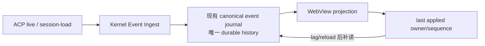

# Pylon Kernel 加固施工台账

> 最新完成（2026-08-21）：`WI-A5 / AGT-010、SES-010、OBS-004`——Agent client 代际与远端 Session 连续性已拆分为 `Preserved / Invalidated / Unknown`；未知连续性在共享 30 秒上限内以最多 4 路 `session/load` 探测收敛为 Attached/Detached，探测期与失联后的通知、发送均由 Kernel 门禁拒绝。远端 session missing 改用结构化 RPC 分类并清理幽灵映射；状态快照只暴露 agent/source/health/reason 等安全元数据，前端锁定发送并仅允许用户显式重试或分叉。Rust 20 项定向回归、TS 39 项定向回归、Rust check/format 与全项目 TS build 通过。下一项 `WI-P1`。
>
> 长程目标：在保留现有五个第一方 Product Plugin 构造的前提下，持续加固 Pylon Kernel 的持久化、重放、生命周期、Agent Runtime、插件故障隔离和结构化错误。  
> 基线提交：`a38145b chore: establish kernel hardening baseline`  
> 开工日期：2026-08-19  
> 工作方式：不使用子 Agent；先读 [`Pylon-项目架构参考.md`](Pylon-项目架构参考.md)，只做目标调用链的定向核验。  
> 状态标记：`待施工`、`施工中`、`待决策`、`待验证`、`已完成`、`暂缓`。

## 1. 施工目标

1. SQLite 在 Tauri 桌面模式下成为唯一持久化权威。
2. Kernel 收到的用户可见事件不因 WebView 生命周期、广播 lag、revision conflict 或关闭竞态而静默丢失。
3. Session identity、state、canonical event 和 tombstone 使用一致的 owner 语义。
4. 重放深化现有 canonical event journal，不另建历史中心或平行存储。
5. Kernel 启动、持久化和插件激活具备可观察的 readiness、degraded、retry 和 Safe Mode 状态。
6. Agent Runtime 的发现、身份判断、ACP 验证、配置存储和 live activation 状态彼此可区分。
7. 错误保留稳定机器码、上下文、可重试性和恢复动作。
8. 每个跨层 invariant 都由跨层回归测试覆盖。

## 2. 已确认产品决策

| ID | 决策结论 | 实施含义 |
|---|---|---|
| D1 | SQLite canonical events 是本地历史权威 | Agent replay 只能补充/校验同一 journal，不能覆盖或建立平行历史 |
| D2 | 用户可见事件采用 at-least-once durable | 使用稳定 event ID/sequence 去重；所有失败可见且可恢复 |
| D3 | durable owner 为 `(profileId, agentId, localSessionId)` | remote ACP session ID 仅为可变化映射 |
| D4 | 当前 Kernel 单写者 | 仍实现 revision conflict 重读、重排、重试，不丢 batch |
| D5 | `session/load` 失败不自动 fork | 保留原绑定，用户明确选择重试或创建分叉 Session |
| D6 | replay 必须暴露完整性 | 返回 complete/truncated/droppedCount/boundary；超限保留最近事件 |
| D7 | 每种运行模式只保留一个权威 | Tauri：SQLite 唯一权威；localStorage 仅是带 revision 的非权威缓存，不得反向覆盖。Browser：localStorage adapter 是该模式的单一权威 |
| D8 | 损坏/迁移先保护数据 | schema manifest + quick_check；备份、隔离、只读恢复；禁止无 backfill/备份的破坏性迁移 |
| D9 | Agent 配置修改后 pending restart | 存储状态与 live activation 状态分开；用户明确重启 |
| D10 | `agents.yaml` 是应用管理的数据文件 | 应用运行时使用 CAS、原子替换、`.bak`；不承诺保留注释/排版 |
| D11 | 身份置信度与 ACP 可用性分开 | `identityConfidence` 与 `validationStatus` 独立；只有 initialize 成功才是已验证可用 |
| D12 | 未声明连续性的 Agent 重连后逐 Session 验证 | 失败标记 detached；只有可证明未送达或有幂等键时自动重试 Prompt |
| D13 | 无稳定消息 ID 时宁可重复，不误删 | role+content 不作为普通消息的强去重依据 |
| D14 | 先收紧 ownership/interface/tests | 不先大规模搬目录；canonical persistence 前移 Rust Kernel |
| D15 | kernel-critical 插件不可普通停用 | shell 等失败进入 Safe Mode；依赖规则由 Plugin Host 执行 |
| D16 | 第三方插件是完全可信本机代码 | 不建设权限沙箱或安全 capability 限制；仍保留故障隔离、生命周期清理和兼容性检查 |
| D17 | manifest dependencies/conflicts 是硬契约 | 安装、启用、停用和更新均执行依赖/冲突检查 |

## 3. 新重放模型约束

重放设计必须满足“不能另立中央”：

- 继续使用现有 `canonical_events`、owner key、revision、sequence、tombstone 和 EventRepo。
- ACP live event 与 `session/load` replay 都是同一 ingest interface 的输入来源。
- Kernel 完成 normalize、identity、append 后再向 WebView 发布 committed event。
- WebView 只维护 projection 和最后消费 cursor；广播 lag 后从同一 journal 补读。
- `session/load` 的职责是恢复 Agent remote context、发现 journal 缺失事件，不再充当 UI 历史权威。
- replay 事件只能通过同一 identity/deduplication/append transaction 进入 journal。
- 不新增第二张历史表、第二个 event store 或另一套 revision 体系。

## 4. 源代码地图

| 施工域 | TypeScript 入口 | Rust 入口 | 主要测试 |
|---|---|---|---|
| Kernel 启动 | `main.tsx` → `kernel/KernelRoot.tsx` → `pluginCompositionRoot.ts` → `App.tsx` | `src-tauri/src/lib.rs` setup | `src/kernel/__tests__`、bootstrap tests |
| canonical ingest | `components/chat/chatEventController.ts` → `infrastructure/events/canonicalEventSink.ts` → scheduler/repository | `dispatcher/mod.rs` → Tauri event commands → `session/event_repo.rs` | `infrastructure/events/__tests__`、Rust event_repo tests |
| Session state/load | `components/chat/useSessionLifecycle.ts`、chat controller | `session/persist.rs`、`msg_repo.rs`、`acp/replay.rs` | chat replay/session tests、Rust persist/replay tests |
| Profile/Session metadata | `identityStore.ts` → `userDataRepository.ts` | `session/user_data.rs` | identity/userData tests |
| Agent config | `AgentRuntimePanel.tsx` → `infrastructure/acp/agentClient.ts` | `lifecycle/mod.rs` → `agent_config.rs` | panel、typed client、Rust agent_config tests |
| Agent detection | `AgentRuntimePanel.tsx`、`domains/agent` | `src-tauri/src/agent_detection.rs` → `pylon-core/agent_detection.rs` | candidate tests、pylon-core tests |
| Agent lifecycle | runtime/identity consumers | `lifecycle/mod.rs`、`agent_runtime.rs`、`dispatcher/mod.rs` | lifecycle/runtime/session tests |
| Plugin host | `plugin-runtime/*`、`plugins/product/*` | `plugin_cmds.rs`、`plugin_process/*` | plugin-runtime/package/process tests |

## 5. 问题台账

### 5.1 持久化与重放

| ID | 状态 | 问题 | 验收标准 |
|---|---|---|---|
| KER-001 | 已完成 | `session_state` 写 local source、读 remote periId | owner 类型化；真实 `source != periId` 跨层恢复测试通过 |
| KER-002 | 已完成 | live/prompt/replay 曾分散在不同写入与恢复路径 | live/prompt 逐行提交；空 journal 导入；partial journal 追加 `history.snapshot` 对账，不覆盖旧行、不建立平行历史 |
| KER-003 | 已完成 | 三个 SQLite module 异步初始化导致启动竞态 | readiness barrier/state；启动立即读写最终收敛 |
| KER-004 | 已完成 | canonical revision conflict 丢弃 pending batch | 重读 revision、重排 sequence、重试；原 batch 不丢 |
| KER-005 | 已完成 | seed 瞬时失败永久禁用 owner | retryable 错误退避恢复；terminal 错误可诊断 |
| KER-006 | 已完成 | `flushAllAsync` 不是稳定 drain | flush 期间新增 dirty batch 也完成后才 resolve |
| KER-007 | 已完成 | 关闭未等待 identity backend | canonical + identity 统一 drain；失败/超时阻止无提示退出 |
| KER-008 | 已完成 | user-data conflict 丢最后一次 mutation | 基于唯一 SQLite 权威重读并重新应用或进入明确 unsynced |
| KER-009 | 已完成 | localStorage fallback 可覆盖较新 SQLite | Tauri load/save 失败进入 degraded-readonly；mutation 被拒；权威重读清失败 pending；仅空库允许 CAS=0 冷启动导入 |
| KER-010 | 已完成 | replay timeout 可被无关广播无限续期 | 使用绝对 deadline；无关事件洪泛仍按总预算结束 |
| KER-011 | 已完成 | replay 超限无完整性 metadata | complete/truncated/droppedCount/boundary 穿透到 UI |
| KER-012 | 已完成 | partial canonical 可压过更完整 replay，loading live event 可丢 | 最新完整 snapshot 建立有效投影；旧行按多重集去重且未匹配证据保留；load race committed row 恰好补应用一次 |
| KER-013 | 已完成 | v9 migration 直接删除 legacy message tables | v11 对可证明基础消息写同 journal snapshot；所有旧表改名取证归档；冲突/失败整事务回滚 |
| KER-014 | 已完成 | canonical JSON 损坏被静默归一为空值 | `event_repo_corrupt` 携带 event/column/size context；`evt_export_raw` 可不解析地隔离导出原始列 |
| KER-015 | 已完成 | 迟到 session-state write 可绕过 tombstone | 所有 Session 写统一 tombstone gate |
| KER-016 | 已完成 | schema version 足够时不验证实际 schema/integrity | startup `quick_check(1)`；table/column/index manifest；future-version fail closed，稳定错误码 |
| KER-017 | 已完成 | load 失败自动创建新 remote Session | UI 提供明确重试/分叉操作，不改变原绑定 |
| KER-018 | 已完成 | role+content fallback 可能误合并合法重复消息 | 仅 capability=supported 的外部 message/event/turn/toolCall identity 可去重；无 identity 的同正文全部保留 |
| KER-019 | 已完成 | `deleted_sessions` 仍以裸 source 为主键，多 owner 同 source 的 tombstone 会碰撞 | v12 原表升级为 owner_key 主键；exact/legacy scope；v11 forensic archive；冲突整事务回滚；begin/finalize 同 owner |

### 5.2 Agent Runtime 检测与配置

| ID | 状态 | 问题 | 验收标准 |
|---|---|---|---|
| AGT-001 | 已完成 | `agent_create` 前端发送整份 document，Rust 期望单 Agent node | typed client 发送结构化 node；初始化 whole document 单独处理；TS/Rust tests 通过 |
| AGT-002 | 已完成 | UI 手拼 YAML，特殊字符可破坏结构 | UI 传 DTO；Rust 负责序列化；特殊字符 round-trip |
| AGT-003 | 待施工 | args 以空白切割，不能表达 quoted/spaced 参数 | 使用数组编辑器；effective invocation 可预览与验证 |
| AGT-004 | 待施工 | high confidence 混合身份与协议可用性 | 两个独立字段与 UI 状态；伪造 version 不能显示已验证 |
| AGT-005 | 待施工 | 首个 alias 命中后遮蔽后续有效 alias | 返回所有候选并排序；stale-first 测试 |
| AGT-006 | 待施工 | version timeout 不终止子进程 | timeout 后杀 process tree；无泄漏测试 |
| AGT-007 | 待施工 | discovery 阻塞扫描且缺总预算/并发限制 | blocking pool、总预算、候选/并发上限、逐 detector diagnostics |
| AGT-008 | 待施工 | unknown detector 静默返回空 | 返回结构化 unknown_detector_id diagnostic |
| AGT-009 | 待施工 | active Agent 配置保存后仍运行旧进程 | Stored/PendingRestart/Activated 状态明确；重启操作与测试 |
| AGT-010 | 待施工 | 配置写入无跨进程 CAS/备份 | hash/generation CAS、`.bak`、原子替换、冲突错误 |
| AGT-011 | 待施工 | connection test 通过字符串判断失败阶段 | preflight/spawn/initialize/capability 类型化错误 |
| AGT-012 | 待施工 | 配置数值缺合理 hard max | timeout/attachment/replay 等 hard max + warning threshold |
| AGT-013 | 待施工 | runtime 重启后 ghost remote session mapping | Unknown continuity 逐 Session probe，失败 detached |

### 5.3 Plugin Host 与 Kernel 生命周期

| ID | 状态 | 问题 | 验收标准 |
|---|---|---|---|
| PLG-001 | 待施工 | 内置插件在 Recovery UI 前同步激活 | Kernel 先可见；单插件失败进入 degraded/Safe Mode |
| PLG-002 | 待施工 | shell 可停用但现有恢复按钮无法重新激活 | kernel-critical 不可普通停用；Safe Mode 可恢复 |
| PLG-003 | 待施工 | dependencies/conflicts/activation events 未执行 | Plugin Host 对安装、启停、更新执行硬契约 |
| PLG-004 | 待施工 | cleanup 失败被显示为停用成功 | partial cleanup 状态、残留资源和恢复动作可见 |
| PLG-005 | 待施工 | Kernel/plugin-runtime 双向依赖和 ESM ordering | 显式 bootstrap seam；删除 side-effect ordering 依赖 |
| PLG-006 | 待施工 | Product Shell 跨插件直调 implementation | 通过稳定 contribution/interface 调用，保留五包构造 |
| PLG-007 | 待施工 | Hook disable-plugin 未真正停用插件 | failure policy 与 PluginRuntime 状态一致 |
| PLG-008 | 待施工 | `disposeNow` 异步 cleanup 错误可能迟到 | dispose result 在上报前稳定收敛或明确 pending |

第三方插件已被产品定义为完全可信代码，因此不创建权限沙箱或安全 capability 项目；其故障隔离、资源清理、依赖兼容和错误诊断仍属于本台账范围。

## 6. 施工阶段

| 阶段 | 状态 | 范围 | 完成条件 |
|---|---|---|---|
| Phase 0 | 已完成 | 全量审计、架构参考、基线提交、产品决策 | `a38145b` + D1–D17 |
| Phase 1 | 施工中 | 配置契约与现有持久化链确定性缺陷 | AGT-001/002、KER-001/003–011/015–018 中不依赖新 ingest 的项目完成 |
| Phase 2 | 已完成 | 新重放模型与 Kernel Event Ingest | KER-002/012：journal 是唯一历史权威，lag 可补读，partial history 可 append-only 对账 |
| Phase 3 | 待施工 | Agent detection、pending restart、重连连续性 | AGT-003–013 |
| Phase 4 | 待施工 | Kernel bootstrap supervisor 与 Plugin Host 硬契约 | PLG-001–008 |
| Phase 5 | 待施工 | corruption recovery、迁移演练、全链路验收 | KER-013/014/016/019，check:all 与故障注入矩阵 |

## 7. 施工切片

### Slice 1：结构化 Agent 创建契约

- 状态：`已完成`
- 问题：AGT-001、AGT-002
- 修改范围：
  - `src/infrastructure/acp/agentClient.ts`
  - `src/components/settings/AgentRuntimePanel.tsx`
  - `src/cli/pylonCliDomainPorts.ts`
  - `src-tauri/src/lifecycle/mod.rs`
  - `src-tauri/src/agent_config.rs`
- 验收：
  - `agent_create` 只接收单 Agent 的结构化 DTO。
  - `initialize_agents_config` 继续接收完整 document 或字段 patch，两种语义不混用。
  - name/exe/provider/args 中特殊字符可安全 round-trip。
  - external config 与 embedded initialization 两条路径都有测试。

### Slice 2：关闭前稳定持久化 drain

- 状态：`已完成`
- 问题：KER-006、KER-007、KER-008
- 修改范围：canonical scheduler、UserDataRepository、App window lifecycle。
- 结果：
  - canonical drain 等待期间产生的续写批次。
  - canonical/identity 最终失败均向关闭流程传播，窗口保持打开并进入 Error Center。
  - 关闭总预算 15 秒，超时返回 `persistence_drain_timeout`。
  - user-data 失败保留 latest pending；revision conflict 刷新 baseline 后由 flush 重试。

### Slice 3：canonical seed/conflict 自愈

- 状态：`已完成`
- 问题：KER-004、KER-005
- 结果：
  - 首次 seed 和 conflict reseed 都显式写入 scheduler revision baseline。
  - seed 瞬时失败保留 raw queue，以指数退避重试；关闭时立即再试并传播失败。
  - revision conflict 保留全部 pending，在现有 journal revision 上整体 rebase 后重试。
  - `event_invalid` 与 tombstone 仍保持 terminal，避免无效事件无限循环。

### Slice 4：Replay 绝对 deadline

- 状态：`已完成`
- 问题：KER-010
- 结果：`session/load` 使用单一绝对 deadline；持续到达的无关广播不能延长总等待预算。

### Slice 5：Session state tombstone gate

- 状态：`已完成`
- 问题：KER-015
- 结果：`set_session_state` 与 `touch_session` 共用 tombstone gate；迟到 usage/commands 写不能复活已删除 Session。

### Slice 6：Durable Session Owner

- 状态：`已完成`
- 问题：KER-001
- 结果：
  - TypeScript/Rust 共用 `(profileId, agentId, localSessionId)` 三元组 interface；remote session ID 只作为映射。
  - schema v10 新增 `session_state_snapshots`；canonical journal 仍是唯一历史，没有新增事件中心。
  - v9 legacy state 仅在 journal 唯一证明 owner 时回填；歧义/无映射数据原样保留。
  - 同 source 的不同 Profile/Agent 状态隔离；exact-owner tombstone 只删除/阻断匹配快照。
  - state write 不再吞错，保留 `session_deleted` 等机器码并进入前端 Error Center。
  - 遗留限制：`deleted_sessions.session_id` 主键仍可能造成多 owner tombstone 碰撞，登记 KER-019，待带备份/回滚的原表迁移。

### Slice 7：Session load 显式恢复

- 状态：`已完成`
- 问题：KER-017
- 结果：
  - `session/load` 失败后不再隐式调用 `new_session`，原 Session 的 remote binding 与 canonical history 保持不变。
  - 失败 owner 进入 detached/send-blocked 状态，输入继续排队，不会误发到不可证明有效的旧 remote context。
  - UI 显式提供“重试恢复”与“创建分叉会话”；重试仍使用原 owner/binding。
  - 分叉建立新的本地 Session、`source` 与 creation snapshot，复用原 profile/agent/workspace/会话配置，再经既有新会话路径建立 remote binding；不建立第二个历史中心。

### Slice 8：Replay 完整性边界

- 状态：`已完成`
- 问题：KER-011
- 结果：
  - `session/load` 返回 `replayMetadata`：`complete/truncated/droppedCount/boundary`，response 是确定性结束边界。
  - boundary 记录本次 load 观察总数和 1-based 保留区间；超过上限时保留最近 N 条，不再静默保留最早 N 条。
  - 前端 typed client 校验元数据自洽性；缺失或矛盾元数据标记为 `metadata-unavailable`，绝不默认 complete。
  - 截断/不可验证状态穿透到 Chat UI 和无正文 trace；canonical journal 仍保留并显示为本地权威历史。
  - export 遇到截断 replay 返回 `replay_truncated`，拒绝生成伪完整文件。

### Slice 9：Kernel ingest owner 前置接线

- 状态：`已完成`
- 问题：KER-002（前置 seam，主问题仍施工中）
- 结果：
  - GUI 的 `new_session` 与 `send_message` 命令显式携带 `profileId`，与既有 `agentId/source` 组成完整 durable owner。
  - Rust runtime `SessionInfo` 保存已证明的 Profile 绑定；同 source 首次绑定与重复绑定幂等，跨 Profile 换绑返回 protocol error 且保留旧 owner。
  - `session/load` 恢复 runtime 时从命令的完整 owner 写入 Profile 绑定，remote `periId` 不参与 durable identity。
  - 平台自动会话维持 `profileId=None`；dispatcher 不得猜测 active/default Profile，后续只能对可证明 owner 进入 canonical ingest。

### Slice 10：SQLite readiness barrier

- 状态：`已完成`
- 问题：KER-003
- 结果：
  - message、user-data、canonical-event 三个 service 作为同一启动单元，串行完成目录创建、schema migration 与连接打开。
  - `setup` 返回前一次性安装三个 service；command 与 dispatcher 不再观察到生产环境的临时 `None` 槽位。
  - 任一 service 打开失败会携带具体阶段阻止 Kernel 启动，不运行 event 可用但 user-data 不可用的半初始化应用。
  - 不回退 localStorage，不引入第二 SQLite 文件或备用 history authority。

### Slice 11：Kernel-owned ACP live ingest

- 状态：`已完成`
- 问题：KER-002（ACP live 子路径；prompt user/terminal 与 cursor 补读仍施工中）
- 结果：
  - `EventRepo` 在单一 SQLite transaction 内读取 owner revision、分配下一 sequence、normalize 并 append；不持有第二份 sequence 状态。
  - Rust normalizer 对齐 EVT-01 的 event type、identity alias、tool/text/error typed payload；unknown/malformed raw 永久保留。
  - 有可证明 durable owner 的 live ACP update 只有 append 成功后才向 WebView/gateway 发布，并附带 committed canonical row。
  - WebView 收到 committed row 后只更新 projection/插件事件，不再把同一 raw offer 给旧 sink；过渡期 legacy mock/Browser 路径仍兼容无 committed row 的事件。
  - 平台自动会话不猜 Profile、不写 GUI journal；append 失败记录稳定 `EventError.code` 且不发布未持久化事件。

### Slice 12：Kernel-owned prompt user/success ingest

- 状态：`已完成`
- 问题：KER-002（prompt 正常路径；失败终态与 cursor 补读仍施工中）
- 结果：
  - GUI prompt 在 runtime mapping 建立后，通过同一 `EventService.ingest_event` 写入 `user.message`；ACP user echo 不重复入库。
  - 成功 response 在 `pylon:done` 发布前写入 `turn.completed`，并把 committed row 随事件交给 projection。
  - prompt ingest 的 `EventError` 在 `PylonError` 中保留原机器码，不降级为泛化 `protocol_error`。
  - WebView 对 committed user/done 只投影与发布插件事件；Tauri 乐观消息标记为未确认 projection，不再提前建立第二 sequence。
  - fake ACP 跨层测试确认同 owner 的一轮 prompt 形成连续 `user.message #1`、`turn.completed #2`。

### Slice 13：Kernel-owned prompt failure ingest

- 状态：`已完成`
- 问题：KER-002（prompt 终态子路径；ACP 无损入口与 cursor 补读仍施工中）
- 结果：
  - prompt 的所有失败出口统一汇入 `publish_prompt_failure`，不再由六个分支各自发布不可恢复的 `pylon:error`。
  - GUI owner 的 `turn.failed` 经同一 `EventService.ingest_event` 提交后才发布，事件同时携带稳定 Kernel error code 与 committed canonical row。
  - 即使 remote mapping 尚未建立，也使用命令已声明且通过校验的 durable owner 记录失败；不创建 remote Session，不建立第二 history authority。
  - failure append 失败时返回持久化错误并禁止发布未落库终态；平台自动会话维持无 Profile 的非 journal 路径。
  - fake ACP 跨层测试确认失败轮次形成连续 `user.message #1`、`turn.failed #2`；WebView 对 committed error 只投影、不二写。

### Slice 14：ACP Kernel notification 无损入口

- 状态：`已完成`
- 问题：KER-002（transport/dispatcher 子路径；replay ingest 与 WebView cursor 补读仍施工中）
- 结果：
  - ACP transport 为 Kernel notification 增加 4096 条启动突发缓冲的 bounded single-consumer inbox；队列持续饱和时反压 stdout reader，不再 `Lagged` 后静默越过未落库事件。
  - dispatcher 独占消费该 inbox；broadcast 继续服务 replay/RPC observer，但不再是 durable ingest source，未新增 journal 或 sequence authority。
  - RPC response 绕过 notification inbox，仍由 pending registry 结算；session update、permission、unknown notification 与带精确 reason 的 crash 保持原顺序进入 dispatcher。
  - 回归测试以 4 条 broadcast 容量制造确定性 lag，证明 inbox 仍连续收到 64 条通知；既有 flood-crash、ACP 72 项、dispatcher 6 项与 B11 跨层 10 项通过。

### Slice 15：WebView committed cursor 与 gap recovery

- 状态：`已完成`
- 问题：KER-002（projection/cursor 子路径；session/load replay ingest 仍施工中）
- 结果：
  - `CanonicalEventCursor` 按 durable owner 串行消费 committed row，隐藏分页、锁、duplicate suppression 与 partial failure ordering，调用方只提供 projection consumer。
  - sequence gap 通过现有 `evt_list` 从同一 SQLite journal 定向补读；不新增 forward journal、缓存数据库或 sequence authority。
  - cursor 仅在每条 projection 成功后推进；缺页、owner 串线、非法 eventId 或不推进的损坏分页均返回稳定错误并保留可重试位置。
  - canonical 首屏加载会 seed 已投影 revision；会话 prune/delete 同时清理 cursor。恢复事件与当前通知在 owner queue 内严格有序，重复通知不再重复投影或重复发布插件事件。
  - 回归测试覆盖并发通知、重复投递、gap 补读、不完整 range、畸形 committed row，以及 `#1 →（丢 #2）→ #3` 的 controller 跨层恢复。

### Slice 16：完整 replay 首次导入单一 Kernel journal

- 状态：`已完成`
- 问题：KER-002/KER-012（empty journal 子路径；partial journal reconciliation 仍施工中）
- 结果：
  - `session/load` replay 完整且 owner journal 为空时，经既有 normalize + `append_events(expected_revision=0)` 在一个 SQLite transaction 内导入；sequence 仍只由 canonical journal 持有。
  - 已存在或并发先写入的 canonical history 获胜，replay 返回 `already-present` 且不覆盖；截断/不可验证 replay 返回 `incomplete-not-imported`，不把 partial history 固化成伪完整权威。
  - replay user prompt 的 persona 分隔前缀只在 typed projection 中剥离，原始 ACP payload 与 replay import 标记完整保留用于取证。
  - load result 返回 `canonicalRevision` 与 `replayJournalStatus`；WebView 在 replay snapshot 提交前 seed cursor，避免导入后的首条 live event 再次补读并重复投影历史。
  - journal、持久状态读取或 runtime generation 应用失败都会恢复 load 前的 session slot；持久状态错误保留 `MessageError` 的稳定机器码，不再降级为 `protocol_error`。
  - EventRepo 与 fake ACP 跨层测试确认完整 replay 形成连续 `user.message #1`、`assistant.text.delta #2`，重复导入保持 revision 2。

### Slice 17：partial journal 的 append-only replay reconciliation

- 状态：`已完成`
- 问题：KER-002/KER-012
- 结果：
  - 已有 canonical rows 永不覆盖；完整 replay 追加一个版本化 `history.snapshot` canonical event，原始 replay 与 `baseRevision` 留在同一 `canonical_events` journal。
  - 相同 replay 与首次逐行导入可幂等识别，不因每次恢复重复追加 snapshot；replay 变化时新 snapshot 只消耗一个 owner sequence。
  - 有效 projection 以最新可解析 snapshot 为完整 remote baseline；snapshot 前旧行按 event type/identity/typed payload 多重集消重，无法证明重复的行作为本地证据保留，snapshot 后 live rows 继续按序应用。
  - `session/load` 返回后重新读取同一 journal，再原子提交 canonical projection；读取窗口之后竞争到达的 committed rows 按 sequence 补应用，legacy 无 committed row 路径保持兼容。
  - 损坏/未知 snapshot 不冒充完整基线：projection 回退更早有效 snapshot 或普通 canonical rows；第三方 projector 收到同一有效流，不需要理解 Kernel 对账细节。

### Slice 18：SQLite schema/integrity 与 canonical corruption fail-closed

- 状态：`已完成`
- 问题：KER-014/KER-016
- 结果：
  - 每次打开共享数据库先执行 `PRAGMA quick_check(1)`；非数据库/损坏镜像返回 `database_integrity_failed`，readiness barrier 不安装半可用 service。
  - 当前版本也必须通过 table/column/index manifest；缺表、缺列、缺索引返回 `database_schema_invalid`，不再因 `user_version` 足够而跳过验证。
  - 高于当前 Kernel 的 future schema 返回 `database_future_schema`，不执行 downgrade DDL、不修改数据库。
  - canonical `identity`、`typed_payload`、`raw_payload` 任一 JSON 损坏都返回 `event_repo_corrupt`，错误只含 event id、column、byte size，不泄漏 payload，也不再静默变成 null/none。
  - `evt_export_raw(eventId)` 从同一仓库直接导出该行原始 JSON 文本，绕过 decoder，便于隔离取证；普通 list/projection 继续 fail closed。

### Slice 19：legacy message 非破坏迁移

- 状态：`已完成`
- 问题：KER-013
- 结果：
  - schema v11 不再 `DROP` v8 `messages/send_attempts/message_migrations`；三表在同一迁移事务内改名为 `legacy_*_v8_archive`，源行逐字保留供取证。
  - 只有 canonical journal 能唯一证明 durable owner，且角色可无损映射为 user/assistant/reasoning 时，才把旧消息写成同一 owner journal 的版本化 `history.snapshot`；不猜 owner，不另立历史中心。
  - 无 owner、owner 歧义或含不可无损映射角色的会话只归档，并在 `legacy_message_backfill_audit` 记录机器可查状态、原因、数量和 owner 证据。
  - archive 名冲突、schema 异常或写后计数验证失败均使 schema、backfill、audit、rename 与 `user_version` 一起回滚；不会留下半迁移数据库。

### Slice 20：Identity 单一权威与只读降级

- 状态：`已完成`
- 问题：KER-009
- 结果：
  - Tauri 模式的 Profile/Session `load` 失败时只用 localStorage cache 展示，并进入逐域 `degraded-readonly`；所有对应 mutation、导入和 owner resolution 均被拒，陈旧 cache 不可能触发后端 save。
  - 用户重试 hydration 时，repository 在读取 SQLite 前清除失败写留下的全量 pending/lastError；权威回读覆盖内存和 cache，后续 close/flush 不会重放旧快照。
  - SQLite 明确返回无行时，才允许以 revision 0 为 expected 的冷启动导入；并发 writer 造成 CAS conflict 时转入只读恢复，不覆盖较新 revision。
  - localStorage cache 另存逐域 `{revision,state=clean|pending|stale}` 元数据；写入 pending、提交 clean、故障 stale，始终明确其非权威身份。

### Slice 21：Replay identity 去重证据收口

- 状态：`已完成（基线既有实现，本切片补台账）`
- 问题：KER-018
- 结果：
  - `reconcileIngressMessages` 只接受 ACP payload 实际声明为 supported 的 message/event/turn/toolCall identity；不从 role、content、sender 或重建后的本地 id 推断同一性。
  - 无 identity 的相同正文、跨回合重复正文与无 toolCallId 的工具行全部保留；明确 identity 相同才去重。
  - 实现来源为基线前 `8b17ed1`/`435a077`；本轮复跑 message identity、replay E2E、事件不变量与 tool fallback 回归确认未退化。

### Slice 22：Owner-keyed tombstone 与删除 wire 对齐

- 状态：`已完成`
- 问题：KER-019
- 结果：
  - schema v12 将唯一活动 `deleted_sessions` 原表升级为 `owner_key` 主键，`session_id` 降为 legacy/诊断索引；同 metadata id/source 的不同 durable owner 可各自幂等存在，未建立第二套 tombstone。
  - v11 源表事务内改名为 `deleted_sessions_v11_archive` 并逐行验证计数；legacy 哨兵转换为唯一 `['*','*',session_id]` + `owner_scope=legacy`，无法证明唯一 owner 时保守 gate 同 source 所有 owner。
  - exact tombstone 只 gate 匹配 owner；另一个 Profile/Agent 即使 source 相同也可继续写。schema manifest 额外验证主键确为 `owner_key`，owner 冲突、archive 冲突或回填失败均完整回滚。
  - 修正删除 wire：begin、canonical discard 与 finalize 统一使用 `(profileId, agentId, Session.source)`；`Session.id` 仅用于 metadata record 删除，不再伪装成 runtime/canonical localSessionId。

## 8. 施工日志

| 日期 | 变更 | 测试 | 提交 | 结果 |
|---|---|---|---|---|
| 2026-08-19 | 建立代码与文档基线 | 审计阶段目标测试通过 | `a38145b` | 已完成 |
| 2026-08-19 | 确认 D1–D17；建立长程台账 | 文档结构与决策核验 | `docs: establish kernel hardening ledger`（随 Slice 1） | 已完成 |
| 2026-08-19 | Slice 1：结构化 Agent create/initialize 契约，移除 UI/CLI YAML 拼接 | Vitest 18；TS build；Rust agent_config 52 | `fix: harden structured agent config creation` | 已完成 |
| 2026-08-20 | Slice 2：canonical + identity 稳定 drain、失败传播、15s timeout、user-data pending retry | Vitest 47；production build | `fix: make persistence shutdown drain reliable` | 已完成 |
| 2026-08-20 | Slice 3：canonical seed retry 与 revision-conflict 保批 rebase | event scheduler/sink tests；TS build | `fix: recover canonical persistence without dropping batches` | 已完成 |
| 2026-08-20 | Slice 4：Replay 绝对 deadline | Rust replay noise-flood regression | `fix: enforce an absolute replay deadline` | 已完成 |
| 2026-08-20 | Slice 5：Session state tombstone gate | Rust msg_repo state resurrection regression | `fix: reject state writes after session deletion` | 已完成 |
| 2026-08-20 | Slice 6：Durable Session Owner + schema v10 可证明迁移 | Rust lib 788 passed/4 ignored；定向 Vitest 47；production build；全量 frontend 1517 passed/4 legacy groups + 1 并发 flaky（单测复跑通过） | `fix: unify durable session ownership` | 已完成 |
| 2026-08-20 | Slice 7：load 失败显式重试/独立分叉，失败 owner 阻止发送 | 定向 Vitest 39；ESLint；production build | `fix: require explicit session recovery choice` | 已完成 |
| 2026-08-20 | Slice 8：replay 完整性 metadata、最近窗口与截断导出保护 | Rust lib 788 passed/4 ignored；定向 Vitest 30；ESLint；production build | `fix: expose replay completeness boundaries` | 已完成 |
| 2026-08-20 | Slice 9：durable owner 穿透 GUI command 与 Rust runtime，为 Kernel ingest 建立可证明 owner seam | Rust model/owner tests；typed client/runtime Vitest；ESLint；production build | `refactor: carry durable owner into runtime sessions` | 已完成 |
| 2026-08-20 | Slice 10：三个 SQLite service 启动 barrier 与 fail-fast 安装 | Rust bootstrap 2；cargo check | `fix: make persistence ready before kernel startup` | 已完成 |
| 2026-08-20 | Slice 11：ACP live update 事务内 sequence/normalize/append，committed 后发布，WebView 禁止二写 | Rust ingest 4 + cargo check；定向 Vitest 26；ESLint；production build | `feat: persist live agent events before publishing` | 已完成 |
| 2026-08-20 | Slice 12：prompt user/success 进入同一 Kernel ingest，ACP user echo 去重 | Rust fake-ACP cross-layer 1 + B11 8 + error 3；定向 Vitest 14；ESLint；production build | `feat: persist prompt boundaries in kernel journal` | 已完成 |
| 2026-08-20 | Slice 13：prompt failure 统一进入 Kernel journal，提交后才发布结构化终态 | Rust B11 10 + event repo 15；定向 Vitest 9；ESLint；production build | `feat: commit prompt failures before publishing` | 已完成 |
| 2026-08-20 | Slice 14：ACP notification 使用 bounded single-consumer inbox，broadcast 不再承担 durable ingest | Rust ACP 72 + dispatcher 6 + B11 10；cargo check | `fix: make kernel notification ingest lossless` | 已完成 |
| 2026-08-20 | Slice 15：owner-scoped committed cursor、定向 gap 补读与有序 projection | 定向 Vitest 24；targeted ESLint；TypeScript build | `fix: recover canonical projection gaps by cursor` | 已完成 |
| 2026-08-20 | Slice 16：完整 session/load replay 仅在空 journal 时原子导入，partial replay 拒绝伪完整落库；失败恢复原 slot 并保留消息仓库错误码 | Rust EventRepo 1 + fake-ACP cross-layer 1 + error-code 2；定向 Vitest 21；targeted ESLint；TypeScript build | `feat: import complete replay into kernel journal` | 已完成 |
| 2026-08-20 | Slice 17：partial canonical + 完整 replay 追加 `history.snapshot` 对账；有效流去重保留证据；load race 补应用 | Rust EventRepo 2 + fake-ACP cross-layer 1；定向 Vitest 64；targeted ESLint；TypeScript build | `feat: reconcile replay inside canonical journal` | 已完成 |
| 2026-08-20 | Slice 18：startup quick_check + schema manifest + future-version guard；canonical JSON 损坏显式失败并支持单行 raw export | Rust 定向 7 + error-code 2；定向 Vitest 19；targeted ESLint；TypeScript build | `fix: fail closed on persistence corruption` | 已完成 |
| 2026-08-20 | Slice 19：v11 legacy message 可证明回填、全量取证归档与事务回滚 | Rust migration/schema 定向 7 | `fix: preserve legacy history during schema migration` | 已完成 |
| 2026-08-20 | Slice 20：Tauri Identity SQLite 单一权威、cache revision metadata、degraded-readonly 与权威重读 recovery boundary | 定向 Vitest 78；TypeScript build；targeted ESLint | `fix: prevent stale identity cache from overwriting sqlite` | 已完成 |
| 2026-08-20 | Slice 21：核验既有 ACP identity-only reconciliation，关闭漏登记 KER-018 | 定向 Vitest 36 | `docs: close replay identity dedup ledger gap` | 已完成 |
| 2026-08-20 | Slice 22：v12 owner-keyed tombstone、legacy scope/forensic archive、source-based delete/finalize wire | Rust tombstone/schema 定向 25；Vitest 10；TypeScript build；targeted ESLint | `fix: key session tombstones by durable owner` | 已完成 |

## 9. 每个切片的完成纪律

1. 先添加能复现问题的测试。
2. 只修改当前纵向调用链，不顺手迁移无关目录。
3. 运行目标测试、类型检查/编译，再按风险扩大验证。
4. 更新问题状态、施工日志和架构参考中的已知风险。
5. 一个可独立回滚的切片对应一个小提交。
6. 若发现新的产品语义分支，标记 `待决策` 并暂停该分支，不阻塞其他确定性施工。
