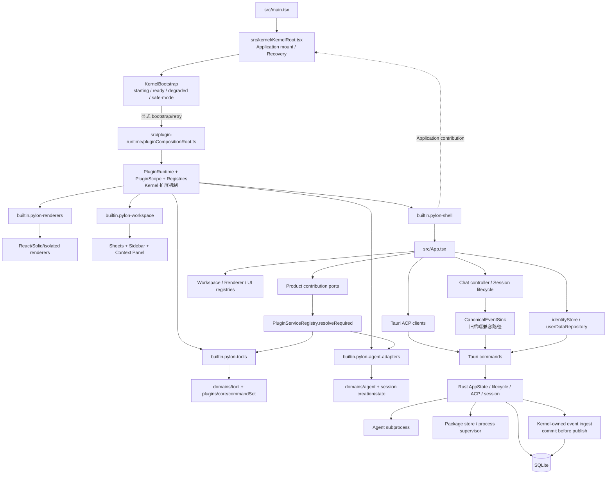
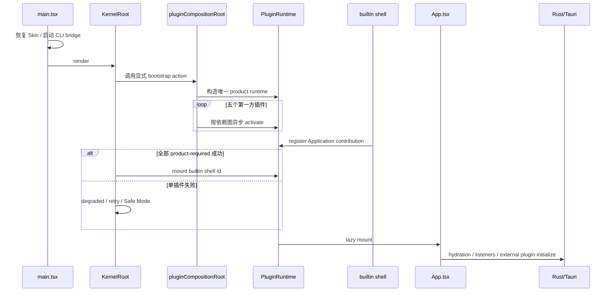
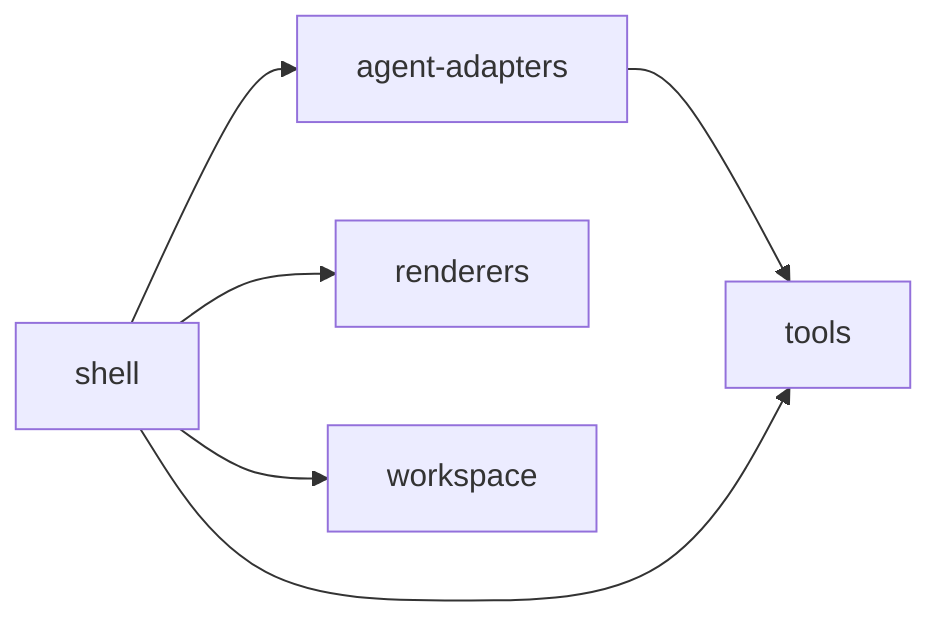
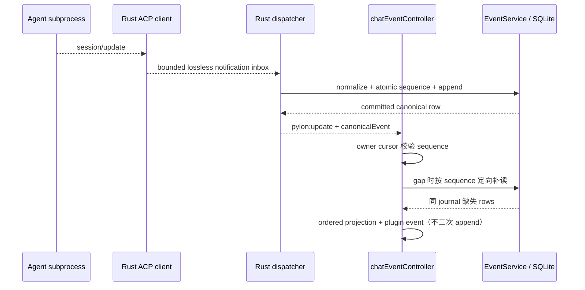
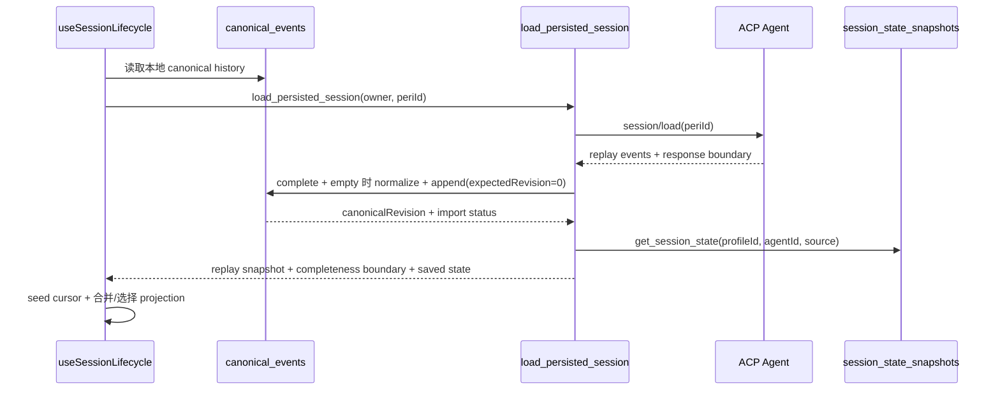
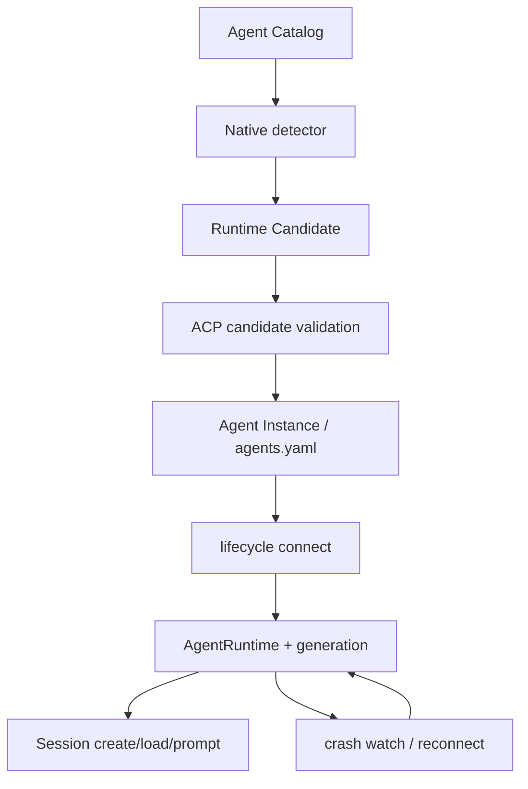
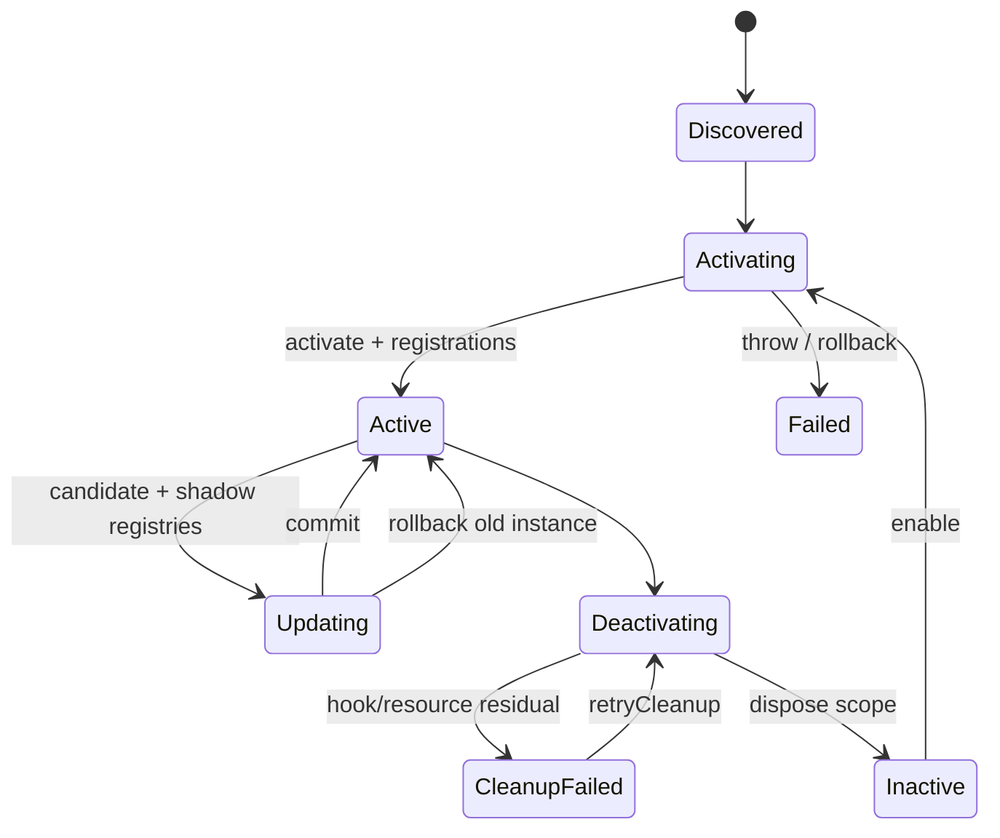

# Pylon 项目架构参考

> 状态：当前实现地图，不是目标架构承诺  
> 最后核验：2026-08-26
> 适用仓库：`prism-desktop`  
> 阅读规则：后续任务先读本文，再只核验涉及区域；除非命中“全量复核触发条件”，不要重新扫描整个仓库。

当前 Kernel 加固的决策、问题编号、施工阶段和进度见 [`Docs/Archive/Pylon-Kernel-施工台账.md`](../../Docs/Archive/Pylon-Kernel-施工台账.md)。

插件 Host、五个 Product Plugin、前端 registries/consumers、Tauri IPC、Rust Kernel、native package/process supervisor 与外部进程的细粒度依赖见 [`Pylon-插件化前后端拓扑全图.md`](Pylon-插件化前后端拓扑全图.md)。该图同时用虚线标出 Renderer Suite 施工规划，虚线不得视为当前实现。

## 1. 文档目的

本文固定 Pylon 当前代码的主要结构、运行时拓扑、数据流、Kernel 与插件层归属、关键 invariants、已知风险和测试入口。

本文将信息分为三类：

- **当前事实**：可以从现有代码直接确认的行为。
- **目标方向**：加固时推荐维持的 ownership 和依赖方向，尚不代表已经实现。
- **待决策**：必须由产品语义决定，不能由重构者擅自选择。

领域术语以仓库根目录的 [`CONTEXT.md`](../CONTEXT.md) 为准。本文使用的关键术语包括 Agent Catalog、Agent Profile、Agent Instance、Runtime Candidate、Presentation Profile、Renderer Engine 和 Workbench Renderer。

## 2. 一句话项目定位

Pylon 是通过 ACP 连接多个本地 Agent runtime 的桌面工作台。它以最小 Kernel 承载 Agent、Session、ACP、持久化、基础生命周期和插件运行环境，以第一方和第三方插件组合产品功能与界面。

## 3. 最重要的分层结论

不要把目录名直接等同于架构层级：

- `src/kernel` 目前主要实现 Application mount、recovery 和少量 Kernel UI，**不是完整的概念 Kernel**。
- `src/plugin-runtime` 是 **Kernel 的插件宿主与扩展机制**，不是业务插件层。
- `src/plugins/product` 是五个第一方 Product Plugin 的激活和依赖定义。
- `src/plugins/core` 是第一方 Product Plugin 使用的 implementation；虽然叫 `core`，但它不是 Kernel。
- Session、ACP、持久化与恢复的概念 Kernel implementation 目前跨越 React/TypeScript 和 Rust/Tauri 多个目录。
- `App.tsx` 仍承担大量 bootstrap、hydration、listener 和关闭收敛职责，因此当前 Product Shell 与概念 Kernel 之间并未完全分离。

## 4. 当前总体拓扑



虚线表示 Shell 通过稳定 Application contribution 被 Kernel mount，而不是业务层直接控制 Kernel。

## 5. 目录地图与 ownership

| 路径 | 当前职责 | 架构归属 | 修改前优先阅读 |
|---|---|---|---|
| `src/kernel` | Application runtime、mount、recovery | 物理 Kernel 壳 | `KernelRoot.tsx`、`applicationRuntime*.ts` |
| `src/plugin-runtime` | PluginRuntime、Scope、registries、shadow update、package runtime | Kernel 扩展机制 | `pluginCompositionRoot.ts`、`pluginRuntime.ts`、`pluginActivationContext.ts` |
| `src/plugins/product` | 第一方插件包定义、依赖拓扑、激活入口 | Product Plugin | `builtinProductPlugins.ts`、`packages/*` |
| `src/plugins/core` | 第一方插件的具体贡献 implementation | Product Plugin implementation | 按目标贡献定向阅读 |
| `src/components/chat` | UI projection、消息控制、Session load 协调 | 当前横跨 Product 与概念 Kernel | `chatEventController.ts`、`useSessionLifecycle.ts` |
| `src/identityStore.ts` | Profile/Session/Agent 前端状态与 hydration | 当前横跨 Product 与概念 Kernel | 同时阅读 `userDataRepository.ts` |
| `src/infrastructure/events` | canonical event 前端 repository/sink/scheduler | 当前概念 Kernel implementation | sink、scheduler、repository |
| `src/infrastructure/acp` | Tauri command typed clients | Adapter | 目标 command client 及测试 |
| `src/domains` | Agent、event、workspace、search 等领域逻辑 | Domain modules | 仅阅读目标 domain |
| `src/renderers` | Workbench Renderer 与 Solid implementation | Product Renderer | renderer contracts 与目标实现 |
| `src/sheets`、`src/workspace-sheets` | 产品工作区与 Sheet UI | Product Plugin/UI | 对应 Sheet 与 integration tests |
| `src-tauri/src/acp` | subprocess、JSON-RPC、transport、replay | Rust Kernel | `mod.rs`、`replay.rs`、`process.rs` |
| `src-tauri/src/session` | Session create/prompt/load/state、SQLite repos | Rust Kernel | `persist.rs`、`msg_repo.rs`、`event_repo.rs` |
| `src-tauri/src/lifecycle` | Agent connect/switch/reconnect/config transaction | Rust Kernel | `mod.rs` |
| `src-tauri/src/dispatcher` | ACP notification dispatch、runtime projection、reconnect | Rust Kernel，夹杂产品行为 | `mod.rs` |
| `src-tauri/pylon-core` | Agent Catalog、native detection、CLI client | 可复用 Kernel library | `agent_catalog.rs`、`agent_detection.rs` |
| `src-tauri/src/plugin_cmds.rs` | Native plugin package transaction/store | Kernel plugin adapter | stage/commit/recovery 代码 |
| `src-tauri/src/plugin_process` | 外置插件进程监督 | Kernel plugin adapter | process lifecycle 与 restart |

## 6. 前端启动序列



当前事实：Kernel recovery layer 先可见；第一方插件由 `KernelBootstrap` 显式启动。单插件失败进入可观察 degraded 状态，可定向 retry 或进入 Safe Mode，不再依赖 ESM import 副作用。

## 7. 第一方 Product Plugin 拓扑



| Product Plugin | 主要贡献 |
|---|---|
| `builtin.pylon-tools` | 平台命令、工具字典与工具相关能力 |
| `builtin.pylon-agent-adapters` | Agent Catalog/Detector、Session Creation、Session State provider |
| `builtin.pylon-renderers` | Renderer Engine、内容/工具 renderer、Presentation Profile、字体 |
| `builtin.pylon-workspace` | Workspace、Sidebar、Context Panel、Search、Export、Projector |
| `builtin.pylon-shell` | 根 Application、Shell commands、Shell CSS |

当前约束：尽量保留这五个包的构造。Kernel 加固优先通过稳定 seam、结构化状态和 adapter 收拢业务，不先做目录搬家。

## 8. Session 与 canonical event 数据流

### 8.1 当前实时路径



当前事实：具备完整 durable owner 的 ACP live update 与 prompt 的 user/success/failure boundary 由 Rust Kernel 在发布前写入现有 `canonical_events`；dispatcher 通过有背压的单消费者 inbox 无损摄取，WebView 以 owner cursor 消费 committed row 并从同一 journal 补 gap。完整 replay 在空 journal 时经同一 normalize/append transaction 逐行导入；已有 partial rows 时，缺失的 replay 事件会先迁移为带回放锚点的 canonical 行，再追加一个 `history.snapshot` 兼容 checkpoint。旧行不覆盖、未匹配证据不丢失，仍只有一个 journal 与 sequence authority；snapshot 不再是用户或 Agent transcript 的唯一持久化来源。

### 8.2 当前恢复路径



当前契约：会话状态以 `(profileId, agentId, source)` durable owner 写读；`periId` 只记录最近 remote binding，不参与 identity。旧 `sessions.session_state` 不再接受生产写入，v10 迁移仅在 canonical journal 能唯一证明 owner 时回填，歧义行原样保留。

GUI 创建、恢复和发送链路会把 `profileId` 送入 Rust runtime 的 `SessionInfo`。同一 runtime `source` 首次绑定 Profile 后不可换绑；dispatcher 后续只能从该绑定与 runtime `agentId` 构造完整 durable owner。平台自动会话没有 UI Profile，明确保持 `None`，禁止以 active/default Profile 猜测并误写 journal。

`session/load` 失败时不会自动创建 remote session，也不会改写原 binding。该 owner 转入 detached/send-blocked，UI 让用户明确选择：按原 owner/binding 重试，或创建具有新 local `id/source` 的独立 Session 分叉。分叉继续走既有 `new_session` seam，canonical journal 仍是唯一 durable history。

`session/load` 成功时携带 `replayMetadata`。`boundary.kind=session-load-response` 表示匹配的 load response 是收集终点；`observedCount` 与 1-based retained ordinals 描述实际窗口。超限保留最近 N 条并报告 `droppedCount`。前端遇到缺失/不自洽 metadata 时标成 `metadata-unavailable`，不会把 partial replay 当完整 snapshot；export 对 truncated replay 返回 `replay_truncated`。

### 8.3 Workbench 绑定与流式稳定性 seam

Workbench Renderer 的显示事实源是 `Workbench Runtime` 当前文档；`chatEventController` 保留为 ACP/legacy Adapter，向 Runtime 提供按 source 隔离的生成元数据，不拥有第二份渲染历史。Session metadata 更新（标题、`lastReplyAt`、`periId`、workspace 路径）不得被当作文档身份变化。`workbenchSessionBindingKey` 只由 `(session.id, source, agentId, profileId)` 构成，`agentWorkbenchSession.bind` 对同一 key 幂等；因此终态事件不会因 Zustand 产生新 Session 对象而替换整份文档。需要真正重载时，使用显式 session/reload token seam，而不是依赖对象引用。

### 8.4 当前本地存储

SQLite schema 当前包括：

- `sessions`：legacy 会话行；旧 state 只保留供可证明迁移/取证，不再是生产状态权威。
- `session_state_snapshots`：owner-keyed usage/commands 等可恢复快照；不是历史存储。
- `canonical_events`：owner-scoped canonical event stream。
- `legacy_message_backfill_audit`：v11 升级审计，仅记录旧 message 会话的回填/归档结论，不存第二份活动历史。
- `user_data`：Profile、Session metadata、active Profile 等 versioned envelope。
- `deleted_sessions`：v12 durable-owner keyed 删除 tombstone；`owner_scope=exact` 精确 gate，`legacy` 保守 gate 同 source；旧 v11 表仅作 forensic archive。
- `retention_policy`：保留策略。

Tauri 模式以 SQLite 为唯一权威；localStorage 只作带逐域 revision 与 `clean/pending/stale` 标记的非权威缓存。后端不可用时缓存仅供展示，Identity mutation 被阻断；重试会先清失败 pending，再以 SQLite 权威回读覆盖缓存。只有后端明确无行时才允许 expected revision 0 的冷启动导入。Browser 模式由 localStorage adapter 单独承担该模式权威。

## 9. Agent Runtime 生命周期



配置来源优先级：

1. 环境变量指定路径。
2. 可执行文件旁的 `agents.yaml`。
3. embedded 配置。

当前交互能力：Agent Runtime UI 使用参数数组编辑器并预览 effective invocation；发现报告把 identity confidence 与 ACP validation 分离。配置保存使用 revision CAS、`.bak` 和 hard max，并区分 Stored/PendingRestart/Activated；显式 restart 失败保留旧 generation，未知连续性逐 Session 有界 probe 后收敛为 attached/detached。

## 10. Plugin Runtime 生命周期



已有的可靠机制：

- registry entry 带 plugin/runtime ownership，可精确回收。
- `PluginScope` 以稳定 resource id 管理 listeners、timers、abort controllers 和 registration handles；逆序 dispose，成功项移除、失败 residual 可重试。
- shadow update 支持 validate、commit、revert 和批量发布。
- Native package store 有 staging、journal 和恢复流程。
- manifest dependency/conflict/activation event 由单一 resolver 执行，Runtime 与 package mutation 均有防线。
- Hook `disable-plugin` 接入唯一 PluginRuntime；cleanup 失败进入 `cleanup-failed` 并写 trace。
- Product Shell 通过 `AgentInstanceSink`/`ToolDictionarySink` contribution port 消费插件能力，静态 guard 禁止重新直调 `builtinPylon*` implementation。

当前约束：第三方插件按 D16 视为完全可信本机代码，不建设权限沙箱；故障隔离、资源清理、依赖兼容与诊断仍由 Kernel Plugin Host 负责。

### 插件架构验收基线（2026-08-21）

| 边界 | 当前权威与入口 | 回归护栏 |
|---|---|---|
| Runtime authority | `pluginCompositionRoot.ts` 中唯一 `PluginRuntime`；Kernel、package、Hook 均引用该实例 | 搜索生产源码不得出现第二个 `new PluginRuntime` |
| Kernel 启动 | `KernelRoot` → `KernelBootstrap` → `bootstrapBuiltins/retryBuiltinPlugin` | `kernelBootstrap.test.ts`、`builtinPluginBootstrap.test.ts` |
| Manifest 契约 | `pluginContractResolver.ts`；Runtime 与 package mutation 共同执行 | resolver/runtime/package tests |
| Cleanup | `PluginScope` stable resource id + awaited reverse dispose；`cleanup-failed` residual + `retryCleanup` | scope/instance/runtime/hook tests |
| Product 数据入口 | `productContributionPorts.ts` → `PluginServiceRegistry.resolveRequired` → Agent/Tool sink | port/sink tests + `check-product-contribution-boundary.mts` |
| 第一方包构造 | `builtinProductPlugins.ts` 保留五个粗粒度物理包及依赖排序 | `builtinProductPlugins.test.ts` + production artifact smoke |
| 第三方信任 | D16 完全信任本机代码；不设第二权限中心 | lifecycle/contract/cleanup 仍由同一 Host 执行 |

本基线定向验证为 13 个测试文件、79/79；静态 Product contribution boundary 通过；production artifact smoke 扫描 231 个 JS assets，未把 Solid smoke 带入生产构建。后续普通插件改动从本表入口局部核验，不再全量侦察。

## 11. Kernel ownership：当前与目标

| 能力 | 当前主要位置 | 目标 ownership |
|---|---|---|
| Agent lifecycle | Rust lifecycle/dispatcher | Kernel |
| ACP transport/JSON-RPC | Rust `acp` | Kernel |
| Session create/load/prompt | Rust session + React lifecycle | Kernel，UI 只消费 projection |
| canonical sequencing/persistence | Rust ACP/session ingest + EventService；WebView 仅兼容旧后端与 gap projection | Kernel durable journal |
| Session metadata persistence | identityStore + UserDataService | Kernel persistence module |
| PluginRuntime/Scope/registries | `src/plugin-runtime` | Kernel extension mechanism |
| Product Shell/UI | `App.tsx`、components | First-party Product Plugin |
| Workspace/Renderer/Tools | product/core plugins | First-party Product Plugin |
| SQLite、Tauri IPC、ACP subprocess | Rust/TS infrastructure | Kernel adapters |
| Pet/Prism/Gateway 产品反应 | 部分嵌在 dispatcher/prompt | 待确认是否迁为 Kernel events 的订阅 adapter |

## 12. 必须维持或建立的 invariants

### Session 与持久化

- 同一 Session 的本地 durable identity 必须唯一且不能混用本地 source 与远端 session id。
- tombstone 后所有迟到写都不得复活 Session。
- 用户已经看到的 canonical event 不应静默消失。
- revision conflict 不等于可以丢弃事件。
- flush 必须 drain 调用期间产生的后续批次，而非只等待一次 Promise 快照。
- partial replay/canonical history 必须携带完整性信息，不能伪装成完整 snapshot。
- corruption、conflict、unavailable、future schema 必须保持不同机器错误码。

### Agent Runtime

- Agent Instance 配置写盘状态与 live runtime 生效状态必须可区分。
- generation 变化后，旧 runtime 的迟到事件不得污染新 runtime。
- Runtime Candidate 的“身份可信”和“ACP 可运行”是两个不同证据级别。
- 检测、版本探测、连接测试和 replay 都必须有总时间预算。

### Plugin Runtime

- 单插件失败不应阻止 Kernel recovery surface 出现。
- Scope cleanup 的部分失败必须可观察，不能报告假成功。
- 依赖、停用和更新策略必须由 Plugin Host 执行，不能只存在于 manifest 文本。

## 13. 已知高风险点索引

以下是当前审计发现，不表示已经修复：

| 优先级 | 风险 | 主要位置 |
|---|---|---|
| P0（已修复） | live/prompt、无损入口、cursor、empty-journal import 与 partial-journal snapshot reconciliation 已收口；load race committed rows 按 sequence 补应用 | session/persist.rs、event_repo.rs、messageProjection、chatEventController |
| P1（已修复） | `deleted_sessions` 曾以裸 session/source 为主键且删除 wire 误用 metadata id；v12 改为 owner_key 主键并让 begin/finalize 统一使用 Session.source | session/msg_repo.rs、event_repo.rs、removeSessionTransaction.ts |
| P0（已修复） | DB services 曾异步初始化，首次 unavailable 可演变为永久失败；现由 setup readiness barrier 串行打开并一次安装 | `src-tauri/src/session/persistence_bootstrap.rs`、`src-tauri/src/lib.rs` |
| P0（已修复） | Tauri Identity 读取失败曾回退 localStorage 并可反向覆盖较新 SQLite；现为带 revision cache + degraded-readonly，权威重读清失败 pending | identityStore.ts、userDataRepository.ts |
| P0（已修复） | 内置插件异常曾可阻止 Kernel 渲染；现由 KernelBootstrap 暴露 degraded/retry/Safe Mode | KernelRoot、kernelBootstrap、pluginCompositionRoot |
| P1（已修复） | session/load 失败曾自动创建新远端 Session；现为显式重试或独立本地分叉 | useSessionLifecycle、identityStore、ChatView |
| P1（已修复） | replay 超限曾无完整性信息且保留最早窗口；现返回边界并保留最近窗口 | Rust acp/replay.rs、sessionClient、ChatView |
| P1（已修复） | replay/live reconciliation 曾可能按 role+content 猜测重复；现仅使用协议明确支持的外部 identity，无 identity 的重复正文保留 | messageIdentity.ts、chatEventController.ts |
| P0（已修复） | 当前 schema version 曾跳过实际结构与 integrity 校验；现 startup quick_check + schema manifest + future-version guard fail closed | session/msg_repo.rs、persistence_bootstrap.rs |
| P1（已修复） | canonical JSON 损坏曾静默归一 null/none；现按 event/column 报 corrupt，并可 `evt_export_raw` 隔离取证 | session/event_repo.rs、canonicalEventRepository.ts |
| P1（已修复） | v9 migration 曾删除 legacy message tables；v11 现将可证明基础消息回填至同一 canonical journal，全部旧表保留为 forensic archive，失败整事务回滚 | session/msg_repo.rs |
| P1（已修复） | external `agent_create` 曾发送错误 YAML 形状；现使用结构化单 Agent DTO | AgentRuntimePanel、agentClient、agent_config.rs |
| P1（已修复） | active Agent 配置保存与 live runtime 曾混淆；现区分 Stored/PendingRestart/Activated 并显式 restart rollback | lifecycle/mod.rs、AgentRuntimePanel.tsx |
| P1（已修复） | detection high confidence 曾与 ACP 可用混合；现为 identityConfidence + validationStatus | pylon-core/agent_detection.rs、AgentRuntimePanel.tsx |
| P2（按决策关闭） | 第三方 context 能力较宽 | D16：第三方插件完全可信；不建设权限沙箱，保留 lifecycle/contract 隔离 |
| P2（已修复） | Kernel/plugin-runtime ESM ordering 与 Product Shell 跨插件直调 | KernelBootstrap、productContributionPorts、静态 boundary guard |

## 14. 已确认产品决策

D1–D17 已全部确认，以 [`Docs/Archive/Pylon-Kernel-施工台账.md`](../../Docs/Archive/Pylon-Kernel-施工台账.md) 第 2 节为唯一决策记录。特别是：canonical journal 是唯一 durable history；重放只深化同一 journal，不另建中央；第三方插件视为完全可信本机代码，但仍须故障隔离。

## 15. 已完成的加固顺序

以下顺序已经在不改变五个 Product Plugin 粗粒度构造的前提下完成，可作为提交历史与回归定位顺序：

1. 统一 Session durable identity，修复 state 写读契约。
2. 建立 DB readiness 与 retryable initialization 状态。
3. 修复 canonical conflict、seed retry、真正 drain、close transaction。
4. 增加 replay deadline、完整性 metadata 和 gap 诊断。
5. 修复 Agent create 的结构化契约和参数数组编辑。
6. 将 canonical persistence 前移到 Rust Kernel 的 ACP/Session seam。
7. 建立 Kernel bootstrap supervisor 和 Safe Mode。
8. 建立 Kernel bootstrap、manifest/cleanup 硬契约与 Product contribution ports；按 D16 不建设第三方权限沙箱。

## 16. 测试入口

### 常用命令

```powershell
npm run test:unit
npm run test:frontend
npm run build
npm run check:solid
cargo test --manifest-path src-tauri/Cargo.toml --lib
cargo test --manifest-path src-tauri/pylon-core/Cargo.toml
```

### 按改动区域选择测试

| 改动区域 | 最小测试集 |
|---|---|
| canonical event sink/repository | `src/infrastructure/events/__tests__` + Rust `session::event_repo` |
| Session load/replay | chat replay/session tests + Rust `acp::replay`、`session::persist` |
| identity/user data | `identityStore.*`、`userDataRepository.test.ts` + Rust `session::user_data` |
| Agent detection | `src-tauri/pylon-core` detection tests + AgentRuntimePanel tests |
| Agent config | AgentRuntimePanel、typedClients + Rust `agent_config`/lifecycle tests |
| Plugin Runtime | `src/plugin-runtime/__tests__` + package/plugin process tests |
| Plugin 架构边界 | Kernel bootstrap + contract/scope/runtime/package + product port/sink 13 文件矩阵；静态 contribution boundary |
| Kernel mount/recovery | `src/kernel/__tests__` + application runtime tests |
| Renderer/Workbench | Solid Workbench tests + `check:solid` |
| Renderer Suite 基建（规划） | render kind/suite/slot registry + candidate graph + Suite Host + settings/selection + real package integration |

跨层错误必须补跨层回归测试；单 module 测试通过不能证明调用方使用了相同 key、相同 ordering 或相同错误语义。

## 17. 后续任务的最短阅读路径

### 所有任务

1. 阅读 `CONTEXT.md`。
2. 阅读本文第 3、5、11、13 节。
3. 检查 `git status --short`，保护用户已有修改。
4. 根据下表只打开目标调用链。

### 定向入口

| 任务 | 从这里开始，不做全量扫描 |
|---|---|
| Session 持久化/恢复 | `chatEventController.ts` → `useSessionLifecycle.ts` → `session/persist.rs` → repos |
| canonical event | `canonicalEventSink.ts` → scheduler/repository → `event_repo.rs` |
| Profile/Session metadata | `identityStore.ts` → `userDataRepository.ts` → `session/user_data.rs` |
| Agent 连接/重连 | `lifecycle/mod.rs` → `agent_runtime.rs` → `dispatcher/mod.rs` |
| Agent 检测 | `AgentRuntimePanel.tsx` → `agentClient.ts` → `pylon-core/agent_detection.rs` |
| Agent 配置 | `AgentRuntimePanel.tsx` → lifecycle config commands → `agent_config.rs` |
| 内置插件 | `builtinProductPlugins.ts` → 目标 package activation → 目标 implementation |
| 外置插件 | packageInstallationService/packagePluginRuntime → PluginRuntime → native plugin commands |
| Kernel 启动 | `main.tsx` → `KernelRoot.tsx` → `kernelBootstrapServices.ts` → `pluginCompositionRoot.ts` → `App.tsx` |
| Product contribution | `productContributionPorts.ts` → `PluginServiceRegistry.resolveRequired` → Agent/Tool sink |

## 18. 禁止默认全量侦察的工作规则

后续开发默认采用以下流程：

1. 以本文作为结构基线。
2. 用 `rg` 定位目标 symbol 的直接 callers、callees 和 tests。
3. 只验证受影响的一个纵向调用链。
4. 实现后运行最小相关测试，再按风险决定是否扩大测试集。
5. 若架构事实发生变化，同一提交更新本文相关章节。

只有命中以下任一条件才进行全量架构复核：

- Kernel、Plugin Runtime、五个 Product Plugin 的 ownership 被重新定义。
- 启动 composition root 或应用入口被替换。
- canonical event、Session identity 或持久化权威模型被更改。
- SQLite schema 发生破坏性升级或引入第二持久化引擎。
- Plugin API major version、第三方信任模型或进程隔离模型改变。
- Tauri/Rust 与 WebView 的职责整体迁移。
- 本文与代码出现两个以上可证实的结构性不一致。

新增一个普通页面、命令、Sheet、renderer、detector 或字段，不构成全量复核理由。

## 19. 文档维护纪律

- 当前事实变化：直接更新对应拓扑、ownership 表和风险索引。
- 产品决策落地：从“待产品确认”移除，并记录到 ADR；本文只保留结论和链接。
- 风险修复：从高风险索引移除，或标记为已由哪个 invariant/test 覆盖。
- 新增 Kernel interface：在目录地图、ownership 和最短阅读路径中同时登记。
- 不在本文复制具体实现代码；symbol 和路径用于导航，行为由测试保证。
- 文档核验日期应在结构变化时更新，普通业务改动无需机械刷新日期。
