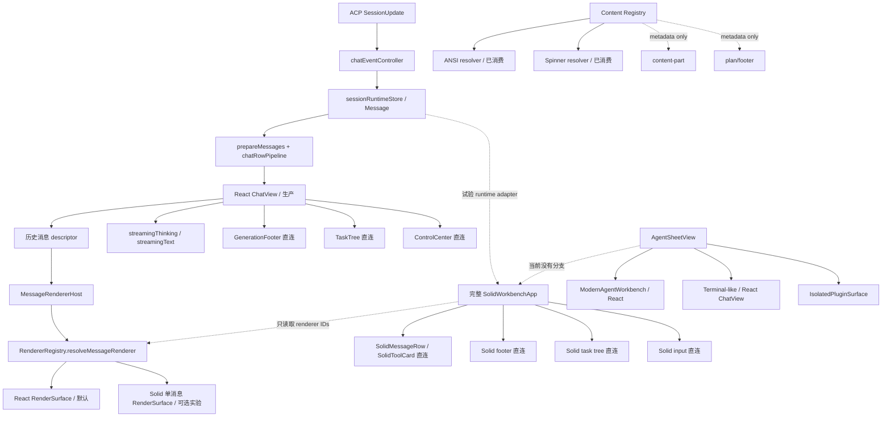

# 渲染引擎：源码查证与原子施工书

> **已失效。** 本文自 2026-08-21 起只作历史查证记录；唯一有效施工依据为 `docs/渲染引擎-唯一权威施工书.md`。其中 React/Solid 对照 benchmark、Solid“候选”表述及旧 WI 编号均不得继续执行。
>
> 查证日期：2026-08-21  
> 源码基线：`b404425fe0dae44d42eed0ecc169bbbf49154dbe`  
> 输入文档：`docs/渲染引擎-现状与目标架构.md`  
> 文档性质：查证报告 + 可直接执行的 TDD 施工书。输入文档仍保留，待本施工书评审后再同步修订。

## 0. 结论先行

原文的产品方向可保留：React 继续承担应用 GUI，SolidJS 作为聊天工作台候选实现，插件表现层继续沿现有 `RendererRegistry` 深化，不另立新的中央注册中心。

但原文不能直接作为施工依据。源码查证发现：

1. 完整 `SolidWorkbenchApp` 确实未进入 `AgentSheetView` 生产分支；但 Solid 单消息 `RenderSurface` 已能由生产 `ChatView/MessageRendererHost` 选择。原文把两者混为一谈。
2. 生产链只消费了 `renderMessage`；`renderTool`、`renderReasoning` 没有调用点。完整 Solid Workbench 只是读取 renderer id，并未使用 registry 渲染行。
3. 流式 thinking/text 仍由 React `ChatView` 直接渲染，绕过 `MessageRendererHost`。因此现有 Solid 单消息接入没有覆盖原文声称的主要性能热点。
4. “React 无法流畅实现流式更新”目前没有对照基准支撑，只能视为待验证的架构假设。更换框架本身不构成性能证据。
5. `RenderSurface` 接口文件不 import React/Solid，但实际载荷并不统一：React 接收 `{ component, componentProps }`，Solid 接收 `{ messageProps, appearance }`。原文所说“两者都作 component 传入”不属实。
6. `config_option` 已有通用 React 设置 UI，支持 select/boolean/string/number、乐观更新、失败回滚。原文“任意 config_option 无通用 UI”不属实。
7. `ContentBlock` 和 `rawInput/rawOutput` 并未在模型中丢失；缺陷发生在可见展示投影。`locations` 则确实在 wire→runtime 投影处丢失。
8. 外置工具字典确实会整 provider 替换，但“删除一次 unregister 即完成 overlay”不够稳固；必须处理旧 overlay、别名和原子替换。
9. Solid 测试文件已包含在主 Vitest 配置中，但 `check:solid` 没进入 CI，且当前命令因 `MarkdownContent.solid.tsx:30` 类型错误失败。

所以正确顺序是：先修基线与建立性能证据，再补数据投影和工具字典，随后深化框架无关的 surface 接口，最后才允许 Solid 工作台进入生产和切默认。

## 1. 查证范围与方法

本轮只读核查以下真实调用链，没有根据文档注释反推实现：

- 应用入口、`AgentSheetView` 与两个 React 工作台分支。
- `ChatView → MessageRendererHost → RenderSurface` 的生产消费链。
- `SolidWorkbenchApp`、`mountSolidWorkbench` 和 Solid 单消息 renderer。
- `RendererRegistry`、`ReactiveRegistryStore`、内容/provider facade。
- ACP `SessionUpdate`、`chatEventController`、`sessionRuntimeStore`、`Message`、工具展示模型。
- 工具 catalog、外置 `tool_dictionary`、运行时 reload。
- 配置项 UI、Solid commands/footer、计划树与未展示字段。
- `package.json`、`vitest.config.ts`、`.github/workflows/ci.yml`。

已执行定向验证：

```text
npm test -- --run \
  src/plugin-runtime/renderers/__tests__/rendererRegistry.test.ts \
  src/domains/tool/__tests__/toolRegistry.test.ts \
  src/components/chat/__tests__/messageRendererConsumption.test.tsx \
  src/renderers/solid-workbench/input/__tests__/InputBar.solid.test.tsx

结果：4 files / 15 tests 全通过。

npm run check:solid

结果：失败；MarkdownContent.solid.tsx:30，TS2769。
```

## 2. 逐条事实判定

判定含义：✅ 属实；🟡 部分属实/表述不精确；❌ 不属实；🔵 产品决策或假设，不是可由源码证明的事实。

| 原文断言 | 判定 | 源码事实与修订口径 |
|---|---:|---|
| React 是应用 GUI 框架 | ✅ | `main.tsx → KernelRoot → ApplicationMount`；当前 104 个 TS/TSX 文件直接 import React。 |
| 完整 Solid Workbench 未接生产 | ✅ | `mountSolidWorkbench` 仅测试/fixture 使用；`AgentSheetView` 只分发 modern React、terminal React、isolated surface。 |
| Solid 仅 smoke/demo | 🟡 | 完整 Workbench 是；但 `core.renderer.solid` 已可经生产 `MessageRendererHost` 渲染历史消息行。 |
| 消息/工具/reasoning 已深度接 registry | ❌ | 只有 `renderMessage` 有生产调用；`renderTool`/`renderReasoning` 仅定义和测试。工具/reasoning 是 message row 内部直连。 |
| 流式链已经由 Solid/registry 承担 | ❌ | `streamingThinking`、`streamingText` 在 `ChatView` 中直接渲染，未走 `MessageRendererHost`。 |
| React 无法流畅流式/行级更新 | 🔵 | 未找到 React/Solid 同轨迹基准。React 当前每 chunk 更新父级 state 是风险，但结论尚无证据。 |
| RendererRegistry 有四类 store | ✅ | message/content/tool/highlighter 四个 `ReactiveRegistryStore`。 |
| 排序为 layer→priority→owner→id，支持 before/after、成环检测 | ✅ | `reactiveRegistry.ts::orderEntries` 与对应测试支持。 |
| ANSI 是唯一真正消费的内容 provider | ❌ | ANSI 和 spinner 都有真实 resolver 消费；plan/footer 仅 list，content-part 连 list facade 都没有。 |
| spinner 是双轨 | 🟡 | 调用点先查 registry，再回退 builtin；这是容错回退，不是两个权威源。 |
| ContentRendererKind 当前封闭 | ✅ | 类型是五成员联合。运行时 filter 可比较字符串，不等于公开类型支持任意 kind。 |
| RenderSurface 不 import React/Solid | ✅ | 契约文件成立。 |
| React/Solid 都以 component 载荷消费 | ❌ | React 使用 component payload；Solid 使用 semantic `messageProps + appearance`，忽略 component。 |
| locations 在归一化时丢失 | ✅ | wire 有字段；runtime event、Message、ToolPresentationModel 均无字段。 |
| 多模态 ContentBlock 被数据链静默丢弃 | 🟡 | blocks 在 Message/live/replay/canonical 中保留；`collectToolOutput` 只投影 text/diff，未知块不可见。是展示缺口，不是原始数据丢失。 |
| 14 action 坍缩为 7 kind 并丢语义 | 🟡 | `ToolPresentationModel` 仍保留 action；当前卡片主要按 kind 选视觉，action 粒度没有可见利用。 |
| 任意 config_option 无通用 UI | ❌ | `ConfigOptionsPanel/ConfigOptionField` 已支持 select/bool/string/number；复杂 unknown 只读 JSON，Solid 工作台无入口。 |
| time/inputText/priority/externalIdentity 不可见 | ✅ | 字段存在或被计算，但 React/Solid 当前卡片/任务树没有对应展示。 |
| Solid available_commands 未接 | ✅ | Solid 输入栏只合并 fallback/plugin commands，未消费 session live commands。 |
| Solid footer 缺 cache/usage 百分比 | ✅ | `WorkbenchRuntimeSnapshot`/footer contract 只有 tokenCount；但 React footer同样没有完整 cache/上限展示，不能写成 Solid 独有退化。 |
| TodoWrite todos 数组摘要为空 | ✅ | `fieldSummary` 只接受 string；数组不产生摘要。 |
| Peri catalog 16 工具，ArtifactTool 只在 catalog | ✅ | `shared/agent-catalog.json` 为 16；示例外置字典不含 ArtifactTool。 |
| 外置字典整 provider 替换 | ✅ | `registerToolDictionary` 先 `unregisterToolRegistryProvider` 再注册 wire 条目。 |
| 去掉 unregister 即可正确 overlay | ❌ | 会残留旧 overlay/旧 alias，且同一工具的 baseline alias 仍可能指向旧 entry。需要显式 baseline/overlay 合成。 |
| Solid tests 已在主 Vitest 门 | ✅ | `vitest.config.ts` include 覆盖 Solid tests。 |
| check:solid 已是 CI 正式门 | ❌ | CI `check:frontend` 不调用 `check:solid`；当前 `check:solid` 本身失败。 |

## 3. 纠正后的现状拓扑



关键解释：

- 单消息 Renderer Engine 与完整 Workbench Renderer 是两个尺度，必须分开命名和验收。
- 现有 `MessageRenderer` 接口是浅接口：`renderMessage(props)` 收到一次 props，随后 `surface.mount` 又收到另一份载荷；三个 render 方法实际返回同一种 surface，其中两个无人消费。
- 完整 Solid Workbench 已经有较深的 `WorkbenchRuntime`、`WorkbenchCommandFacade`、appearance/session UI adapters，可复用；不应复制 React controller 或新增状态中央。

## 4. 目标架构约束

### 4.1 单一权威

- ACP/canonical/runtime 继续是会话语义数据源；renderer 只消费快照和命令，不持久化第二份业务状态。
- `RendererRegistry` 继续是 renderer contribution 的唯一注册表；不得增加平行 global registry。
- Presentation Profile 只保存视觉/交互 token；Renderer Engine 决定 React/Solid/isolated 技术适配，两者正交。

### 4.2 深模块与适配器

- `WorkbenchRuntime` 对外给稳定语义快照，内部吸收 React store、replay、streaming 的变化。
- `RenderSurface` 只负责 lifecycle；载荷必须是框架无关语义 DTO，不能泄露 React component。
- React、Solid、isolated/web component 是 adapters；同一语义输入必须有一致 fallback/error/lifecycle 行为。
- ANSI/spinner 是纯转换 provider，不强行变成 DOM surface；plan/footer/content-part 才走 surface provider。

### 4.3 迁移护栏

- 保留 React 聊天 fallback，直到 Solid 通过功能、性能、恢复与插件兼容门。
- 不以“框架更快”代替测量；相同 transcript、相同 chunk trace、相同插件集合对比。
- 不把 third-party renderer 异常升级为整个 Sheet 崩溃；按行/slot fallback。
- 不在迁移期改变插件 manifest 构造；兼容旧 provider，新增能力走可选字段或 adapter。

## 5. 长程施工 harness

每个 WI 独立执行以下循环；任一步失败，不进入下一 WI，不提交半绿状态。

1. **审查现状**：重新读取本 WI 列出的实现、调用点、现有测试；记录当前行为和冲突的并行改动。
2. **RED**：先写一个最小失败测试，只锁本 WI 的外部行为；运行该测试并确认失败原因正确。
3. **GREEN**：做满足测试的最小实现，不顺便搬家或统一命名。
4. **定向测试**：运行本 WI 命令；联动到 React+Solid 时再跑双方测试；不默认全量。
5. **审核**：检查唯一数据源、dispose/rollback、error fallback、旧 API 兼容、无框架 import 泄漏。
6. **提交**：只 stage 本 WI 文件；提交信息使用 `render(<scope>): <behavior>` 或 `test(render): <behavior>`。
7. **台账头部**：记录 commit、测试、已知残留和下一 WI；然后停顿报告 `ok`。

升级测试规则：

- 单纯函数/单 registry：只跑对应 test file。
- 同时修改 contract + registry + 一个 adapter：跑相关 test files + `tsc` 对应 project。
- 同时修改 React 与 Solid：再跑 `npm run check:solid`。
- 生产接线、默认切换、CI 修改：跑 `npm run build`、Solid smoke、相关集成测试；阶段终点才跑前端全量。
- 本计划不触碰 Rust；除非后来发现 wire contract 需要 Rust 变更，否则不跑 Rust 全量。

## 6. 原子化施工队列

### 阶段 P0：先把基线变成可信门禁

#### WI-R00：同步事实口径，不改实现

- RED：在本文的判定表中为每个被修正断言保留源码锚点；人工检查原文仍含旧说法。
- GREEN：评审通过后修订 `docs/渲染引擎-现状与目标架构.md`：区分单消息/完整 Workbench；删除 config_option 假缺口；把性能结论改为目标+验证门；修正 spinner、ContentBlock、action、CI 表述。
- 验收：`rg` 不再命中“仅 ANSI 真正消费”“React 无法”“任意 config_option 无 UI”“React/Solid 都作 component”。
- 提交：`docs(render): align renderer architecture with source audit`

#### WI-R01：修复 Solid 类型门基线

- 审查：`MarkdownContent.solid.tsx:30` 的 `<Show>` children 类型与 Solid JSX 写法；对应 Markdown 测试。
- RED：保留 `npm run check:solid` 的 TS2769 作为失败证据；若测试未覆盖分支，补最小 render test。
- GREEN：仅调整 children 表达式/窄化方式，不改 Markdown 输出和 streaming split。
- 测试：
  - `npm test -- --run src/renderers/solid-workbench/chat/__tests__/MarkdownContent.solid.test.tsx`
  - `npm run check:solid`
- 提交：`fix(render-solid): restore solid type gate`

#### WI-R02：建立 React/Solid 同轨迹性能 harness

- 新建：`src/renderers/benchmarks/chatRenderScenario.ts`，生成固定 1k/5k 历史消息和固定 token chunk trace；不得使用随机时间/内容。
- 扩展：现有 `renderMetrics`，至少记录 host render、历史 row render、streaming leaf render、surface mount/update/destroy、单 chunk 调度耗时。
- RED：React 和 Solid adapter 对同一 scenario 输出不同格式或缺少计数时测试失败。
- GREEN：为两条实现提供同一 `runScenario(adapter, scenario)`；先只收证据，不切实现。
- 测试：纯函数/metrics 单测；需要浏览器帧时间时使用现有 Vite benchmark 页面，不把硬件 wall-time 写成易抖单测。
- 验收门：结构性指标必须证明 chunk 不重建历史 rows/surfaces；p95 帧预算由首次实测写入台账，不在实现前拍脑袋。
- 提交：`test(render): add comparable chat streaming benchmark`

### 阶段 P1：先保住语义与工具字典

#### WI-R03：工具字典从整 provider 替换改为显式 overlay

- 设计：在 `domains/tool/toolRegistry.ts` 内维护 `baseline` 与 `overlay` 两层数据，查询只看合成后的 effective map；仍是同一个 module，不新增中央。
- RED 用例：
  1. 外置覆盖 Peri `Read`，`ArtifactTool` 仍存在。
  2. 第二次 reload 删除某外置工具，旧工具和旧 alias 消失。
  3. 外置覆盖同名工具后，内置 alias 也解析到有效覆盖条目，而非旧对象。
  4. 卸载/重新激活恢复相同 effective snapshot。
- GREEN：新增 `replaceToolDictionaryOverlay(dictionary)`；一次解析、验证、构建 candidate，最后原子替换 overlay；非法 provider 不破坏旧有效快照。
- 兼容：旧 `registerToolDictionary` 暂代理到 replace 并标注 deprecated；`builtinPylonTools` 调用新语义。
- 测试：`toolRegistry.test.ts` + `builtinPylonTools` lifecycle 定向测试。
- 提交：`fix(render-tools): overlay external dictionary atomically`

#### WI-R04：locations 贯穿投影但默认视觉不变

- 类型：为 tool_call runtime event、`Message`、tool presentation DTO 增加 `locations?: readonly ToolLocation[]`；先定义宽容规范化器，未知字段保留为 raw metadata。
- RED：live、canonical replay、agent replay 三条路径输入相同 locations，最终 Message/Presentation 相等；未知 shape 不抛错。
- GREEN：在 `chatEventController` 的所有 tool_call dispatch 统一调用一个 extractor，禁止六处各自解析。
- 测试：扩展 `toolProjectionThreePaths.test.ts`、`canonicalProjectionParity.test.ts`。
- 提交：`feat(render-tools): preserve tool locations across projections`

#### WI-R05：ContentBlock 建立“可见投影 + 未知回退”

- 新建纯函数 `buildContentBlockRenderModels(blocks)`，输出 text/diff/image/audio/resource/unknown 的语义模型；原始 block 保留引用或只读副本。
- RED：text/diff 行为不变；image/audio/resource 产生可见模型；未知 type 生成安全 metadata fallback，不执行任意 HTML/URL。
- GREEN：`collectToolOutput` 只负责文本 fallback，不再被当作全量 content renderer；ToolPresentationModel 增加 `contentParts`。
- 第一提交只建立模型与文本 fallback，不做精美多模态 UI。
- 测试：`toolPresentationModel` 单测 + 三路径 raw preservation 回归。
- 提交：`feat(render-content): project all content block kinds safely`

#### WI-R06：修复数组型工具摘要并用 rawInput 重投影

- RED：TodoWrite/todo 的 `todos` 数组生成稳定摘要；对象/字符串旧摘要不变；字典 reload 后旧 Message 可由 `rawInput` 按新规则重投影。
- GREEN：
  - `fieldSummary` 支持 array/object 的受控 compact formatter，设长度/层级上限。
  - `buildToolPresentationModel` 优先传 `message.rawInput` 给 `buildToolRenderModel`，`toolInput` 只作旧快照 fallback。
  - 不改 rawInput 持久化结构。
- 测试：`toolPresentation`、`toolPresentationModel`、TodoWrite fixture。
- 提交：`fix(render-tools): summarize structured inputs from raw data`

#### WI-R07：逐项补轻字段，不捆成一次 UI 重写

拆为四个独立提交：

- R07a `time`：消息行可选时间，默认 profile 可关闭；React/Solid 同语义测试。
- R07b `inputText`：工具展开区增加“输入”，只在非空且不与 summary 重复时显示。
- R07c `priority`：TaskTree 使用稳定排序/标识，但不得改变原 plan 顺序，除非产品另行决定。
- R07d `externalIdentity`：默认用户 UI 不展示；仅 trace/debug surface 暴露复制能力，避免泄露协议噪声。

每项单独 RED/GREEN/定向测试/commit。R07c 的“排序还是只标识”是唯一需要产品确认的视觉决策；默认采用只标识、不重排。

### 阶段 P2：深化 Content Renderer module

#### WI-R08：开放 namespaced ContentRendererKind

- RED：内置 kind 继续可用；第三方 `plugin.id.custom-kind` 可注册/resolve；空白、保留前缀冒用、无命名空间第三方 kind 被拒绝；shadow transaction 保持原子性。
- GREEN：
  - 将类型改为 `BuiltinContentRendererKind | string`，同时导出内置常量和校验函数。
  - 第三方 contribution 由 owner identity 校验前缀；内置 plugin 允许保留 kind。
  - `resolveContentRenderer` 支持 exact kind；暂不引入 content wildcard，避免隐藏错误。
- 测试：`rendererRegistry.test.ts`、plugin API/manifest validation 定向测试。
- 提交：`feat(render-content): support namespaced content kinds`

#### WI-R09：区分 transform provider 与 surface provider

- 目标接口：

```ts
type ContentRendererProvider = TransformContentProvider | SurfaceContentProvider

interface SurfaceContentProvider {
  readonly providerId: string
  createSurface(input: ContentSurfaceInput): RenderSurface
}
```

- ANSI/spinner 保持 transform provider；plan/footer/content-part 改为 surface provider。禁止把所有 provider 塞进一个靠类型断言工作的 union。
- RED：错误 capability 不能注册到对应 kind；surface lifecycle 的 mount/update/destroy/error 有统一契约测试。
- GREEN：增加 capability discriminant 和 typed resolver，删除调用端 `as AnsiProvider` 等宽泛 cast。
- 测试：renderer registry + content facade contract。
- 提交：`refactor(render-content): separate transforms from surfaces`

#### WI-R10：建立跨框架 ContentSurfaceHost adapters

- React host：effect 中 mount/update/destroy，error 时切 builtin fallback。
- Solid host：onMount/createEffect/onCleanup 执行相同 lifecycle；不得把 React component 传入 Solid。
- RED：相同 fake surface 在两 host 中得到一致调用序列；异步 error 只击穿当前 slot；切 provider 销毁旧 handle 一次。
- GREEN：新增很薄的 React/Solid lifecycle adapters，共用 selection/fallback state machine。
- 测试：两个 host 测试 + shared state machine 单测。
- 提交：`feat(render-content): add framework adapters for content surfaces`

#### WI-R11：按 content-part→plan→footer 顺序接生产消费点

拆成三个提交，每次都保留内置组件 fallback：

- R11a content-part：先接未知 ContentBlock 安全卡和 assistant content part；不一次实现所有媒体播放器。
- R11b plan：React `TaskTree` 与 Solid `SolidTaskTree` 的输入先投影为同一 `PlanRenderInput`，再接 surface。
- R11c footer：把 generation 状态投影为同一 `FooterRenderInput`，再接 surface。

每个提交的 RED 都验证：首选 provider、provider throw、异步 error、无 provider fallback、dispose。完成后 metadata-only provider 不再存在。

### 阶段 P3：修正 Message Renderer interface

#### WI-R12：先锁现有 surface lifecycle

- 扩充 `messageRendererConsumption.test.tsx`：选择、update、不重复 mount、renderer 切换 destroy、同步 throw、异步 error、fallback renderer 也失败时回到 builtin row。
- 只加测试与最小 bugfix，不改接口。
- 提交：`test(render-message): characterize renderer surface lifecycle`

#### WI-R13：定义框架无关 MessageRenderSnapshot

- 新建纯 DTO：role、content parts、tool presentation、reasoning、status、identity/debug metadata；不包含 React component、Solid accessor 或 store。
- 新建唯一 projector `toMessageRenderSnapshot(descriptor, appearanceTokens)`；React/Solid 两边不得各做一套工具归一化。
- RED：user/assistant/reasoning/tool/error/system fixtures 的 snapshot 相等且可序列化。
- 提交：`feat(render-message): introduce semantic render snapshots`

#### WI-R14：收深 MessageRenderer 接口

- 新接口只保留一个能力：`createSurface(): RenderSurface`；语义 snapshot 只通过 mount/update 传入。
- `renderMessage/renderTool/renderReasoning` 先保留 compatibility adapter 并 deprecated，一个版本后再删；不要在同一提交破坏插件 API。
- React/Solid builtin surfaces 都消费相同 snapshot；删除 `{ component }` 泄漏和 renderMessage+mount 双份 props。
- RED：两个 adapter 对同一 snapshot 输出关键 data/class contract；旧 renderer 经 adapter 仍可用。
- 提交：
  1. `feat(render-message): add semantic surface contract`
  2. `refactor(render-message): migrate builtin adapters`
  3. `docs(plugin): deprecate component mount payload`

#### WI-R15：让完整 Solid Workbench 真正消费 registry

- 当前仅把 renderer ids 写进 data attribute；改为逐 descriptor resolve，并用 Solid MessageSurfaceHost 消费。
- RED：选择第三方/React fallback/renderer error 时，完整 Solid Workbench 与 React ChatView 选择规则一致。
- GREEN：复用 registry selection module，不在 Solid 内复制 priority/fallback 算法。
- 测试：`mountSolidWorkbench.solid.test.tsx` + renderer integration。
- 提交：`feat(render-solid): consume message renderer registry`

### 阶段 P4：补齐 Workbench 语义并接入生产

#### WI-R16：扩展 WorkbenchRuntimeSnapshot，而不是读取 React store

- 分四个独立字段组提交：
  1. session `availableCommands`；
  2. `usage`（input/output/cacheRead/cacheWrite/contextWindow）；
  3. `configOptions` 与 setConfigOption command；
  4. replay recovery/degraded diagnostics。
- 每组先写 runtime adapter 单测，再接 Solid UI；禁止 Solid 组件直接 import Zustand runtime store。
- 提交示例：`feat(workbench-runtime): expose live session commands`

#### WI-R17：Solid commands/footer/config parity

- commands：plugin commands 与 live session commands 按现有 host precedence 合成，不能互相污染。
- footer：显示 cache、context usage 百分比/bar；无 contextWindow 时不造假百分比。
- config：复用框架无关 normalize/update command，不复制 React optimistic rollback 状态机。
- 每项独立测试/提交。

#### WI-R18：给 AgentSheet 增加 Solid host renderer 分支

- 类型：`InterfaceModeWorkbench` 的 host renderer 增加 `'solid'`，不新增第二个 mode registry。
- 实现：React `AgentSheetView` 只负责创建 host DOM、装配现有 `WorkbenchRuntime/CommandFacade/Appearance/SessionUi`，动态 mount Solid，cleanup 销毁。
- RED：session switch、sheet close、replay posture、renderer load failure、React fallback。
- 首次接入只提供显式实验开关/内部 interface mode，不改默认。
- 测试：AgentSheet 集成 + mount Solid + `check:solid` + production build。
- 提交：`feat(agent-sheet): mount solid workbench as host renderer`

#### WI-R19：功能对照矩阵与恢复/插件验收

逐项验收：历史加载、live streaming、tool call/update、thinking、plan、usage、commands、config、attach、cancel、queue、search/location、replay readonly、presentation profile、renderer fallback、plugin reload。

- 自动化优先锁语义状态和 data contract；视觉差异用固定 fixture/screenshot 人工验收，不写脆弱像素测试。
- 任何缺项单开 WI，不在 R19 内大修。
- 提交：`test(render-solid): close workbench parity matrix`

#### WI-R20：默认切换与一键回退

前置全部满足才执行：

- `check:solid` 绿；相关 build/smoke 绿。
- 性能 harness 显示 Solid 在目标场景确有收益，且无历史 row/surface 随 token 重建。
- 功能矩阵无 P0/P1 缺项。
- React fallback 在 renderer load/runtime error 时自动生效。

施工：先把一个 builtin interface mode 默认 renderer 切 Solid，观察一阶段；再决定 modern/terminal 是否都切。不要一次删除 React ChatView。

提交：`feat(render): promote solid workbench with react fallback`

### 阶段 V1：门禁与文档收口

#### WI-R21：把 Solid 正式门接入 CI

- 先保证本地 `check:solid` 稳定。
- 将 `check:solid` 作为独立 CI step/job，避免 `check:frontend` 失败时丢失 Solid 诊断。
- `build:solid-smoke` 仅在涉及 Solid bundle/动态 import 时运行；是否每次 CI 都跑由耗时实测决定。
- RED：临时 fixture 违反 Solid import seam 时 CI 脚本能失败；随后移除 fixture。
- 提交：`ci(render-solid): enforce solid workbench gate`

#### WI-R22：更新唯一权威架构文档和插件说明

- 把本施工书中已完成项回写 `渲染引擎-现状与目标架构.md`。
- 更新开发者版：开放 kind、surface capability、namespace、fallback/error/dispose、兼容周期。
- 更新用户版：只描述可观察选择/回退，不泄露内部 adapter 细节。
- 删除已失效行号，优先使用文件+symbol。
- 提交：`docs(render): publish verified renderer architecture`

#### WI-R23：阶段全量校验与台账关闭

- 前端：`npm run check:frontend`、`npm run check:solid`、`npm run build:solid-smoke`。
- 若本阶段完全未改 Rust，不跑 Rust 全量；若 contract 联动 Rust，再运行相关 cargo tests，最后 `check:rust`。
- 审核 git diff，确认没有用户并行文件混入；记录已知非阻塞债务与回退开关。
- 提交：只在确有文档/门禁修订时提交；不要制造空 commit。

## 7. 依赖与并行限制

```text
R01 ─┬─> R02 ──────────────────────────────┐
     └─> R08 -> R09 -> R10 -> R11          │
R03 ---------------------------------------┤
R04 -> R05 -> R06 -> R07                   ├-> R19 -> R20 -> R21 -> R22 -> R23
R12 -> R13 -> R14 -> R15 ------------------┤
R16 -> R17 -> R18 -------------------------┘
```

- R03–R07 可在接口施工前完成，但同一时间不要并行改 `toolPresentationModel.ts`。
- R09–R11 与 R13–R15 都会改 RenderSurface/registry，必须顺序施工。
- R18 不得早于 R01、R02、R15、R17。
- R20 是产品开关，不是普通重构；任何门未绿都不得执行。

## 8. 施工中应顺手修复但不得扩张的额外问题

以下已由本轮源码审查发现，应绑定最近 WI 修复：

1. Solid 单消息 surface 的 `update` 会 dispose 并重新 `renderSolid` 整行，不是细粒度更新；在 R14 迁移 semantic snapshot 时修。
2. `MessageRendererHost` 同时传 `componentProps` 和 `messageProps`，且 `renderMessage` 参数重复；R14 收敛。
3. 完整 Solid Workbench 查询 registry 但只展示 ids；R15 修复，避免“假接入”。
4. `listContentPartProviders` 缺失；不要单补 list API，随 R09 typed resolver 一起处理。
5. 外置字典 reload 的正确性依赖调用者先 clear provider；R03 把原子替换收进 module，提升 locality。
6. 当前 CI 不运行 `check:solid`；R21 修复，但必须先让 R01 恢复绿色基线。

## 9. 暂不施工的项目

- 不删除 React 或重写设置、Sheet、Sidebar、Kernel。
- 不把 Renderer Engine 变成第二套会话状态管理。
- 不为 14 个 ToolAction 一次性制作 14 套卡片；先保语义，再按产品价值增加 renderer。
- 不在 unknown ContentBlock 上执行任意 HTML/script；先安全 fallback。
- 不因 D1 已选 Solid 就跳过 R02 性能基准。
- 不在本轮改变第三方插件构造、manifest 基本形态或隔离策略；接口扩展保持兼容。

## 10. 首批建议施工顺序

按风险和 leverage，首批执行：

1. R01 恢复 Solid gate。
2. R03 工具字典原子 overlay。
3. R06 Todo/结构化摘要与 rawInput 重投影。
4. R02 性能 harness。
5. R12–R14 收深 Message Renderer 接口。

这五项完成后再进入 ContentSurface 和完整 Solid Workbench，可避免在不可靠接口上扩大迁移面积。

## 11. 源码地图

| 模块 | 关键文件/符号 |
|---|---|
| Agent workbench 分发 | `src/sheets/AgentSheetView.tsx::AgentSheetView`；`src/plugin-runtime/interface-mode/interfaceModeTypes.ts` |
| React chat | `src/components/chat/ChatView.tsx::{ChatView,MessageRendererHost,MessageRow,ToolCard}` |
| Solid workbench | `src/renderers/solid-workbench/{SolidWorkbenchApp.solid,mountSolidWorkbench.solid}.tsx` |
| Renderer contract | `src/contracts/messageRenderer.ts`；`src/plugin-runtime/renderers/rendererTypes.ts` |
| Registry | `src/plugin-runtime/renderers/rendererRegistry.ts`；`src/plugin-runtime/registry/reactiveRegistry.ts` |
| Content providers | `src/contracts/rendererContentPoints.ts`；`src/domains/rendererContent/rendererContentRegistry.ts`；`src/plugins/core/renderer/builtinRenderContent.ts` |
| Builtin renderer adapters | `src/plugins/core/renderer/{reactRenderer,solidRenderer}.ts` |
| Wire→runtime | `src/infrastructure/acp/chatContracts.ts`；`src/components/chat/chatEventController.ts`；`sessionRuntimeStore.ts` |
| Tool projection | `src/domains/tool/{toolRegistry,toolPresentation,toolResolution}.ts`；`src/components/chat/toolPresentationModel.ts` |
| Shared agent catalog | `shared/agent-catalog.json`；`agents.example.yaml`；`src/plugins/product/builtinPylonTools.ts` |
| Config UI | `src/components/settings/{ConfigOptionsPanel,ConfigOptionField,configOptionState}.tsx` |
| Workbench ports | `src/domains/workbench/{workbenchRuntime,workbenchCommandFacade,appearance,sessionUiStore}.ts` |
| Tests/gates | `vitest.config.ts`；`tsconfig.solid.json`；`package.json`；`.github/workflows/ci.yml` |

## 12. 最终验收定义

全部任务完成的含义不是“Solid 页面能显示”，而是：

- 相同会话语义输入经 React/Solid adapters 得到等价的可观察行为。
- 流式更新不会随历史消息数量线性重渲染历史 rows/surfaces。
- renderer/plugin 故障有局部 fallback，且 mount/update/destroy 无泄漏。
- locations、ContentBlock、raw tool input 不在投影 seam 丢失。
- 外置字典按工具覆盖、reload 原子、内置独有工具保留。
- 完整 Solid Workbench 真正消费 registry，而非只列出 renderer ids。
- `check:frontend`、`check:solid`、Solid smoke 及阶段相关测试全部通过。
- React fallback 仍可一键恢复；未建立第二个状态或注册权威。
