# Pylon 插件化前后端拓扑全图

> 状态：当前实现地图 + 明确标注的 Renderer Suite 规划接缝  
> 核验日期：2026-08-26
> 适用基线：当前 `prism-desktop` 工作副本；规划施工入口见仓库内工作副本外的渲染引擎施工台账（00-唯一入口台账.md）  
> 阅读纪律：实线节点/边表示当前代码；带 `PLANNED` 且虚线边框的节点表示尚未实现。不得把规划节点写进“当前已支持”说明。

## 一张图

```mermaid
flowchart TB
  subgraph EXTERNAL[外部输入、代码与进程]
    USERPKG[第三方插件目录<br/>pylon-plugin.json + web entry + styles]
    PLUGINWEB[第三方 Web bundle<br/>可信本机代码]
    PLUGINEXE[插件自带 executable<br/>JSON-RPC / stdio]
    AGENT[Agent subprocess<br/>Hermes / Peri / Claude-compatible]
    ACPWIRE[ACP JSON-RPC<br/>stdio transport]
    USER[Pylon 用户]
    CLI[Pylon CLI / 本机 IPC 客户端]
  end

  subgraph WEB[WebView / TypeScript]
    direction TB

    subgraph BOOT[Kernel 壳与启动组合]
      MAIN[src/main.tsx]
      KROOT[src/kernel/KernelRoot.tsx]
      KBOOT[KernelBootstrap<br/>normal / degraded / safe-mode]
      APPHOSTRT[ApplicationRuntime<br/>mount / unmount / soft-remount]
      RECOVERY[KernelRecoveryLayer]
      COMPOSE[pluginCompositionRoot.ts<br/>唯一组合根]
      BUILTINBOOT[builtinPluginBootstrap.ts]
    end

    subgraph PLUGINHOST[Kernel Plugin Host]
      PRUNTIME[唯一 PluginRuntime]
      PINSTANCE[PluginInstance]
      PSCOPE[PluginScope<br/>registrations/listeners/timers/abort/process]
      PACTX[PluginActivationContext]
      PCONTRACT[PluginContractResolver<br/>dependencies/conflicts/events]
      PUPDATE[PluginContributionTransaction<br/>shadow validate/commit/revert]
      RBATCH[runRegistryBatch<br/>单批通知]
      PKGINSTALL[PackageInstallationService]
      PKGRUNTIME[PackagePluginRuntimeService<br/>dynamic import / styles]
      STYLE[PackageStyleRuntime]
    end

    subgraph REGISTRIES[RuntimeServices：当前 registries 与 host modules]
      APPREG[PluginApplicationHost]
      CMDREG[CommandRegistry]
      HOOKREG[HookRuntime + HookRegistry]
      EVENTBUS[PluginEventBus]
      RENDERREG[RendererRegistry<br/>message/content/tool/highlighter]
      UIREG[PluginUiRegistry]
      SERVREG[PluginServiceRegistry]
      WORKREG[WorkspaceRegistry]
      SIDEREG[AgentSidebarRegistry]
      FILEREG[FileWorkbenchRegistry]
      CTXREG[ContextPanelRegistry]
      PRESREG[PresentationProfileRegistry]
      SETPAGEREG[PluginSettingsPageRegistry]
      SETSTORE[PluginSettingsStore]
      SETOPTREG[PluginSettingOptionsRegistry]
      FONTREG[FontContributionRegistry]
      SESSIONCREG[SessionCreationRegistry]
      IMODEREG[InterfaceModeRegistry]
    end

    subgraph PRODUCT[五个第一方 Product Plugin 包 + 可选 Kernel Skin]
      PTOOLS[builtin.pylon-tools<br/>tool-provider]
      PADAPTERS[builtin.pylon-agent-adapters<br/>agent-adapter]
      PRENDERERS[builtin.pylon-renderers<br/>renderer]
      PWORKSPACE[builtin.pylon-workspace<br/>workspace]
      PSHELL[builtin.pylon-shell<br/>shell]
      PSKIN[builtin.skin<br/>Kernel skin command plugin]
    end

    subgraph CONSUMERS[Product Shell、UI Host 与 Registry 消费点]
      APP[src/App.tsx<br/>Product Shell composition]
      TITLE[WorkspaceTitlebar]
      SHEETLAYOUT[SheetLayout / Sheet registry host]
      SETTINGS[src/components/Settings.tsx]
      PLUGINMGR[PluginManager]
      AGENTSHEET[AgentSheetView]
      SUITEWB[AgentRendererSuiteWorkbench<br/>Renderer Suite 宿主接线]
      CHATCTRL[chatEventController 消费面]
      ISOLATED[IsolatedPluginSurface<br/>isolated-surface 模式宿主]
      SOLID[SolidWorkbenchApp<br/>builtin.solid suite 实现]
      FILESHEET[FileSheetView]
      SIDEHOST[SheetSidebarSlot]
      CTXHOST[ContextPanelHost]
    end

    subgraph DOMAIN[当前业务/Kernel 前端 modules]
      IDSTORE[identityStore]
      USERREPO[userDataRepository]
      SESSIONLIFE[useSessionLifecycle]
      CHATCTRL[chatEventController]
      LEGACYRUNTIME[sessionRuntimeStore / runtimeStore<br/>会话运行时状态（CC 输入组件与 CLI ports 消费）]
      ROWPIPE[messagePipeline / chatRowPipeline]
      WORKRUNTIME[WorkbenchRuntime<br/>当前 Message/Plan snapshot]
      WORKCOMMAND[WorkbenchCommandFacade]
      APPEARANCE[WorkbenchAppearanceStore]
      SESSIONUI[SessionUiStore]
      CANONREPO[CanonicalEventRepository / Sink / Scheduler]
      GAP[committed event cursor / gap recovery]
      TOOLCAT[Agent Catalog / Tool Registry]
      WORKPORTS[AgentInstanceSink / ToolDictionarySink]
    end

    subgraph INFRA[WebView infrastructure adapters]
      ACPCLIENTS[Typed ACP clients<br/>agent/session/chat/runtime]
      TAURICLIENTS[Tauri clients<br/>workspace/gateway/browser]
      PKGCLIENT[PluginPackageClient]
      PROCCLIENT[PluginProcessClient]
      TAURIEVENTS[Tauri event listeners<br/>pylon:update / canonical event / diagnostics]
      CLIBRIDGE[Pylon CLI bridge]
    end

    subgraph RENDERSUITE[Renderer Suite 宿主（当前实现）]
      RSUITE[plugin-runtime/renderers/rendererSuiteTypes.ts<br/>RendererSuiteContribution]
      RSLOT[rendererSuiteTypes.ts<br/>RendererSlotContribution targetSuites/kinds/surface]
      RKIND[plugin-runtime/renderers/rendererTypes.ts<br/>RenderKindDefinition]
      ACTRES[plugin-runtime/renderers/rendererActivationResolver.ts<br/>activation snapshot 解析]
      ACTSNAP[rendererSuiteTypes.ts<br/>RendererActivationSnapshot immutable]
      CROSSVAL[plugin-runtime/renderers/rendererSuiteValidation.ts<br/>candidate contribution graph 校验]
      SUITEHOST[src/host/renderer-suite/rendererSuiteHost.ts<br/>prepare / stage / atomic switch / fallback]
      HOSTPORT[renderers/solid-workbench/workbenchContracts.ts<br/>WorkbenchHostPort / WorkbenchMountInput]
      SOLIDSUITE[renderers/solid-workbench/builtinSolidRendererSuite.ts<br/>suiteId builtin.solid]
      WORKDOC[domains/workbench/workbenchProjector.ts<br/>WorkbenchDocument 单一投影输出]
      SETSCHEMA[plugin-runtime/renderers/rendererSettingsTypes.ts<br/>+ components/settings/rendererSettingsCatalog.ts]
      SETPANEL[components/settings/RendererSettingsPanel.tsx]
      SUITEPREF[presentationPreferenceStore<br/>rendererSuiteIdByMode]
    end

    subgraph PLANNED[Renderer 深化中尚未实现的接缝]
      THIRDSUITE[PLANNED installable third-party Solid Suite]
      REACTFATAL[PLANNED React minimal fatal fallback<br/>same WorkbenchDocument]
    end
  end

  subgraph IPC[Tauri IPC / event seam]
    INVOKE["@tauri invoke commands"]
    EMIT[Tauri Window events]
    PLUGINPROTO[pylon-plugin:// custom URI protocol]
  end

  subgraph RUST[Rust / Tauri Kernel]
    direction TB
    BUILDER[src-tauri/src/lib.rs<br/>Tauri Builder + setup readiness]
    APPSTATE[AppState<br/>runtime/persistence/plugin/process/gateway/workspace slots]
    DATADIRS[DataDirs OnceLock<br/>single path authority]

    subgraph AGENTKERNEL[Agent、ACP 与 Session Kernel]
      LIFECYCLE[lifecycle/mod.rs<br/>connect/switch/reconnect/config]
      ARMANAGER[AgentRuntimeManager<br/>per-agent generations]
      ACP[acp/*<br/>jsonrpc/process/transport/replay]
      DISPATCH[dispatcher/*<br/>normalize/ingest/project runtime]
      SESSION[session/*<br/>create/prompt/load/control/owner]
      AGENTCFG[agent_config + agent_detection + catalog]
      PERMISSION[permission.rs<br/>approval/interaction]
    end

    subgraph PERSIST[Kernel persistence]
      PBOOT[PersistenceServices::open<br/>readiness barrier]
      EVENTSRV[EventService<br/>canonical_events]
      MSGSRV[MessageService<br/>legacy/forensic/session rows]
      USERSRV[UserDataService<br/>profile/session metadata]
      RETENTION[retention / tombstone / migrations]
    end

    subgraph NATIVEPLUGIN[Native plugin package/process modules]
      PLUGINCMD[plugin_cmds.rs<br/>inspect/stage/commit/rollback/uninstall/resource]
      PKGSTATE[package state + transaction journal]
      PROCSUP[PluginProcessSupervisor]
      PROCJSON[plugin process JSON-RPC pending/log/restart]
    end

    subgraph OTHERKERNEL[其他 Kernel adapters]
      WORKSPACE[workspace_cmds/workspaces/git]
      GATEWAY[gateway_cmds + GatewayCore/instances/credentials]
      BROWSER[browser_cmds + BrowserManager]
      RUNTIMELOG[runtime_log/logs_cmds]
      PYLONCLI[pylon_cli.rs]
      PRISM[prism / pet / mcp adapters]
    end
  end

  subgraph STORAGE[持久化与受控文件]
    SQLITE[(pylon-data-v1.sqlite3<br/>canonical_events / user_data / session_state / tombstones)]
    AGENTSYAML[(agents.yaml / MCP config)]
    PKGFILES[(plugin packages/data/runtime/transactions/state.json)]
    GATEWAYFILES[(gateway/workspace/pet/credentials files)]
  end

  %% Bootstrap and single runtime
  MAIN --> KROOT --> KBOOT
  KBOOT --> RECOVERY
  KBOOT --> COMPOSE --> BUILTINBOOT --> PRUNTIME
  KBOOT --> APPHOSTRT
  APPHOSTRT --> APPREG
  PRUNTIME --> PINSTANCE --> PSCOPE
  PRUNTIME --> PACTX
  PRUNTIME --> PCONTRACT
  PRUNTIME --> PUPDATE --> RBATCH
  PACTX --> REGISTRIES
  PUPDATE --> REGISTRIES

  %% Product package dependency graph（箭头 = 依赖方 --> 被依赖方，与图例同向；
  %% 真值：src/plugins/product/packages/*/pylon-plugin.json 的 dependencies）
  PSHELL --> PTOOLS
  PSHELL --> PADAPTERS
  PSHELL --> PRENDERERS
  PSHELL --> PWORKSPACE
  PADAPTERS --> PTOOLS
  COMPOSE --> PTOOLS
  COMPOSE --> PADAPTERS
  COMPOSE --> PRENDERERS
  COMPOSE --> PWORKSPACE
  COMPOSE --> PSHELL
  COMPOSE --> PSKIN
  PSHELL -->|register application/commands/styles| APPREG
  PSHELL --> CMDREG
  APPREG --> APPHOSTRT --> APP
  PTOOLS -->|commands| CMDREG
  PTOOLS -->|ToolDictionarySink| SERVREG
  PADAPTERS -->|AgentInstance/SessionState/Detector services| SERVREG
  PADAPTERS --> SESSIONCREG
  PRENDERERS --> RENDERREG
  PRENDERERS --> PRESREG
  PRENDERERS --> IMODEREG
  PRENDERERS --> FONTREG
  PRENDERERS --> CMDREG
  PWORKSPACE --> WORKREG
  PWORKSPACE --> SIDEREG
  PWORKSPACE --> FILEREG
  PWORKSPACE --> CTXREG
  PWORKSPACE --> SERVREG
  PWORKSPACE --> CMDREG
  PSKIN --> HOOKREG

  %% Current UI consumers
  APP --> TITLE
  APP --> SHEETLAYOUT
  APP --> SETTINGS
  APP --> IDSTORE
  APP --> SESSIONLIFE
  APP --> IMODEREG
  TITLE --> IMODEREG
  SETTINGS --> PRESREG
  SETTINGS --> IMODEREG
  SETTINGS --> SETPAGEREG
  SETTINGS --> SETSTORE
  SETTINGS --> SETOPTREG
  SETTINGS --> PLUGINMGR
  PLUGINMGR --> PKGINSTALL
  SHEETLAYOUT --> WORKREG
  SHEETLAYOUT --> AGENTSHEET
  SHEETLAYOUT --> SIDEHOST --> SIDEREG
  SHEETLAYOUT --> CTXHOST --> CTXREG
  AGENTSHEET --> IMODEREG
  AGENTSHEET --> SUITEWB --> SUITEHOST
  AGENTSHEET -->|renderKind=isolated-surface| ISOLATED --> UIREG
  SOLID -->|snapshot ids only| RENDERREG
  SOLID -->|direct imports| WORKRUNTIME
  FILESHEET --> FILEREG
  FILESHEET --> UIREG

  %% Current domain/data flow
  IDSTORE --> USERREPO --> ACPCLIENTS
  SESSIONLIFE --> ACPCLIENTS
  SESSIONLIFE --> CHATCTRL
  CHATCTRL --> LEGACYRUNTIME
  SOLID -->|buildChatRowDescriptors| ROWPIPE
  SOLID -->|messageListPort items| ROWPIPE
  CHATCTRL --> GAP --> CANONREPO
  WORKRUNTIME --> WORKCOMMAND
  WORKRUNTIME --> APPEARANCE
  WORKRUNTIME --> SESSIONUI
  WORKPORTS --> SERVREG
  WORKPORTS --> TOOLCAT
  APP --> WORKPORTS
  CANONREPO --> INVOKE
  ACPCLIENTS --> INVOKE
  TAURICLIENTS --> INVOKE
  TAURIEVENTS --> CHATCTRL
  CLIBRIDGE --> INVOKE

  %% External package installation and native process chain
  USER --> PLUGINMGR
  USERPKG --> PKGINSTALL --> PKGRUNTIME
  PKGINSTALL --> PKGCLIENT --> INVOKE
  PKGRUNTIME --> PKGCLIENT
  PKGRUNTIME --> PLUGINPROTO --> PLUGINCMD
  PKGRUNTIME --> STYLE
  PKGRUNTIME --> PLUGINWEB --> PRUNTIME
  PACTX --> PROCCLIENT --> INVOKE

  %% Tauri command/event/root
  INVOKE --> BUILDER --> APPSTATE
  BUILDER --> DATADIRS
  APPSTATE --> LIFECYCLE
  APPSTATE --> ARMANAGER
  APPSTATE --> SESSION
  APPSTATE --> PERSIST
  APPSTATE --> PROCSUP
  APPSTATE --> OTHERKERNEL
  LIFECYCLE --> ARMANAGER --> ACP --> ACPWIRE --> AGENT
  AGENT --> ACPWIRE --> ACP
  ACP --> DISPATCH
  SESSION --> ACP
  SESSION --> PERMISSION
  AGENTCFG --> LIFECYCLE
  DISPATCH ==> EVENTSRV
  DISPATCH --> EMIT --> TAURIEVENTS
  SESSION ==> EVENTSRV
  SESSION ==> MSGSRV
  LIFECYCLE ==> USERSRV
  PBOOT --> EVENTSRV
  PBOOT --> MSGSRV
  PBOOT --> USERSRV
  EVENTSRV ==> SQLITE
  MSGSRV ==> SQLITE
  USERSRV ==> SQLITE
  RETENTION ==> SQLITE
  DATADIRS --> PBOOT
  DATADIRS --> PLUGINCMD
  DATADIRS --> OTHERKERNEL
  AGENTCFG ==> AGENTSYAML
  PLUGINCMD ==> PKGSTATE ==> PKGFILES
  PLUGINCMD --> PLUGINPROTO
  PROCSUP --> PROCJSON --> PLUGINEXE
  PROCSUP ==> PKGFILES
  WORKSPACE ==> GATEWAYFILES
  GATEWAY ==> GATEWAYFILES
  PRISM ==> GATEWAYFILES
  CLI --> PYLONCLI --> EMIT

  %% Renderer Suite 接缝（原 PLANNED A11–A17 已落地：实线为当前实现）
  RENDERREG --> RKIND
  RENDERREG --> RSUITE
  RENDERREG --> RSLOT
  PUPDATE --> CROSSVAL
  RKIND --> CROSSVAL
  RSUITE --> CROSSVAL
  RSLOT --> CROSSVAL
  SETOPTREG --> CROSSVAL
  PRESREG --> CROSSVAL
  IMODEREG --> CROSSVAL
  RKIND --> ACTRES
  RSUITE --> ACTRES
  RSLOT --> ACTRES
  IMODEREG --> SUITEPREF
  SUITEPREF --> ACTRES
  ACTRES --> ACTSNAP --> SUITEHOST
  WORKRUNTIME --> WORKDOC --> HOSTPORT
  WORKCOMMAND --> HOSTPORT
  APPEARANCE --> HOSTPORT
  SESSIONUI --> HOSTPORT
  HOSTPORT --> SUITEHOST
  SUITEHOST --> SOLIDSUITE
  SUITEHOST -. mount candidate .-> THIRDSUITE
  SOLIDSUITE --> RSLOT
  THIRDSUITE -. node rendering .-> RSLOT
  RSUITE --> SETSCHEMA
  RSLOT --> SETSCHEMA
  RKIND --> SETSCHEMA
  SETSCHEMA --> SETPANEL
  SETPANEL --> SETSTORE
  SETTINGS --> SETPANEL
  PKGRUNTIME -. installed adapter .-> THIRDSUITE
  SUITEHOST -. final fatal only .-> REACTFATAL
  WORKDOC -. same revision .-> REACTFATAL

  classDef planned fill:#eef7ff,stroke:#3b82f6,stroke-width:1px,stroke-dasharray:6 4,color:#111827;
  class THIRDSUITE,REACTFATAL planned;
```

## 图例与最重要结论

- 普通实线：当前直接依赖、调用或宿主消费。
- 带文字的实线：当前 contribution registration、adapter 或 package lifecycle。
- 粗箭头：当前 durable 写入或关键数据流。
- 蓝色虚线框且名称带 `PLANNED`：尚未进入生产代码的接缝（当前仅剩第三方可安装 Suite 与 React fatal fallback 两项；原 A11–A17 规划已落地为实线）。
- Rust 后端没有第二套 Web Plugin Runtime：它负责包事务、资源协议和插件子进程；WebView 中唯一 `PluginRuntime` 负责加载 entry、生命周期和 contributions。
- Kernel journal/projector 永远位于 Renderer Suite 之前；Suite 只替换表现与交互 adapter，不能成为第二业务状态源。

## 关键源码锚点

| 区域 | 入口 |
|---|---|
| Kernel 启动 | `src/main.tsx` → `src/kernel/KernelRoot.tsx` → `kernelBootstrapServices.ts` |
| 唯一 Plugin Runtime | `src/plugin-runtime/pluginCompositionRoot.ts`、`pluginRuntime.ts`、`pluginActivationContext.ts` |
| 原子 contribution 更新 | `src/plugin-runtime/shadowUpdate.ts`、`registry/reactiveRegistry.ts`、`registry/registryBatch.ts` |
| Registries | `src/plugin-runtime/runtimeServices.ts`、`pluginHostServices.ts` |
| 五个 Product Plugin | `src/plugins/product/builtinProductPlugins.ts`、`src/plugins/product/packages/*/pylon-plugin.json`、`src/plugins/product/builtinPylon*.ts` |
| 当前 Renderer/完整 Workbench 原型 | `src/plugin-runtime/renderers/*`、`interface-mode/*`、`ui/*`、`src/sheets/AgentSheetView.tsx` |
| 当前 Solid | `src/renderers/solid-workbench/*` |
| 外部包 Web 链 | `packageInstallationService.ts` → `packagePluginRuntime.ts` → `src/infrastructure/plugins/pluginPackageClient.ts` |
| Rust package/process | `src-tauri/src/plugin_cmds.rs`、`src-tauri/src/plugin_process/mod.rs` |
| Rust Kernel / IPC | `src-tauri/src/lib.rs`、`lifecycle/*`、`acp/*`、`dispatcher/*`、`session/*` |
| 唯一持久化事实 | `src-tauri/src/session/event_repo.rs`、`persistence_bootstrap.rs`、`src/infrastructure/events/*` |

## 维护规则

1. 增删 Plugin Host registry、Product Plugin、Tauri plugin command 或 Renderer Suite 接缝时，同一提交更新本图。
2. 原 A11–A17 规划（Renderer Suite 宿主接缝）已落地为实线节点；后续新增同类接缝时，完成一项就把 PLANNED 节点改为真实文件名和实线边，不得只改文字状态。
3. 若发现图中两个以上当前实线关系与源码不符，触发一次局部架构复核；不要继续在错误图上叠加节点。
4. 施工状态仍只写外部唯一入口台账；本图不复制 WI 状态。
5. 修改 Mermaid 后必须用真实 Mermaid parser/renderer 渲染一次；围栏、节点计数等文本检查不能替代语法检查。含 `@` 等 Mermaid 特殊 token 的节点标签必须使用双引号包裹。
