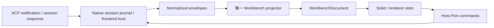

# Pylon 模块维护地图

本页说明当前源码的责任边界，不是将来必须照着搬目录的施工计划。术语见 [CONTEXT](../../CONTEXT.md)，命名与模块规则见 [开发规范](../../.agents/dev-standards.md)。目录清单的可执行来源是 [audit-maintenance.mts](../../scripts/audit-maintenance.mts)；用 `bun run check:maintenance` 查看当前数量、未归属文件和大文件定位。数量随代码计算，不在文档复制。

## 责任与入口

| 维护块 | 路径与入口 | 所有者、输入输出与限制 | 验证入口 |
| --- | --- | --- | --- |
| 公开契约 | `src/contracts/`、`src/sdk/` | 定义插件可消费的类型、语义和版本边界；不拥有运行时状态 | SDK / manifest / contribution 测试；`check:deps` |
| 领域 | `src/domains/`；[workbenchProjector](../../src/domains/workbench/workbenchProjector.ts) | normalized envelope → 可丢弃文档；projector 保持唯一，选择器不改 journal | `vitest run src/domains` |
| 应用装配 | `src/app/`、`src/application/`、`src/kernel/`；[applicationRuntime](../../src/application/applicationRuntime.ts) | application 层拥有应用注册和事务；kernel 负责根挂载、恢复与启动接线 | `vitest run src/kernel src/application` |
| 基础设施 | `src/infrastructure/`；[runtimeClient](../../src/infrastructure/tauri/runtimeClient.ts) | UI / domain 边界到 IPC、存储、传输；处理错误和取消，不决定产品布局 | `vitest run src/infrastructure`；`check:boundaries` |
| 插件宿主 | `src/plugin-runtime/`；[pluginCompositionRoot](../../src/plugin-runtime/pluginCompositionRoot.ts) | 拥有 registry、activation、权限与资源 Scope；产品通过贡献接入 | `vitest run src/plugin-runtime` |
| 第一方产品 | `src/plugins/`；[builtinProductPlugins](../../src/plugins/product/builtinProductPlugins.ts) | 产品定义激活依赖，`plugins/core` 提供产品实现；不因 core 名称变成 Kernel | `vitest run src/plugins`；产品贡献/样式门禁 |
| 工作台宿主 | `src/host/`、`src/sheets/agent-workbench/`；[agentWorkbenchSession](../../src/sheets/agent-workbench/agentWorkbenchSession.ts) | 拥有会话绑定、generation、订阅和文档更新；renderer 经 Host Port 发命令 | `vitest run src/host src/sheets/agent-workbench` |
| 渲染器 | `src/renderers/`；[SolidWorkbenchApp](../../src/renderers/solid-workbench/SolidWorkbenchApp.solid.tsx) | 消费 document / appearance / commands；拥有局部 UI 与 DOM 清理，不另建会话数据源 | `vitest run src/renderers`；`check:solid`；实际 UI 检验 |
| 工作区 UI | `src/sheets/`、`src/workspace-sheets/`、`src/components/` | Sheet 激活、设置与已有组件；agent-workbench 子目录优先归宿主块。chat 含历史编排，迁移前逐个核实 | 对应组件/Sheet 测试；`check:first-party-styles` |
| CLI | `src/cli/` | 语法和执行适配，复用命令责任方，不重建 session 生命周期 | `vitest run src/cli` |
| 观测 | `src/obs04/`—`src/obs07/` | 冷启动、删除取证、stderr 样本与三源导出 DEV 触发器；只读证据，触发器在 main 动态接入。#228 起三源采集器下沉 `src/domains/export/`（生产 `core.export.*` 与 DEV 钩子同源） | `vitest run src/domains/export src/obs04 src/obs05 src/obs06 src/obs07` |
| 历史策略 | `src/css01/` | 已有样式取证基线；目录编号本身不是删除或合并的证据（`src/css04/`、`src/cwd02/` 已作为零引用死代码删除，#228；cwd wire 行为锁迁 `src/infrastructure/acp/__tests__/`） | 各目录测试；样式与边界门禁 |
| 窄工具 / 演示 | `src/utils/`、`src/demo/` | 窄工具按消费者归属；demo 数据不能当真实 Agent 结果 | 对应工具测试；生产 bundle 检查 |
| 前端根文件 | `src/*` 的直接文件 | 入口、schema、旧 store / 策略；不吸收新增子目录以掩盖归属缺失 | `lint`、`build` 与消费者测试 |
| Native ACP | `src-tauri/src/acp/`、`dispatcher/`、`lifecycle/` | 传输、协商、通知路由、实例连接；lifecycle 锁序与 generation 保持一个入口。#98 起：`acp/negotiated.rs` 是能力协商快照唯一真源（canonical 矩阵 + 四态 + 消费者注册表，session 建立/重连探针/agent_status 消费同一份；#110 F2：`list`/`close` 为**双形状**——ACP 标准的 object 与线上旧广告的显式 `true` 都算广告，其它值仍 fail-closed），`acp/interaction_queue.rs` 是 permission/elicitation/question 等 client request 的统一 request-id 队列（FIFO、单一 Active、cancel/timeout/disconnect drain 终态、冷挂载快照），`session/fork.rs` 是 `session/fork` raw RPC 消费者（能力 usable gate + 受限 envelope + parent/child 登记） | Rust ACP / dispatcher / lifecycle 测试；`check:acp-shadow` |
| Native session | `src-tauri/src/session/`；[mod.rs](../../src-tauri/src/session/mod.rs) | session 事务、journal 与 replay；持久化提交先于发布，删除 tombstone 阻止复活（#110 F3：删除在写 tombstone 的同一事务内清扫该 owner 的 canonical 事件；遗留垃圾由墓碑清扫 + WAL checkpoint 的后台维护兜底；#110 F5：建立期按「agent 显式 model > profile.model > 响应回显」落 `session.model-updated`） | Rust session / event_repo / replay 测试 |
| Native host | `src-tauri/src/` 其余模块 | Tauri 命令注册、文件/终端/Gateway/安装等 native adapters；专业子目录优先归属 | host 库测试、构建与 Clippy |
| 可复用 Agent 能力 | `src-tauri/pylon-core/src/` | catalog、检测、preflight；保持受控探测与配置身份区分 | workspace 化后随 `cargo test --workspace --lib` 进门禁；Clippy 走 workspace 单跑 |
| Native 基础 / 宠物 | `src-tauri/pylon-foundations/src/`、`src-tauri/pet-core/src/` | 基础类型与独立宠物领域；不从 renderer 或 Tauri UI 反向导入 | 同上（单锁单 target，`--workspace` 一条命令覆盖全 crate） |
| canonical 契约单源 | `src-tauri/pylon-canonical-types/src/` | canonical 事件类型词表、wire 判别符映射与 identity 推导（owner key / eventId / sequence）。**唯一事实源**：TS 侧词表由 `scripts/generate-canonical-event-types.mjs` 从它生成，写入侧 `session/event_repo.rs` 与计算核同时消费（#220 WP1，ADR-0018） | `cargo test --workspace --lib`；`check:canonical-types`（TS 生成物是否同步） |
| 前端计算核（WASM，**2026-09-21 起只剩流式**） | `src-tauri/pylon-compute/src/streaming/` | 流式文本管线（stable/unstable 切分、揭示预算引擎 D1/D2）的**计算层**，`wasm-bindgen` 出口。纯函数：不读时钟/store/registry、不做 IO、不发明活性判定（权威在运行时内核，ADR-0017）。出口分「纯内层 + wasm 薄壳」两层（`JsError` 在非 wasm 目标会 panic）。**投影与 events 的 Rust 侧已删、回退 TS**（ADR-0018 修订 1）：投影在 `src/domains/workbench/workbenchProjector.ts`（活实现），events 一直就在前端 TS（`src/domains/events/**`、`infrastructure/events/canonicalEventBatch.ts`）。产品路径的编排与 DOM 消费仍在 JS，`src/wasm/` 是构建产物 | `cargo test --workspace --lib`、`check:rust`；对照见 `scripts/compute-parity/`（只对流式两项）；markdown 回归见 `markdownComputeParity.test.ts` 的快照锁 |
| markdown 与高亮（WASM） | `src-tauri/pylon-markdown/src/` | comrak（GFM）解析 → 与 TS `MarkdownRenderNode` 同形状的渲染模型；syntect + **vendored tmLanguage 语法**（`assets/`，由 `gen/generate-assets.mjs` 从 starry-night 导出）做**整块进/整块（行数组）出**的高亮。不含 DOM 与缓存编排（那些留 JS） | `cargo test -p pylon-markdown --lib`；`parity/` 下的差分工具与快照（`diff.mjs` / `parity-report.json`） |
| 构建与工具 | `src-tauri/*` 的构建文件、`scripts/` | 开发、审计、打包工具；不是产品运行时依赖 | 脚本测试、发行校验、`check:docs` |

`check:maintenance` 覆盖上述根下受 Git 管理或未忽略的新 TS/JS（含 m/c 变体）、Rust、Python、PowerShell、shell 源文件；排除 tests、fixtures、vendor、target、node_modules、声明文件与打包资源。CSS、图片、配置及文档不是该源码计数的对象，分别由样式、主题、manifest、bundle 和文档门禁维护。Rust 行数包含内联单测，只能用于定位；不能由行数断言生产复杂度。资源 SDK 是构建产物，不能当作第二份可编辑实现。

新增目录的归属在 `moduleDefinitions` 显式登记；未知前端子目录会导致检查失败。该清单按目录责任归类，**不能替代 import 依赖检查**，后者仍由现有 runtime / renderer / contribution 门禁负责。

## 会话与渲染边界

图是责任流，不表示每个响应都写入 native journal。session response 的补充投影和浏览器旧消息桥接有各自来源与信任级别，不能借重构升级为 authoritative replay。

当前已分开的责任：

- [sessionResponseProjection](../../src/sheets/agent-workbench/sessionResponseProjection.ts)：响应选项、模型/模式与 envelope 值转换。去重集合、session owner、订阅与顺序留在 host。
- [messageSnapshotProjection](../../src/sheets/agent-workbench/messageSnapshotProjection.ts)：旧消息快照转换。调用者负责读取存储；转换不提升历史数据的权威性。
- [toolConnectorProjection](../../src/renderers/solid-workbench/toolConnectorProjection.ts)：连线身份、legacy 优先去重与 appearance 解析。布局测量、DOM 注册和卸载留在挂载组件。
- [interactionProjection](../../src/domains/workbench/interactionProjection.ts)：interaction 的脱敏与终态保留策略。类型引用不引入反向运行时依赖，事件次序/去重仍由父 projector 管理。

## 判断是否需要继续拆分

| 已核验的现状 | 维护判断 |
| --- | --- |
| `kernel/applicationRuntime*` 是 application 层的 deprecated 转发，只剩根挂载组件和测试消费者 | 消费者直接依赖 application；删除旧转发，运行时实现不复制 |
| `lifecycle/mod.rs` 的后半部为内联测试，连接/切换/重连通过 `do_connect_and_replace` 共享锁序 | 不为缩短文件搬动锁和并发流程；后续行为变更与对应 characterization 测试一起处理 |
| `dispatcher/mod.rs` 已有 `routing` 模块；宠物事件在 sessions 锁内收集、锁外按序应用 | 继续拆块必须保持锁外副作用时序；不是本轮纯 UI 投影拆分的附带改动 |
| OBS 04—07 的采集对象、trace 包装与返回 API 不同 | 不把相似安装守卫抽成泛用全局注册器；保留 DEV 隔离和各自证据语义 |
| 根 store 与部分产品模块仍在 runtime 边界白名单 | 已知迁移债务仍报告；不能通过新增豁免宣称模块化完成 |

## 验证

`bun scripts/audit-maintenance.mts --naming` 额外输出生产 TS 绑定命名发现；它复用 ESLint 配置，不维护第二套规则。`bun run lint` 是包含测试代码的命名门禁。Rust casing 由 Rust lint 维护，语义名与单位仍需 code review。

整体入口是 `check:frontend` 与 `check:solid`——#179 起 `check:solid` 同入 CI 前端 job，本地与远端同一套边界门禁——再加上当前 CI 的 Rust 测试 / ACP shadow parity / 四 crate Clippy。#184 起 CI 拆为多并行 job；#193 起为 frontend（静态门禁 `check:frontend:static` + main 专用覆盖率）/ frontend-test（vitest `--shard` 分片矩阵）/ rust-test / rust-clippy / rust-shadow 五个 job：`check:frontend` 本地语义保留（含测试），CI 上 vitest 走 frontend-test 分片（606 文件 / 4439 用例对半并行），覆盖率门禁只在 main push 执行（阈值仍拦住合入后的 main）；Tauri core mock 统一走 `src/test-utils/tauriCoreMock.ts` 工厂（形状单一来源，行为仍 per-file）；#193 曾试点 react-shared 组 jsdom 环境共享（`isolate: false`），因实测收益微小（environment 累计仅降 ~16s）且与隔离组时序敏感测试的抖动相关而**回退**——DOM 套件维持 per-file 隔离；`check:acp-shadow` 与 golden trace generator 的 cargo 调用统一 `--features test-agent` 指纹；`check:maintenance` 已接入 `check:docs`，随前端 CI 执行。各阶段的测试日志和 CI 结果放在本次工作记录，避免把一次绿色运行写成永久保证。
