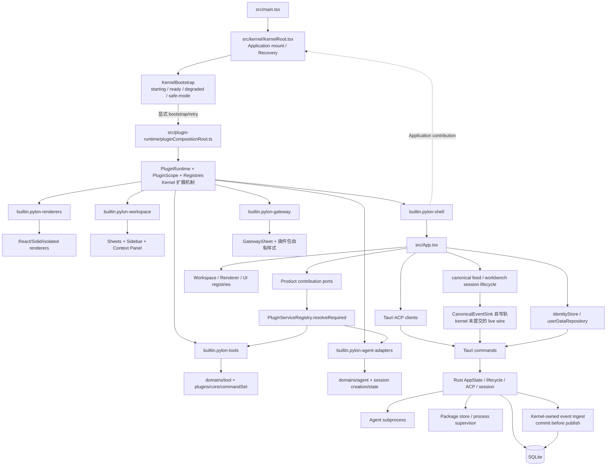
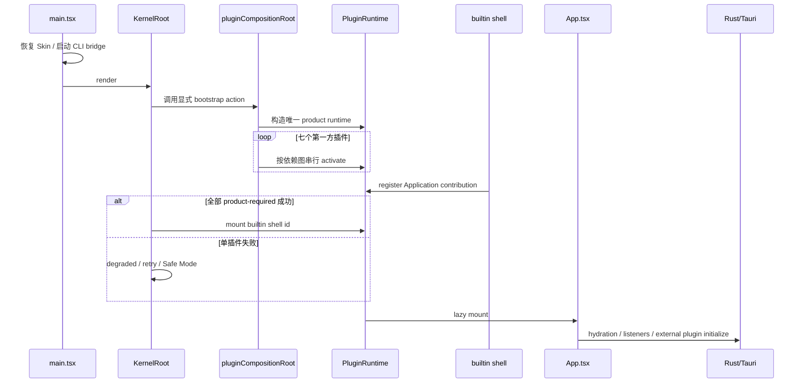
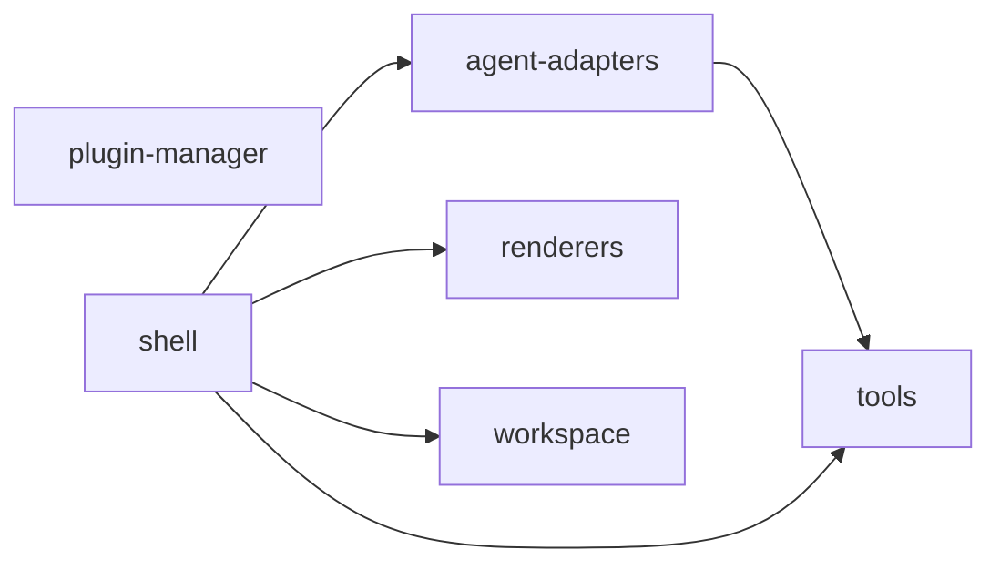
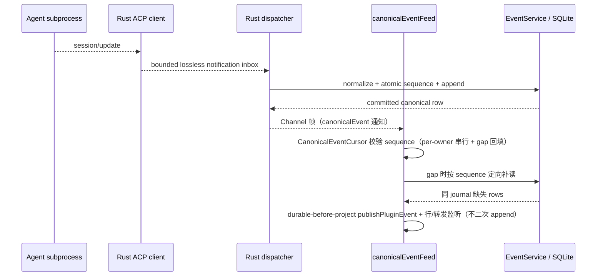
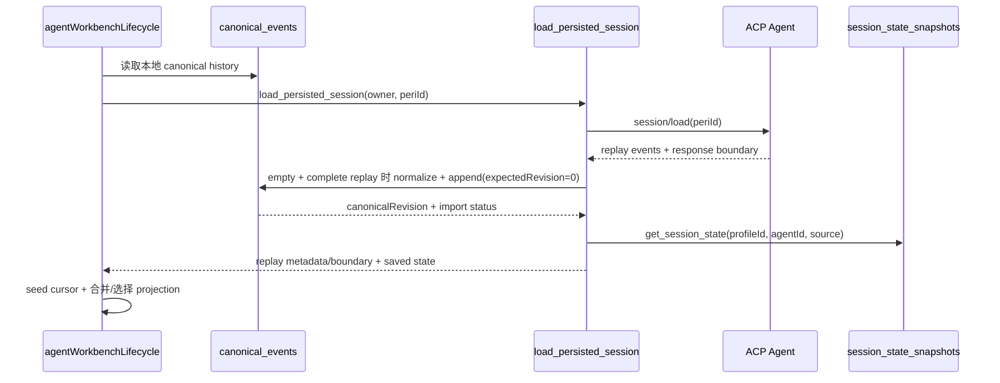
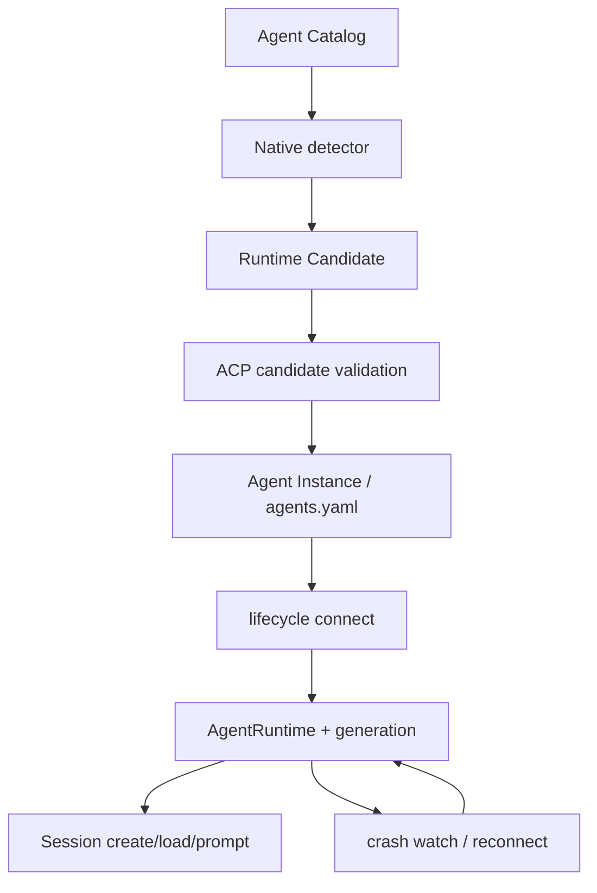
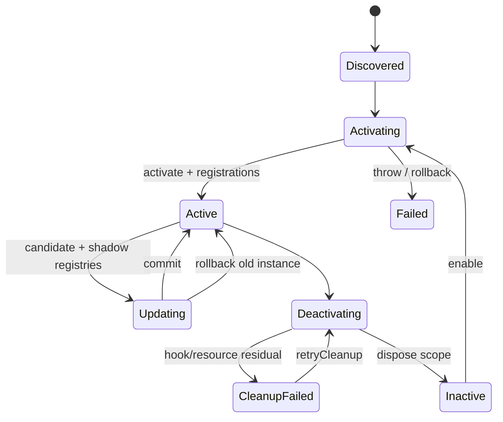

# Pylon 项目架构参考

> 状态：当前实现地图，不是目标架构承诺  
> 最后核验：2026-09-26  
> 适用仓库：`prism-desktop`  
> 阅读规则：后续任务先读本文，再只核验涉及区域；除非命中“全量复核触发条件”，不要重新扫描整个仓库。

当前 Kernel 加固的决策、问题编号、施工阶段和进度见 [`Docs/Archive/Pylon-Kernel-施工台账.md`](../../../Docs/Archive/Pylon-Kernel-施工台账.md)。

2026-09-13 局部核验：第一方产品现含 plugin-manager；application runtime 已归 `src/application/`，kernel 仅保留根挂载与恢复接线。当前路径、命名与维护入口见 [模块维护地图](Pylon-模块维护地图.md)。下文历史阶段仍按当时范围描述，不将其当成最新文件计数。

插件 Host、七个 Product Plugin、前端 registries/consumers、Tauri IPC、Rust Kernel、native package/process supervisor 与外部进程的细粒度依赖见 [`Pylon-插件化前后端拓扑全图.md`](Pylon-插件化前后端拓扑全图.md)。该图的 Renderer Suite 宿主接缝已落地为实线；仅第三方可安装 Suite 仍是虚线规划，虚线不得视为当前实现（React minimal fatal fallback 规划已取消，Suite 宿主的 fatal 分支为纯错误横幅）。

## 1. 文档目的

本文固定 Pylon 当前代码的主要结构、运行时拓扑、数据流、Kernel 与插件层归属、关键 invariants、已知风险和测试入口。

本文将信息分为三类：

- **当前事实**：可以从现有代码直接确认的行为。
- **目标方向**：加固时推荐维持的 ownership 和依赖方向，尚不代表已经实现。
- **待决策**：必须由产品语义决定，不能由重构者擅自选择。

领域术语以仓库根目录的 [`CONTEXT.md`](../../CONTEXT.md) 为准。本文使用的关键术语包括 Agent Catalog、Agent Profile、Agent Instance、Runtime Candidate、Presentation Profile、Renderer Engine 和 Workbench Renderer。

## 2. 一句话项目定位

Pylon 是通过 ACP 连接多个本地 Agent runtime 的桌面工作台。它以最小 Kernel 承载 Agent、Session、ACP、持久化、基础生命周期和插件运行环境，以第一方和第三方插件组合产品功能与界面。

## 3. 最重要的分层结论

不要把目录名直接等同于架构层级：

- `src/kernel` 目前主要实现 Application mount、recovery 和少量 Kernel UI，**不是完整的概念 Kernel**。
- `src/plugin-runtime` 是 **Kernel 的插件宿主与扩展机制**，不是业务插件层。
- `src/plugins/product` 是七个第一方 Product Plugin 的激活和依赖定义。
- `src/plugins/core` 是第一方 Product Plugin 使用的 implementation；虽然叫 `core`，但它不是 Kernel。
- Session、ACP、持久化与恢复的概念 Kernel implementation 目前跨越 React/TypeScript 和 Rust/Tauri 多个目录。
- `App.tsx` 仍承担大量 bootstrap、hydration、listener 和关闭收敛职责，因此当前 Product Shell 与概念 Kernel 之间并未完全分离。

## 4. 当前总体拓扑



虚线表示 Shell 通过稳定 Application contribution 被 Kernel mount，而不是业务层直接控制 Kernel。

## 5. 目录地图与 ownership

| 路径 | 当前职责 | 架构归属 | 修改前优先阅读 |
|---|---|---|---|
| `src/kernel` | 根 mount、recovery 与 bootstrap 接线 | 物理 Kernel 壳 | `KernelRoot.tsx`、`ApplicationMount.tsx` |
| `src/application` | Application runtime、注册事务与 soft-remount | Application 所有者 | `applicationRuntime*.ts` |
| `src/plugin-runtime` | PluginRuntime、Scope、registries、shadow update、package runtime | Kernel 扩展机制 | `pluginCompositionRoot.ts`、`pluginRuntime.ts`、`pluginActivationContext.ts` |
| `src/plugins/product` | 第一方插件包定义、依赖拓扑、激活入口 | Product Plugin | `builtinProductPlugins.ts`、`packages/*` |
| `src/plugins/core` | 第一方插件的具体贡献 implementation | Product Plugin implementation | 按目标贡献定向阅读 |
| `src/components/chat` | 消息投影、发送事务、replay 协调与呈现纯逻辑 | 当前横跨 Product 与概念 Kernel | `streamingSend.ts`、`chatReplayCoordinator.ts`、`messagePipeline.ts` |
| `src/sheets/agent-workbench` | Workbench 会话运行时（TurnClock 生成时钟）、生命周期 IPC 编排与命令面 | Product Workbench | `agentWorkbenchSession.ts`、`agentWorkbenchLifecycle.ts` |
| `src/identityStore.ts` | Profile/Session/Agent 前端状态与 hydration | 当前横跨 Product 与概念 Kernel | 同时阅读 `userDataRepository.ts` |
| `src/infrastructure/events` | canonical feed/cursor、repository/sink/scheduler、pluginEventBus | 当前概念 Kernel implementation | `canonicalEventFeed.ts`、sink、scheduler、repository |
| `src/infrastructure/acp` | Tauri command typed clients | Adapter | 目标 command client 及测试 |
| `src/domains` | Agent、event、workspace、search 等领域逻辑 | Domain modules | 仅阅读目标 domain |
| `src/renderers` | Workbench Renderer 与 Solid implementation | Product Renderer | renderer contracts 与目标实现 |
| `src/sheets`、`src/workspace-sheets` | 产品工作区与 Sheet UI | Product Plugin/UI | 对应 Sheet 与 integration tests |
| `src-tauri/pylon-acp` | ACP 协议引擎核（`agent-client-protocol`）：engine/client/negotiated/replay/wire trace/policies；日志经 `runtime_sink` 端口注入 | 可复用 Kernel library | `engine.rs`、`client.rs`、`negotiated.rs` |
| `src-tauri/src/agent_config` | agents.yaml 读取/补丁/config 域原子事务编排（AgentDef 值类型在 pylon-core）；通用原子写正身在 `pylon-foundations/src/atomic_write.rs`（#317 批次二） | Rust Kernel | `load.rs`、`patch.rs`、`atomic_write.rs` |
| `src-tauri/pylon-session` | 会话存储核：canonical event / message / user_data 仓库、retention、turn 聚合（rusqlite，零 tauri） | 可复用 Kernel library | `event_repo/`、`msg_repo/`、`error.rs`（SessionError） |
| `src-tauri/src/lifecycle` | Agent connect/switch/reconnect/config transaction | Rust Kernel | `mod.rs` |
| `src-tauri/src/dispatcher` | ACP notification dispatch、runtime projection、reconnect | Rust Kernel，夹杂产品行为 | `mod.rs` |
| `src-tauri/src/agent` | GUI 检测命令层（`detection.rs`：`DetectionSnapshot` 三态 TTL 缓存、force 刷新与取消，P74 B0）与多 agent 运行时状态机（`runtime.rs`） | Rust Kernel | `detection.rs`、`runtime.rs` |
| `src-tauri/pylon-core` | Agent Catalog、native detection、preflight/环境诊断、launch plan、CLI client | 可复用 Kernel library | `agent_catalog.rs`、`agent_detection.rs`、`agent_diagnostics.rs` |
| `src-tauri/pylon-foundations` | event_names、sanitize、time、workspace、git、atomic_write（通用原子写正身，#317 批次二下沉）等零 tauri 纯逻辑（P58 拆分） | 可复用 Kernel library | `src/lib.rs` |
| `src-tauri/pylon-canonical-types` 等 | 其余 workspace 成员：canonical wire 契约单源（#220）、前端 WASM 计算核（`pylon-compute`）、Markdown 纯逻辑（`pylon-markdown`）、pet 域（`pet-core`） | 可复用 Kernel library | 各 crate 的 `src/lib.rs` |
| `src-tauri/src/plugin_cmds/` | Native plugin package transaction/store | Kernel plugin adapter | stage/commit/recovery 代码 |
| `src-tauri/src/plugin_process` | 外置插件进程监督 | Kernel plugin adapter | process lifecycle 与 restart |

## 6. 前端启动序列



当前事实：Kernel recovery layer 先可见；第一方插件由 `KernelBootstrap` 显式启动（依赖图拓扑排序后**串行 await** activate——activate 本体为同步注册，无并行收益）。单插件失败进入可观察 degraded 状态，可定向 retry 或进入 Safe Mode，不再依赖 ESM import 副作用。

**窗口先见（#270，ADR-0022）**：Rust 侧窗口创建不再等待默认 agent 的 ACP 连接——`run()` 仅把 runtime 置 `Connecting`，`run_setup_pipeline` 以后台任务复用 `connect_and_replace` 完整激活机器（持 switch_lock → agent_lifecycle 双锁），连接完成/失败经 `pylon:agent-status` 事件广播；连接期间前端 `send` 门控阻断发送（不做排队/自动触发），左上角三灯黄（connecting）→ 绿（connected）/ 红（回落 Disconnected 携带 lastError）。启动耗时相位表见 `startup_timing.rs`（#269，runtime log `source="startup"` 一条时间线）。

## 7. 第一方 Product Plugin 拓扑



| Product Plugin | 主要贡献 |
|---|---|
| `builtin.pylon-tools` | 平台命令、工具字典与工具相关能力 |
| `builtin.pylon-agent-adapters` | Agent Catalog/Detector、Session Creation、Session State provider |
| `builtin.pylon-renderers` | Renderer Engine、内容/工具 renderer、Presentation Profile、字体 |
| `builtin.pylon-workspace` | Workspace、Sidebar、Context Panel、Search、Export、Projector |
| `builtin.pylon-shell` | 根 Application、Shell commands、Shell CSS |
| `builtin.pylon-plugin-manager` | 插件管理面板（P53 起“设置 → 插件”默认页）：安装/启用/Shadow Update 诊断与能力授权卡；声明 `plugin.management` capability，不依赖其他产品包 |
| `builtin.pylon-gateway` | Gateway sheet 注册与插件包自有样式（P77 起自 core/workspace 包代管迁入）；Rust GatewayCore 仍在 Kernel |

当前约束：尽量保留这七个包的构造。Kernel 加固优先通过稳定 seam、结构化状态和 adapter 收拢业务，不先做目录搬家。

## 8. Session 与 canonical event 数据流

### 8.1 当前实时路径



当前事实：具备完整 durable owner 的 ACP live update 与 prompt 的 user/success/failure boundary 由 Rust Kernel 在发布前写入现有 `canonical_events`；dispatcher 通过有背压的单消费者 inbox 无损摄取（#99：入站帧经引擎侧可靠中继——inbox 满时有界 spill 续投，spill 溢出以显式 `overloaded` 终态关闭连接并记录 gap 计数，禁止静默丢帧；agent 请求/崩溃广播走独立控制通道，dispatcher 以 biased select 优先消费，帧携带单调 ingress_seq）。prompt/turn 的 live 状态由 per-runtime turn 终态账本（`acp/turn_ledger.rs`，CAS 单终态 + generation 硬隔离 + 每会话终态保留上界）作为后端权威，`load_persisted_session` 响应携带 turn 快照（形状以契约测试钉定：`turn.phase`/`turn.terminal.cause`/`turnInFlight`/`turnInFlightAnomaly`/`sequence.lastIngressSeq`/`lastError`/`replayLoading`）作为前端冷挂载的后端数据面，不依赖一次性 Tauri event；前端归一化层（`infrastructure/acp/sessionClient.ts` 的 `normalizePersistedSessionLoadResult`）已透传该字段——#110 F4 闭合了此前的「后续接线」缺口，只透传已知字段并逐字段做类型守卫，缺失不伪造。该字段的消费端（#68 残留面）：`chatReplayCoordinator` 把它抬上 `ReplayLoadOutcome.turn`，`AgentWorkbenchLifecycle.onCanonicalRefresh` 交给 `agentWorkbenchSession.refresh`——因为终帧只经 per-source IPC Channel 一条路交付（`send_channel_terminal` 是 take 语义、`stop_agent_runtime` 清注册，而窗口广播此前无消费者），且 journal 读可能早于终态行落盘（后端 done 先于 persist），故 refresh 判定「本回合是否已收敛」取 **journal 读到终态行 ∨ 账本 `turn.terminal` 已收敛** 二者之或；账本 cause 的呈现映射收在 `domains/workbench/generationLedgerSummary.ts`，词表外一律不映射——不把失败报成成功。#217（ADR-0017）：「这个会话有没有在途回合」的权威同样归内核——`SessionInfo.turn_in_flight`（进程内标记，不落盘，语义严格为「本进程已派发 prompt、尚未收到终态」，与 `turn_ledger.begin` 同点置位），在终态路径上无条件清理（`report_settle` 按键清理为三条终态臂唯一汇聚点，`publish_prompt_failure` 追加 force-clear 防御纵深；映射移除随条目结构性消失），快照输出 `turnInFlight`/`turnInFlightAnomaly`/`turnInFlightAnomalies`（「已不在途却仍为真」的诊断读数：标记滞留时告警 + 计数）。前端活性权威优先级为 **kernel > clock > document**：会话层（`agentWorkbenchSession`）经 refresh 收到快照即以内核事实表态（`livenessSource: 'kernel'`）；内核表态可用时 applyLive 的两条「采纳实时帧」启发式（非乐观 user echo 起时钟、无时钟实时正文 delta 采纳）停用——他端先开回合的「是否在途」由内核回答，本进程不再从观察物猜；`turnClocks` 保留承担 elapsed 起点与终态摘要。新鲜度守卫：快照观测到 false 而本地时钟活动时不覆盖（load 链与发送竞态下本地生命周期更新；终帧/账本终态随后自会落静）。前端自 P52 起以应用级单例 `canonicalEventFeed` 为 Channel 帧唯一入口：帧先过 source gate，再由 `CanonicalEventCursor` 做 per-owner 串行、去重与按 sequence 的 gap 定向补读，committed 行在投影之前逐条 `publishPluginEvent`（durable-before-project），终帧（done/error）以 onTerminal 信号交给 Workbench 会话的 TurnClock 收敛终态；kernel 未提交的 live wire 才走 sink 自写轨。`canonical_events` 是重启后的历史权威：已有 authoritative local rows 时 local journal wins，replay 只作为诊断/完整性证据，不覆盖、补齐或重排本地事实。仅在空 journal（或既定幂等的 unverified import 分支）且 replay response 完整时，才允许经同一 normalize/append transaction 导入；partial/truncated replay 必须保持 `complete=false`，不得伪装完整 snapshot，也不得通过 `history.snapshot` reconciliation 合成第二历史源。 Dispatcher now batches same-owner live session/update rows in a bounded 32-row / 8ms window before the durable append; control, replay, owner-switch, and terminal boundaries flush the window.
#315（provider 私有扩展通道与双栈语义单源）：peri 侧 PeriCaps 契约（peri-acp-types peri_caps.rs，经 initialize clientCapabilities._meta 协商）由 `pylon-core::agent_config::default_initialize_caps` 统一声明 agentEvent/agentEventDone/unstableEvent/prediction 四开关（hitlPending 上游无发送者不声明）；内核 `pylon-acp::AcpKind::ProviderExtension` 识别 peri/agent_event、peri/agent_event_done、peri/unstable-event、peri/prediction_ready 四通知，dispatcher 经 `wrap_provider_extension_notification` 就地包络为 session/update 形状（判别符=wire method 原名，载荷字段原样，event_json→eventJson 投影）后走既有 durable canonical + publish 通路——routing 对未知 sessionUpdate 变体照常 publish/persist，包络不绕过 journal。前端 periNormalizer 是这些帧唯一语义化入口：AcpEvent DTO（serde tag=type/content=value）映射到既有 workbench 语义事件（subagent→activity.*、compact/rewind/suspend/retrying→lifecycle.*、ContextWarning→budget.warning、StateSnapshotMeta→usage.updated、OAuth→interaction.*、prediction_ready→assist.prediction、SystemNotification/LspDiagnostics→diagnostic.*）；peri/agent_event_done 不映射 session.completed（turn 终态权威归 turn_ledger，ADR-0017）。同一条 wire 的 canonical（EVT-03）与 workbench（C 系列）双栈的判别符→语义方向由 `domains/events/wireSemanticCorrespondence.ts` 单源对应表钉住（parity 测试双向校验），session_info_update 口径按 workbench 语义收敛为 mode-updated；C16 覆盖清单新增 WIRE-EXTENSION transport 分级承载扩展通道单元（SOURCE-ONLY 47→31）。hermes polished title（如 "read: /x"、裸 machine name）经 agents.yaml tool_dictionary aliases + toolResolution 前缀/全等候选匹配反解 machine name（wire 零改动）。

#316（ACP v1 协议面补强）：宿主 fs/terminal 能力"实现与广告同源"通电——`acp.host_tools`（fs 门，默认 host）与 `acp.host_terminal`（terminal 门，默认 agent）双门控进 `AcpProtocolConfig`（YAML 声明优先、env `PYLON_ACP_HOST_TOOLS` 兼容回退、两门入 runtime_fingerprint），`build_initialize_plan` 消费与 dispatcher 门禁**同一份** `HostToolsPolicy::resolve` 结论注入/裁剪官方形状声明（`fs:{readTextFile,writeTextFile}`/`terminal:true`/`elicitation:{form:{}}`；显式 initialize_caps 不追加不裁剪）；strict fs 沙箱根取自会话工作区（SessionInfo.cwd），不信任 agent 自报参数。stopReason 走官方 `StopReason` typed 判定（max_tokens 转合法终态、未知值 warn 降级 end_turn）、initialize 回显 protocolVersion 校验（缺字段 lenient、不一致 fail-closed `protocol_version_mismatch`）、session/update 变体分类单一入口 `classify_session_update`（schema typed-first + Peri/Hermes 宽容别名 fallback），turn_ledger 增 saw_thinking 位（thinking-only 回合不算 agent-empty）。elicitation 标准 form 模式：能力广告 + GUI 表单卡（受限原语子集，object/array/url 降级拒绝）+ `elicitation/complete` 通知收敛（typed `CompleteElicitationNotification`，elicitationId 匹配 pending 私有交互）；permission watcher 死亡分支补 private_interactions 残留清理。TerminalRegistry 增 release_session/clear（close_session 与 stop_agent_runtime 挂钩，终端进程不再跨代泄漏）。协议解析面收编官方 SDK 类型：StopReason/SessionUpdate/ContentBlock/CancelNotification/各 fs·terminal Response/CLIENT_METHOD_NAMES/ErrorCode。


### 8.2 当前恢复路径



当前契约：会话状态以 `(profileId, agentId, source)` durable owner 写读；`periId` 只记录最近 remote binding，不参与 identity。旧 `sessions.session_state` 不再接受生产写入，v10 迁移仅在 canonical journal 能唯一证明 owner 时回填，歧义行原样保留。

GUI 创建、恢复和发送链路会把 `profileId` 送入 Rust runtime 的 `SessionInfo`。同一 runtime `source` 首次绑定 Profile 后不可换绑；dispatcher 后续只能从该绑定与 runtime `agentId` 构造完整 durable owner。平台自动会话没有 UI Profile，明确保持 `None`，禁止以 active/default Profile 猜测并误写 journal。

`session/load` 失败时不会自动创建 remote session，也不会改写原 binding。该 owner 转入 detached/send-blocked，UI 让用户明确选择：按原 owner/binding 重试，或创建具有新 local `id/source` 的独立 Session 分叉。分叉继续走既有 `new_session` seam，canonical journal 仍是唯一 durable history。

发送路径的映射缺失是另一条链路（P51）：Pylon 重启后内存映射消失时，`send_message` / `send_message_streaming` 可携带持久化 `periId`（`PromptContext.known_peri_id`）；Rust 复活链在 agent 广告 resume 能力时优先 ACP 原生 `session/resume`（object-only fail-closed），失败或未广告再走 `session/load`（普通 RPC，无 replay capture——历史由本地 canonical journal 呈现；resume/load 通道一律消费 initialize 协商快照 `acp/negotiated.rs` 的「catalog 声明 ∩ 服务端广告」交集，未协商则 typed 跳过；根级 `loadSession: true` 仅作为登记的兼容 alias，见 ADR-0004）复活原远端会话并重挂槽位，复活失败（远端会话真死）或复活成功但远端返回了不同 sessionId（显式 rebind）时，经 `pylon:session-recreated {source, periId}` 广播让前端回写新 binding，不静默复用旧映射。若 prompt Response 携带“会话不存在”语义，则按 `(peri_id, generation)` 复核删除幽灵映射、保留 Detached 健康快照，要求显式 load/重试/分叉，不静默新建。

`session/load` 成功时携带 `replayMetadata`。`boundary.kind=session-load-response` 表示匹配的 load response 是收集终点；`observedCount` 与 1-based retained ordinals 描述实际窗口。超限保留最近 N 条并报告 `droppedCount`。前端遇到缺失/不自洽 metadata 时标成 `metadata-unavailable`，不会把 partial replay 当完整 snapshot；export 对 truncated replay 返回 `replay_truncated`。

前后端 replay trace 使用 `C0-v1.0-20260902` 字段对账：`owner`、`loadGeneration`、`captureLp`、`responseBoundary`、`observedCount`、`retainedCount`、`droppedCount`、`authority`、`canonicalRevision` 与 `commitOutcome`。Rust `replay_trace` 记录 transport/journal 结果，前端 `load-response`/`load-commit` 记录 projection 结果；两侧以 owner + generation 配对。无匹配 response 的 timeout/EOF/RPC/取消只记录显式失败 code，不能把已收集的部分 batch 宣称 complete。

### 8.3 Workbench 绑定与流式稳定性 seam

Workbench Renderer 的显示事实源是 `Workbench Runtime` 当前文档；P52 后 `chatEventController` 已删除，canonical committed row 的唯一前端入口是应用级单例 `canonicalEventFeed`（cursor/gap 回填/去重与 durable-before-project 发布），`agentWorkbenchSession` 经 pluginEventBus 消费行投影，并以 TurnClock 作为按 source 隔离的唯一生成时钟（终帧信号直接收敛 TurnClock 终态：主轨是 feed 的 onTerminal，另有 `subscribeWindowTerminalFrames` 订阅 `pylon:done`/`pylon:error` 窗口广播作兜底轨——两条路共用同一信号构造，重复投递由 TurnClock 幂等吸收，终态收敛因此不单点依赖 per-source Channel 注册），不拥有第二份渲染历史。Session metadata 更新（标题、`lastReplyAt`、`periId`、workspace 路径）不得被当作文档身份变化。`workbenchSessionBindingKey` 只由 `(session.id, source, agentId, profileId)` 构成，`agentWorkbenchSession.bind` 对同一 key 幂等；因此终态事件不会因 Zustand 产生新 Session 对象而替换整份文档。需要真正重载时，使用显式 session/reload token seam，而不是依赖对象引用。

终态 document 与 generation metadata 可能在同一事件中连续发布。显示层 `streamingDisplayScheduler` 对同一 owner/session 的 terminal transition 在微任务边界做 latest-wins 合并；结构性会话切换和显式 flush 仍同步。该合并只影响 Renderer 消费节奏，不改变 canonical journal、Workbench Runtime 事实或 legacy Adapter 的职责边界。

显示层的揭示策略同时受三个上限约束：发布频率（`maxUpdatesPerSecond`，**60 次/秒**，即每显示帧一次）、打字机基线速率（`revealUnitsPerSecond`，120 字素/秒）与单帧上限（`maxRevealUnitsPerTick`，128 单元），追赶窗口（`maxRevealLagMs`，400ms）决定抬升预算的快慢。追赶步长按窗口内剩余拍数细分，所以提高发布频率只会把同一个 400ms 窗口切得更细（单帧增量更小），不改变收敛时间。**三个上限适用于每一次发布，终态那一帧也不例外**：identity/reset 切换整发快照（被替换的行本就无法插值），其余一切——段完成、追加行、列表重排、终态/错误、后台恢复——只立即发布**结构**（summary、耗时、running、错误状态），未揭示文本按同一上限继续收敛，因此流式行不会在单帧内长出整块文本（那是实时布局测量被打破的来源），也不会出现首次整块倒出。该揭示策略只影响**发布节奏**，不可能改变任何行的**宽度**；真正的宽度类版式缺陷（正文宽度塌陷、行盒撑不开）仍在 CSS 层。但「每几个字换行」类碎裂**不是**宽度问题，也不在 CSS 层：它是流式行**行集合**与当前文本漂移的后果——行边界被留在当前文本里已不存在的空行上，于是同一段干净文本被切成大量极短行（issue #55）。判据：同一条文本在终态或重启后渲染正常，即可排除 CSS 层。修复方向是让行集合始终是当前文本的纯函数（`MarkdownContent.solid.tsx` 的 `StreamingMarkdownBlocks` 由当前文本推导行描述、按位置对账，不保留独立于文本的累积状态）；只读判据见 `streamingDisplay` 读数的 `rowSet`（`rows / textParagraphs > 1` 即出现当前文本之外的边界）。

Workbench 的底部跟随由 `followBottom` sticky seam 控制。`PlainMessageList` 负责消息行测量，外层 `.term` 另以 `ResizeObserver` 覆盖流式行、异步 Markdown/highlight 和图片导致的高度变化；观察回调只有在 sticky 时才执行底部跟随，用户上滚后不再夺回滚动权。

聊天动效（#311）只消费显示层标记：`PlainMessageList` 对生成中的少量尾部新增消息设置短时 `data-entry`，`CanonicalActivityList` 对同一会话生成期间新增的工具活动 id 设置短时 `data-entry`；两者在 760ms 后清除，历史重放、会话换代和虚拟化重挂不重复入场。消息入场为短暂抬升与边缘描线，工具卡入场为轻回弹与一次性描边光晕；直播期间从无结果到首次获得输出或错误的工具卡，在原卡头部和已展开结果区播放一次局部回执，历史恢复与后续同 id 更新不重播；入场仅改变不参与行高测量的 opacity/transform。权威生成态下助手正文尾部的独立覆盖层持续扫光、左轨细线呼吸，终态后若显示调度器仍在补齐文字，覆盖层保留至可见文字连续 440ms 不再增长，随后用一次性短扫线与光点收束并清除；长正文只扫尾部，Markdown 节点不因动效重挂。调度器的打字机只负责按预算揭示文字；`MarkdownContent` 在已经开始流式揭示的助手正文发生前缀增长时，把零盒宽高的光标放到最后一个可见文本叶节点（跳过容器末尾的结构空白，含未闭合代码围栏末行），暂停 420ms 后清除，终态补齐期间仍跟随，不改变换行与调度预算；思考区保持既有表现。Markdown 增量解析仍保留上次已解析模型，首次解析才显示骨架；增长尾块晋升稳定块或未闭合代码围栏闭合时，仅代码、表格、列表、引用和标题播放一次局部定稿描线，不对逐 token 解析结果重播段落入场动效。系统与聊天视图减动效设置均关闭这些动画。

完成代码块的高亮 DOM 有显式生命周期（#221，`chat/codeBlockDomLifecycle.ts`）：高亮由共享 IntersectionObserver 门控（上下各一屏余量，进圈才发起、经帧预算调度器排队）；视口外的块把 token-per-span 树降级为纯文本行（`.term-code-line/gutter/text` 骨架与行高恒定，等宽字体下折行位不变），每行高亮 HTML 串留在 JS 缓存，重进视口先走缓存恢复、未命中才重高亮；出圈降级带 500ms 滞后带防滚动抖动。宿主无 IntersectionObserver（测试宿主）时整套机制旁路，行为与直接整块高亮一致。插件 provider 契约（`highlightCode`，HTML 串进出）与引擎「整块进、行数组出」边界不受影响（高亮引擎自 #241 起是前端 Lezer 的 `chat/lezerHighlight.ts`，不再是 wasm 计算核；边界形状未变，故本节机制与消费方零改动）。`.term-code-block` 另有 `contain: layout` 布局圈闭；消息行级圈闭不可行（`.copy-btn` 溢出行外）。

长时间线会话的行虚拟化（#243，`chat/PlainMessageList.solid.tsx`）：行数与字符量双阈值（≥300 行且 ≥100k 字符，取「与」；prop 可强制，祖先带 `data-row-virtualization="off"` 杀停）之上的会话启用视口窗口——引擎 `@tanstack/solid-virtual`（headless，ADR 同 #243 决策 D9）只负责取窗与实测：按行 key 的尺寸缓存卸载不丢、`measureElement` 挂 ResizeObserver 回填实测、尺寸修正经 `shouldAdjustScrollPositionOnItemSizeChange` 姿态门控（仅 pin 姿态、仅视口起点之上、非上滚途中）。估算层是 `chat/rowHeightTable.ts`（按 key 的尺寸真值 + 最早脏索引增量重建的偏移数组）与 `chat/rowHeightEstimate.ts`（按渲染类型/内容量/toolOutputLines 的确定性估算，reasoning 折叠封顶），引擎仅在缓存未命中时经 `estimateSize` 回落。窗外的行不驻留 DOM，几何由容器内联 spacer 承载——高度取自同一张行高表，物化/卸载不改变布局总高，因此 prepend 不需要滚动补偿；滚动锚定仍走 #212 S4 的自管锚点（锚行恒在窗内）。`scrollTo` 命中窗外目标时走 `scrollToIndex`（自带动态尺寸收敛）只物化目标附近。短会话（低于阈值）保持 #212 渐进挂载窗口的原语义，DOM 结构逐字节不变。

Host Port 的 `WorkbenchRuntime` Adapter 同时订阅 `document` 与 `generation` reader，并在微任务边界合并通知。该 seam 兼容 document/generation 分离的第三方 Suite，避免 generation-only 更新漏掉，同时不把两者重新聚合成单一事实状态。

Agentsheet 空态使用输入优先的双层 Composer seam：context row 承载 workspace，输入区承载首条请求，选项 toolbar 承载模型/权限/思考强度；创建中、失败和乐观投影保持同一 DOM 结构。WorkspaceTitlebar 的应用控制与原生窗口控制分组，但共享统一 icon box、命中区和 focus contract，Presentation Profile 只提供外观差异。

### 8.4 当前本地存储

SQLite schema 当前包括：

- `session_state_snapshots`：owner-keyed usage/commands 等可恢复快照；不是历史存储。
- `canonical_events`：owner-scoped canonical event stream。sink 自写轨（kernel 未提交的 live wire）以 1000 ms per-owner trailing debounce 批量落盘，落盘前把批次内**相邻同类流式 delta**（`assistant.text.delta` / `assistant.thinking.delta`，identity 全字段相等）合并为 `*.delta.batch` 聚合行：行占跨度末位 sequence（`seqSpan` 记录 `[first, last]`，中间编号不占用），`typedPayload = { text, foldedCount, seqSpan }`，`rawPayload = 原始 chunk 数组`；单行受 rawPayload 字节与 foldedCount 上限约束，超限切断成多行（不截断）。读侧（`canonicalRowToWorkbench`）自 #226 起把 batch 行**段级**展开为一个 run 信封（对齐 `turn.unit` delta-run 段形：coverage=`[seqStart,seqEnd]`、sourceId=`ownerKey#seqEnd`），归一仍逐 chunk 过 `normalizeAgentEvent`（方言单源不分叉），投影与逐 chunk 存储在消息面逐字节等价、timeline 按聚合行粒度对应（信封数随折叠比下降，最高 2000×）；任一 chunk 归一偏离期望形状时整行退回逐 chunk 展开（raw 不丢）；未知事件与非 delta 事件仍逐条落盘。kernel 在写入 `turn.completed|failed` 的**同一事务**内追加 `turn.unit` 单元行（保序 segment 数组 + `contentSha256`；只加不减，未终结 turn 不折叠）。segment 分两类：相邻同类 delta 折成 `delta-run`（`seqStart/seqEnd` + 精确拼接 text + run 首条 `occurredAt` + `markdown` 标志），其余行（user/tool/状态/unknown/终态）整行保留为 `event` 段——**嵌入形状是该行的 EVT-01 canonical 事件**（嵌套 `owner`/`provenance`，由 `canonical_event_wire` 自 `CanonicalEventRow` 序列化，与前端 `CanonicalConversationEvent` 契约同构；不得退回数据库扁平列形状）。文档与搜索读取走 compact 语义（`evt_load_compact`：单元 + 未覆盖行，被覆盖行不再传输/解析），且未覆盖行里**相邻同类、identity 全等、sequence 连续**的 delta run 在读侧折成同一种 `*.delta.batch` 行（#205；预算 48 KiB / 2000 chunk，与写侧同口径，超限切断不截断，单条 run 不合并）——`turn.unit` 只在回合终帧落盘却覆盖整回合，故**回合进行中**该回合已产出的 chunk 全部属于未覆盖行，读侧折叠把「切会话正撞上长回合」时的下发行数从数万降到数百（实测 79,687 行 → 244 行）；`evt_list` 分页读保持逐行，不动游标语义。前端以信封 `coverage` 区间做 `appliedRanges` 覆盖幂等（单元 segment 与逐 chunk 行粒度互斥），并在解析边界把嵌入事件归一到嵌套 owner（`domains/events/canonicalEventRow`），单个段不可读时只把该段退化为 `event.unknown`（raw 保留），不抹掉整单元。L3 裁剪迁移在应用关闭时执行：逐 turn 单事务，重折叠 sha256 校验通过才删行并 VACUUM 回收，进度落 `rollup_migration_state`（可暂停/续跑），`retention_policy.trim_rolledup` 开关可整体关闭删行。 Kernel live updates reach this path through the bounded dispatcher batch window; the frontend sink remains a separate non-production write path. #155 T2（schema v15）起存储形态收窄：`canonical_events` 为 15 列瘦身行、`(owner_key, sequence)` WITHOUT ROWID 聚簇主键（取代 v14 的 event_id 主键 + UNIQUE(owner_key,sequence) + idx_session_seq 三棵重复 btree）；`event_id`/owner 分维列/`schema_version`/provenance 四字段/raw_* 截断计数一律**读侧派生**（provenance 以单整数编码五组合，provider=agent_id、recovery importId=local_session_id 按组合还原），wire EVT-01 的 28 字段契约不变。旧库（user_version<15）打开时按 ADR-0008「老数据全丢」**重建**而非升版搬迁：保留 `user_data.profiles` 与 `retention_policy`，丢弃 canonical 历史、墓碑、快照与 `user_data.sessions` 会话列表（重建后侧栏无历史会话是已承认的行为变化）；库头设 `application_id` 与 `auto_vacuum=INCREMENTAL`，维护周期追加 `incremental_vacuum` 归还空闲页。实测（storage_write_bench）：1200 chunk 的 WAL 累计写入相对 per-chunk 基线降至 ~1/14（判据 ≤1/8），隐含 checkpoint 频率 6→1。
- `user_data`：Profile、Session metadata、active Profile 等 versioned envelope。
- `deleted_sessions`：v12 durable-owner keyed 删除 tombstone；`owner_scope=exact` 精确 gate，`legacy` 保守 gate 同 source；旧 v11 归档表随 v15 重建一并丢弃。#110 F3 起，删除会话在写 tombstone 的**同一事务**内清扫该 `owner_key` 的 `canonical_events`（此前为 append-only 留存，实测导致已删会话事件累积到全库 97.9%）；`legacy` 墓碑只有裸 `session_id`、无法安全定位 owner，故不清扫。墓碑行本身永久保留——迟到写 gate 依赖其存在性。
- `retention_policy`：保留策略（默认永久保存，D-15 契约不变）。#110 F3 另加墓碑事件清扫与 WAL 维护：后台每 10 分钟（启动即跑一次）回收 `state='deleted'` 且 `owner_scope='exact'` 墓碑中超过 `TOMBSTONE_EVENT_GRACE_DAYS`（7 天，留误删取证窗口）的遗留事件，并执行 `PRAGMA wal_checkpoint(TRUNCATE)`（流式回合每 chunk 一次事务，从不 checkpoint 时 WAL 只增不减）。

Tauri 模式以 SQLite 为唯一权威；localStorage 只作带逐域 revision 与 `clean/pending/stale` 标记的非权威缓存。后端不可用时缓存仅供展示，Identity mutation 被阻断；重试会先清失败 pending，再以 SQLite 权威回读覆盖缓存。只有后端明确无行时才允许 expected revision 0 的冷启动导入。Browser 模式由 localStorage adapter 单独承担该模式权威。

## 9. Agent Runtime 生命周期



配置来源优先级：

1. 环境变量 `PYLON_AGENTS_CONFIG` 指定路径。
2. 可执行文件旁的 `agents.yaml`。
3. 编译期嵌入的兜底样例（`src-tauri/src/agent_config/embedded_agents.yaml`）。

第 3 档是**零 Agent 的注释样例**，因此「既无环境变量、exe 旁也无 agents.yaml」时应用以
**零 Agent** 启动：干净空态 + 设置 → Agent 的引导（「发现的运行时」验证 → 导入，或
「新建 Agent」手填 exe 后用「测试连接」验证，见 #326）。
**零 Agent 是合法的读取状态**（`agents: {}`）；但 `agents` 键本身必需，缺键按配置错误报出，
拼错的键名不会被静默当成空表。写入路径相反：配置**变更**不得把 agents 表清空
（`validate_candidate` 拒绝删到零 Agent——删到空表是操作失误而非意图）。仓库根的 `agents.example.yaml` 是**开发模板与测试夹具**，
不再参与嵌入（此前被 `include_str!` 预加载，导致首屏出现两个占位 exe 必然启动失败的 Agent）。

当前交互能力：Agent Runtime UI 使用参数数组编辑器并预览 effective invocation；发现报告把 identity confidence 与 ACP validation 分离。GUI 检测结果由 `DetectionSnapshot` 三态 TTL 缓存（fresh/stale/expired）承载，支持强制刷新与取消在途探测（P74 B0）；设置页保存受 fail-closed 门禁约束，必须先对当前草稿指纹通过一次连接测试（P74 B1）。配置保存使用 revision CAS、`.bak` 和 hard max，并区分 Stored/PendingRestart/Activated；显式 restart 失败保留旧 generation，未知连续性逐 Session 有界 probe 后收敛为 attached/detached。

## 10. Plugin Runtime 生命周期



已有的可靠机制：

- registry entry 带 plugin/runtime ownership，可精确回收。
- `PluginScope` 以稳定 resource id 管理 listeners、timers、abort controllers 和 registration handles；逆序 dispose，成功项移除、失败 residual 可重试。
- shadow update 支持 validate、commit、revert 和批量发布。
- Native package store 有 staging、journal 和恢复流程。
- manifest dependency/conflict/activation event 由单一 resolver 执行，Runtime 与 package mutation 均有防线。
- Hook `disable-plugin` 接入唯一 PluginRuntime；cleanup 失败进入 `cleanup-failed` 并写 trace。
- Product Shell 通过 `AgentInstanceSink`/`ToolDictionarySink` contribution port 消费插件能力，静态 guard 禁止重新直调 `builtinPylon*` implementation。

当前约束：第三方插件按 D16 视为完全可信本机代码，不建设权限沙箱；故障隔离、资源清理、依赖兼容与诊断仍由 Kernel Plugin Host 负责。

### 插件架构验收基线（2026-08-21）

| 边界 | 当前权威与入口 | 回归护栏 |
|---|---|---|
| Runtime authority | `pluginCompositionRoot.ts` 中唯一 `PluginRuntime`；Kernel、package、Hook 均引用该实例 | 搜索生产源码不得出现第二个 `new PluginRuntime` |
| Kernel 启动 | `KernelRoot` → `KernelBootstrap` → `bootstrapBuiltins/retryBuiltinPlugin` | `kernelBootstrap.test.ts`、`builtinPluginBootstrap.test.ts` |
| Manifest 契约 | `pluginContractResolver.ts`；Runtime 与 package mutation 共同执行 | resolver/runtime/package tests |
| Cleanup | `PluginScope` stable resource id + awaited reverse dispose；`cleanup-failed` residual + `retryCleanup` | scope/instance/runtime/hook tests |
| Product 数据入口 | `productContributionPorts.ts` → `PluginServiceRegistry.resolveRequired` → Agent/Tool sink | port/sink tests + `check-product-contribution-boundary.mts` |
| 第一方包构造 | `builtinProductPlugins.ts` 保留粗粒度物理包及依赖排序（基线时点五个，现七个，见 §3） | `builtinProductPlugins.test.ts` + production artifact smoke |
| 第三方信任 | D16 完全信任本机代码；不设第二权限中心 | lifecycle/contract/cleanup 仍由同一 Host 执行 |

本基线定向验证为 13 个测试文件、79/79；静态 Product contribution boundary 通过；production artifact smoke 扫描 231 个 JS assets，未把 Solid smoke 带入生产构建。后续普通插件改动从本表入口局部核验，不再全量侦察。

## 11. Kernel ownership：当前与目标

| 能力 | 当前主要位置 | 目标 ownership |
|---|---|---|
| Agent lifecycle | Rust lifecycle/dispatcher | Kernel |
| ACP engine/JSON-RPC | Rust `acp`（官方 `agent-client-protocol` SDK engine） | Kernel |
| Session create/load/prompt | Rust session + React lifecycle | Kernel，UI 只消费 projection |
| canonical sequencing/persistence | Rust ACP/session ingest + EventService；WebView 经 canonicalEventFeed 消费 committed row（cursor/gap），自写轨仅限 kernel 未提交 live wire | Kernel durable journal |
| Session metadata persistence | identityStore + UserDataService | Kernel persistence module |
| PluginRuntime/Scope/registries | `src/plugin-runtime` | Kernel extension mechanism |
| Product Shell/UI | `App.tsx`、components | First-party Product Plugin |
| Workspace/Renderer/Tools | product/core plugins | First-party Product Plugin |
| SQLite、Tauri IPC、ACP subprocess | Rust/TS infrastructure | Kernel adapters |
| Pet/Prism/Gateway 产品反应 | 部分嵌在 dispatcher/prompt | 待确认是否迁为 Kernel events 的订阅 adapter |

## 12. 必须维持或建立的 invariants

### Session 与持久化

- 同一 Session 的本地 durable identity 必须唯一且不能混用本地 source 与远端 session id。
- tombstone 后所有迟到写都不得复活 Session。
- 用户已经看到的 canonical event 不应静默消失。
- revision conflict 不等于可以丢弃事件。
- flush 必须 drain 调用期间产生的后续批次，而非只等待一次 Promise 快照。
- partial replay/canonical history 必须携带完整性信息，不能伪装成完整 snapshot。
- corruption、conflict、unavailable、future schema 必须保持不同机器错误码。

### Agent Runtime

- Agent Instance 配置写盘状态与 live runtime 生效状态必须可区分。
- generation 变化后，旧 runtime 的迟到事件不得污染新 runtime。
- Runtime Candidate 的“身份可信”和“ACP 可运行”是两个不同证据级别。
- 检测、版本探测、连接测试和 replay 都必须有总时间预算。

### Plugin Runtime

- 单插件失败不应阻止 Kernel recovery surface 出现。
- Scope cleanup 的部分失败必须可观察，不能报告假成功。
- 依赖、停用和更新策略必须由 Plugin Host 执行，不能只存在于 manifest 文本。

## 13. 已知高风险点索引

以下是当前审计发现，不表示已经修复：

| 优先级 | 风险 | 主要位置 |
|---|---|---|
| P0（已修复） | live/prompt、无损入口、cursor 与 empty-journal import 已收口；local-authoritative precedence 与 partial replay `complete=false` 边界保持可见，load race committed rows 按 sequence 补应用 | session/persist.rs、event_repo/、messageProjection、canonicalEventFeed |
| P1（已修复） | `deleted_sessions` 曾以裸 session/source 为主键且删除 wire 误用 metadata id；v12 改为 owner_key 主键并让 begin/finalize 统一使用 Session.source | session/msg_repo/、event_repo/、removeSessionTransaction.ts |
| P0（已修复） | DB services 曾异步初始化，首次 unavailable 可演变为永久失败；现由 setup readiness barrier 串行打开并一次安装 | `src-tauri/pylon-session/src/persistence_bootstrap.rs`、`src-tauri/src/lib.rs` |
| P0（已修复） | Tauri Identity 读取失败曾回退 localStorage 并可反向覆盖较新 SQLite；现为带 revision cache + degraded-readonly，权威重读清失败 pending | identityStore.ts、userDataRepository.ts |
| P0（已修复） | 内置插件异常曾可阻止 Kernel 渲染；现由 KernelBootstrap 暴露 degraded/retry/Safe Mode | KernelRoot、kernelBootstrap、pluginCompositionRoot |
| P1（已修复） | session/load 失败曾自动创建新远端 Session；现为显式重试或独立本地分叉（发送路径的映射缺失另经 ACP `session/load` 复活链处理，见 §8.2） | agentWorkbenchLifecycle.ts、chatReplayCoordinator.ts、identityStore |
| P1（已修复） | replay 超限曾无完整性信息且保留最早窗口；现返回边界并保留最近窗口 | Rust acp/replay.rs、sessionClient、chatReplayCoordinator |
| P1（已修复） | replay/live reconciliation 曾可能按 role+content 猜测重复；现仅使用协议明确支持的外部 identity，无 identity 的重复正文保留 | messageIdentity.ts、canonicalEventFeed.ts |
| P0（已修复） | 当前 schema version 曾跳过实际结构与 integrity 校验；现 startup quick_check + schema manifest + future-version guard fail closed | session/msg_repo/、persistence_bootstrap.rs |
| P1（已修复） | canonical JSON 损坏曾静默归一 null/none；现按 event/column 报 corrupt，并可 `evt_export_raw` 隔离取证 | session/event_repo/、canonicalEventRepository.ts |
| P1（已修复） | v9 migration 曾删除 legacy message tables；v11 现将可证明基础消息回填至同一 canonical journal，全部旧表保留为 forensic archive，失败整事务回滚 | session/msg_repo/ |
| P1（已修复） | external `agent_create` 曾发送错误 YAML 形状；现使用结构化单 Agent DTO | AgentRuntimePanel、agentClient、agent_config/ |
| P1（已修复） | active Agent 配置保存与 live runtime 曾混淆；现区分 Stored/PendingRestart/Activated 并显式 restart rollback | lifecycle/mod.rs、AgentRuntimePanel.tsx |
| P1（已修复） | detection high confidence 曾与 ACP 可用混合；现为 identityConfidence + validationStatus | pylon-core/agent_detection.rs、AgentRuntimePanel.tsx |
| P2（按决策关闭） | 第三方 context 能力较宽 | D16：第三方插件完全可信；不建设权限沙箱，保留 lifecycle/contract 隔离 |
| P2（已修复） | Kernel/plugin-runtime ESM ordering 与 Product Shell 跨插件直调 | KernelBootstrap、productContributionPorts、静态 boundary guard |

## 14. 已确认产品决策

D1–D17 已全部确认，以 [`Docs/Archive/Pylon-Kernel-施工台账.md`](../../../Docs/Archive/Pylon-Kernel-施工台账.md) 第 2 节为唯一决策记录。特别是：canonical journal 是唯一 durable history；重放只深化同一 journal，不另建中央；第三方插件视为完全可信本机代码，但仍须故障隔离。

## 15. 已完成的加固顺序

以下顺序已经在不改变第一方 Product Plugin 粗粒度构造的前提下完成（五个基础包；第六个 `builtin.pylon-plugin-manager` 由 P53 增补；第七个 `builtin.pylon-gateway` 由 P77 增补），可作为提交历史与回归定位顺序：

1. 统一 Session durable identity，修复 state 写读契约。
2. 建立 DB readiness 与 retryable initialization 状态。
3. 修复 canonical conflict、seed retry、真正 drain、close transaction。
4. 增加 replay deadline、完整性 metadata 和 gap 诊断。
5. 修复 Agent create 的结构化契约和参数数组编辑。
6. 将 canonical persistence 前移到 Rust Kernel 的 ACP/Session seam。
7. 建立 Kernel bootstrap supervisor 和 Safe Mode。
8. 建立 Kernel bootstrap、manifest/cleanup 硬契约与 Product contribution ports；按 D16 不建设第三方权限沙箱。

## 16. 测试入口

### 常用命令

```powershell
bun run test:unit
bun run test:frontend
bun run build
bun run check:solid
# #106 workspace 化后：单锁单 target，全 crate 单元测试一条命令（含子 crate）
cargo test --manifest-path src-tauri/Cargo.toml --workspace --lib
# 集成/夹具形态测试（先构建测试专用假 agent bin）
cargo build --manifest-path src-tauri/Cargo.toml --bin pylon-fake-agent --features test-agent
cargo test --manifest-path src-tauri/Cargo.toml --workspace --tests --features test-agent
```

### 按改动区域选择测试

| 改动区域 | 最小测试集 |
|---|---|
| canonical event sink/repository | `src/infrastructure/events/__tests__` + Rust `session::event_repo` |
| Session load/replay | chat replay/session tests + Rust `acp::replay`、`session::persist` |
| identity/user data | `identityStore.*`、`userDataRepository.test.ts` + Rust `session::user_data` |
| Agent detection | `src-tauri/pylon-core` detection tests + AgentRuntimePanel tests |
| Agent config | AgentRuntimePanel、typedClients + Rust `agent_config`/lifecycle tests |
| Plugin Runtime | `src/plugin-runtime/__tests__` + package/plugin process tests |
| Plugin 架构边界 | Kernel bootstrap + contract/scope/runtime/package + product port/sink 13 文件矩阵；静态 contribution boundary |
| Kernel mount/recovery | `src/kernel/__tests__` + application runtime tests |
| Renderer/Workbench | Solid Workbench tests + `check:solid` |
| Renderer Suite 宿主（已落地） | `src/host/renderer-suite/*`、`src/plugin-runtime/renderers/*`、`src/renderers/solid-workbench/builtinSolidRendererSuite.ts` + AgentRendererSuiteWorkbench tests |

跨层错误必须补跨层回归测试；单 module 测试通过不能证明调用方使用了相同 key、相同 ordering 或相同错误语义。

## 17. 后续任务的最短阅读路径

### 所有任务

1. 阅读 `CONTEXT.md`。
2. 阅读本文第 3、5、11、13 节。
3. 检查 `git status --short`，保护用户已有修改。
4. 根据下表只打开目标调用链。

### 定向入口

| 任务 | 从这里开始，不做全量扫描 |
|---|---|
| Session 持久化/恢复 | `agentWorkbenchLifecycle.ts` → `chatReplayCoordinator.ts` → `session/persist.rs` → repos |
| canonical event | `canonicalEventFeed.ts` → cursor/sink → `event_repo.rs` |
| Profile/Session metadata | `identityStore.ts` → `userDataRepository.ts` → `session/user_data.rs` |
| Agent 连接/重连 | `lifecycle/mod.rs` → `agent/runtime.rs` → `dispatcher/mod.rs` |
| Agent 检测 | `AgentRuntimePanel.tsx` → `agentClient.ts` → `pylon-core/agent_detection.rs` |
| Agent 配置 | `AgentRuntimePanel.tsx` → lifecycle config commands → `agent_config/` |
| 内置插件 | `builtinProductPlugins.ts` → 目标 package activation → 目标 implementation |
| 外置插件 | packageInstallationService/packagePluginRuntime → PluginRuntime → native plugin commands |
| Kernel 启动 | `main.tsx` → `KernelRoot.tsx` → `kernelBootstrapServices.ts` → `pluginCompositionRoot.ts` → `App.tsx` |
| Product contribution | `productContributionPorts.ts` → `PluginServiceRegistry.resolveRequired` → Agent/Tool sink |

## 18. 禁止默认全量侦察的工作规则

后续开发默认采用以下流程：

1. 以本文作为结构基线。
2. 用 `rg` 定位目标 symbol 的直接 callers、callees 和 tests。
3. 只验证受影响的一个纵向调用链。
4. 实现后运行最小相关测试，再按风险决定是否扩大测试集。
5. 若架构事实发生变化，同一提交更新本文相关章节。

只有命中以下任一条件才进行全量架构复核：

- Kernel、Plugin Runtime、七个 Product Plugin 的 ownership 被重新定义。
- 启动 composition root 或应用入口被替换。
- canonical event、Session identity 或持久化权威模型被更改。
- SQLite schema 发生破坏性升级或引入第二持久化引擎。
- Plugin API major version、第三方信任模型或进程隔离模型改变。
- Tauri/Rust 与 WebView 的职责整体迁移。
- 本文与代码出现两个以上可证实的结构性不一致。

新增一个普通页面、命令、Sheet、renderer、detector 或字段，不构成全量复核理由。

## 19. 文档维护纪律

- 当前事实变化：直接更新对应拓扑、ownership 表和风险索引。
- 产品决策落地：从“待产品确认”移除，并记录到 ADR；本文只保留结论和链接。
- 风险修复：从高风险索引移除，或标记为已由哪个 invariant/test 覆盖。
- 新增 Kernel interface：在目录地图、ownership 和最短阅读路径中同时登记。
- 不在本文复制具体实现代码；symbol 和路径用于导航，行为由测试保证。
- 文档核验日期应在结构变化时更新，普通业务改动无需机械刷新日期。
